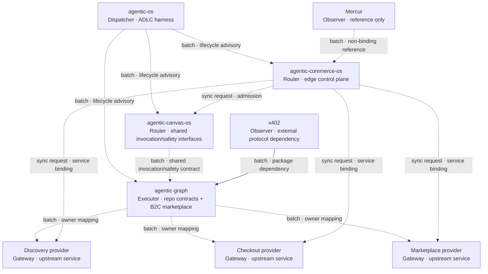
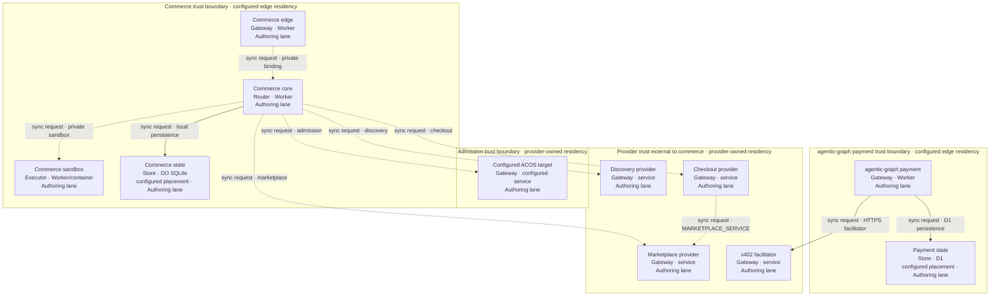
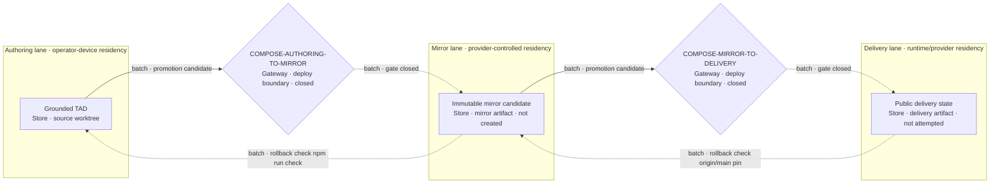

# Reference implementation — composition architecture

This lazy-loaded combined PRD/TAD/ADR records four independently governed repositories. It replaces the imported
draft's memory-derived implementation claims with revision-bound evidence. It is an observer and
acceptance contract, not a multi-repository controller or promotion authority.

The source input was an uncommitted external artifact identified by the frontmatter digest. Its
stated outcome was a published Division of Work, composition diagram, selection record, and known
gaps. Those document-level outcomes and their publication acceptance contract are implemented here.
The cross-repository runtime contract is explicit. The runtime-source directive authorizes bounded
implementation in one owner lane per repository. Source candidates now implement the owner contracts;
mirror and delivery mutation remain closed until independent repository evidence, authenticated release
authority, exact candidate pins, and lifecycle joins are satisfied.

## Opening directive

```yaml
directive_id: "DIR-DOC-PUBLISH-01"
context: "Four repositories already expose lifecycle, invocation, domain, and commerce contracts"
intent: "Document their composition without duplicating capability ownership or inventing runtime proof"
directive: "Bind material claims to exact revisions, preserve provider boundaries, and leave execution closed"
role: "system-architect"
action: "document component composition and selection decisions"
outcome: "grounded TAD with ownership, topology, decisions, verification conditions, and explicit gaps"
subject: "agent"
verb: "compose"
object: "architecture"
```

## Runtime-source directive

```yaml
directive_id: "DIR-RUNTIME-READY-01"
operator_request: "IMPLEMENT production runtime ready"
context: "At agentic-os 99dd3d18, agentic-canvas-os 3c597227, agentic-graph 9ba90b95, and agentic-commerce-os d5323bc3, provider joins were absent or unverified; Commerce admission v1 could not bind its authorized full intent to the four-field provider effect"
intent: "Reach production-verifiable composition through the smallest owner-published contracts without duplicating admission, discovery, money movement, settlement, or marketplace state"
directive: "Implement admission provider v3 and the three evidence-bound provider adapters in independent owner lanes, prove them with cross-repository contract checks, and keep promotion closed until exact authenticated release inputs exist"
role: "solo-founder-ai-orchestrator"
action: "coordinate owner-scoped runtime implementation and independent verification"
outcome: "exact reviewable source candidates prove the owner joins while release and paid-runtime VCCs expose typed external blockers without partial deployment"
subject: "agent"
verb: "implement"
object: "production-runtime-composition"
```

The source sprint is capped at four owner lanes, files below 600 lines, and zero mirror or delivery
mutations before their registered gates. External payee, provider, review, and protected-environment
waits have condition-based rechecks rather than inferred completion times.

## Product requirements

### Must feature and proven buyer pain

| Field | Requirement |
|---|---|
| Pain point | `unvalidated` — a buyer can discover an offer but cannot complete one governed, replay-safe transaction across the four components |
| Hook | One mobile browser flow exposes discovery, explicit confirmation, settlement, and receipt readback |
| Break | Unjoined provider contracts and an unverifiable admission effect stop the flow before a real first dollar |
| Fix | Reuse each current owner and add only versioned adapters, exact evidence pins, and cross-repository checks |
| Close | A buyer receives one digest-valid settlement receipt; replay causes no second effect |
| Min-time-resource-max-value | Extend existing service bindings, Durable Objects, D1 tables, and protected workflows; add no new infrastructure or duplicate ledger |

### Success metrics

| Metric | Target | Evidence |
|---|---|---|
| Time-to-value | One supported purchase in at most five buyer actions and ten minutes from a clean browser session | Timed production smoke receipt |
| Token economics | Discovery/readiness/receipt readback use zero model calls and zero LLM tokens | Per-route cost log and runtime probe |
| Transaction safety | One money effect for any count of exact confirmation retries | Provider and settlement idempotency suites |
| Infrastructure TCO | No net-new paid infrastructure component | Bound configuration and cost inventory |
| Delivery | Every exact candidate and deployed version is joined to review, release, rollback, and runtime receipts | Per-repository lifecycle and delivery evidence |

### Five-flow trace

| Flow pattern | Requirement and owning surface |
|---|---|
| User journey | Buyer discovers → reviews → confirms → receives settlement state; the browser never holds provider credentials |
| Workflow | Commerce reserves admission/checkout authority before an owner effect and completes it only after exact echoed evidence |
| Data flow | Digests bind intent → provider request → owner receipt → settlement readback without copying authoritative state |
| Orchestration/harness | MCP handles discovery; typed service bindings handle admission, checkout, and marketplace; each emits zero-model cost evidence |
| Topology | Authoring, mirror, and delivery lanes remain distinct; Diagrams `COMP-1`, `TOP-1`, and `LANE-1` bind the component and promotion paths |

### Demo skeleton

| Beat | Bound | Observable result |
|---|---:|---|
| Hook | 30 s | Open the mobile storefront and submit one supported discovery intent |
| Probe | 60 s | Show exact offer/provider revision and confirmation total |
| Reveal | 90 s | Confirm once and surface the digest-valid settlement receipt satisfying `VCC-RUNTIME-X402-03` |
| Confirm | 30 s | Replay the same confirmation and show the identical receipt with no second effect |
| Close | 30 s | Read marketplace settlement and runtime evidence from zero-token routes |

The monetization mechanism is `mechanism-proven` only after the local cross-repository suite passes;
it becomes `demand-validated` only after a named real payer completes the production flow. This increment
does not infer demand from mechanism readiness.

## Constraints

- Each capability has one owner; consumers use its versioned contract instead of duplicating logic.
- Each repository keeps its own claim, lane, review, integration, release, and cleanup evidence.
  `agentic-os` supplies repository-local primitives, not cross-repository authority.
- Provider extensions require an owner-published contract. Protocol mentions and non-binding
  references are not adapters, deployments, dependencies, or receipts.
- The component name is **`agentic-graph`**, the primary B2C Marketplace Storefront and
  Orchestration Hub. Architecture keys use `AG_*`; physical repository and runtime service identifiers
  remain revision-bound source identities rather than architecture component names.
- `AG_REPO` is the revision-bound source alias defined below; it is not a repository rename or runtime id.
- Shared invocation tokens and repository-specific machine contracts remain separate: ACOS owns its
  shared dictionary/safety interfaces, while `agentic-graph` owns its collaboration frontmatter, PR grammar,
  domain schemas, and runtime contracts.

## Codebase Grounding Record

Grounding was read-only on 2026-09-03. A `confirmed` disposition proves only the cited current-state
claim at the named revision; it does not grant lifecycle authority or raise delivery readiness.

| Input | Bound revision or digest | Observation |
|---|---|---|
| Imported TAD | `sha256:5e646e3afce86c05415c3f2545282603f3e58d77440382c6ab3fb5dc78e39418` | Untracked input; no committed source revision |
| `agentic-os` | `99dd3d18d573c2ccf7616e29dad15aad94359b84` | Clean canonical checkout; repository-local ADLC contracts and the released document baseline |
| `agentic-canvas-os` | `3c597227dbb1101a2d5d75cb83a8496e22357a0e` | Clean canonical checkout; invocation and composition contracts grounded there |
| `AG_REPO` | `9ba90b95bcde38db9f25f6b945ba66cfd264e735` | `agentic-graph` source at the immutable [Git locator](https://github.com/huijoohwee/knowgrph/tree/9ba90b95bcde38db9f25f6b945ba66cfd264e735); legacy slug retained only as source identity |
| `agentic-commerce-os` | `d5323bc35a62cf2dace300990d5ee0db228897d8` | Clean canonical checkout; provider contracts and receipt gates inspected |
| Mercur | `3c4b3cc04d0fa4bba597013ab7528c12acdd4013` | Reference input only |
| x402 / Cloudflare integration guide | `eb0d899ead358a88eb3899dd3f5051e990e02299` / `37b9c206ecbb92a87eeab0c6869a1e70675e7154` | Sources checked against the existing `agentic-graph` implementation |

| Material claim | Disposition | Evidence and consequence |
|---|---|---|
| `agentic-os` governs worktree/lane lifecycle | `confirmed` | `agentic-os:docs/LANE.md` defines one repository-scoped machine and denies authority to Git projections |
| ACOS is the sole owner of `/`, `#`, `@`, and all frontmatter semantics | `contradicted` | ACOS owns shared dictionaries and safety contracts; `AG_REPO:docs/collaboration-runtime-contract.md` is `agentic-graph`'s machine SSOT for its collaboration frontmatter and PR grammar |
| ACOS provides a native external Agents SDK | `contradicted` | It has a provider-neutral facade and blocked native skill harness; `docs/PROGRESSIVE-AGENTS.md` rejects emulating an external SDK |
| `agentic-graph` uses no external Agents SDK | `contradicted` | `AG_REPO:cloudflare/workers/agenticgraph-mcp/package.json` depends on Cloudflare's `agents` package for its MCP Worker |
| Commerce consumes a live ACOS admission contract | `contradicted` | Config targets ACOS but pins `415e914d...`, not current ACOS `3c597227...`; provider v1 also lacks a wire-verifiable authorized-effect digest |
| `agentic-graph` owns its domain graph and native marketplace/ledger behavior | `confirmed` | `AG_REPO:contracts/kgc-document.schema.js`, `ecs/kgcNodeContract.js`, `src/{ledger,marketplace,payout}`, and D1 migration `0016_native_marketplace_settlement.sql` contain the current owners |
| `agentic-graph` implements StraitsX and Avalanche as equivalent production payment rails | `contradicted` | StraitsX has an implemented rail and persisted schema; Avalanche appears in verification/configuration and planning surfaces, not as an equivalent rail in the current payment contract |
| Commerce discovery, checkout, marketplace, and receipt seams exist | `confirmed` | `agentic-commerce-os:src/core` owns all three provider contracts, clients, receipts, and fail-closed evidence joins |
| Marketplace binding names are interchangeable across repositories | `contradicted` | Commerce consumes `MARKETPLACE_PROVIDER`; `agentic-graph` travel commerce separately consumes `MARKETPLACE_SERVICE` |
| No code exists for the composition | `contradicted` | Product repositories implement most seams, including an `agentic-graph` x402 Worker path; the four-repository contract join is missing |
| `agentic-graph` x402 implements `commerce.checkout-provider/v1` | `absent` | `agentic-graph` has x402 middleware, routes, dependencies, configuration, and readiness gates, but not the commerce contract identifier or adapter; `agentic-commerce-os` has no x402-specific code |
| Commerce ACOS permit binds the provider POST payload | `contradicted` | Commerce hashes the full registration intent but sends only its four admission inputs; ACOS cannot recompute the authorized effect, so provider v1 cannot safely persist it |
| Commerce discovery constraints map to the live owner input | `unverified` | Commerce accepts a generic constraint record while the current live travel discovery owner requires a structured route intent; an adapter must validate one explicit supported projection and fail closed otherwise |

## Division of Work

| Component | Sole owned capability | Consumes | Explicit exclusion |
|---|---|---|---|
| `agentic-os` | Repository-local ADLC records, lane projection, provider observation, exact integration classification | Consumer repository profile and external authority receipts | No cross-repository claim service or product runtime |
| `agentic-canvas-os` | Shared invocation dictionaries, composition/safety interfaces, and provider-neutral agent facade | `agentic-graph` runtime catalogs and executors | No ownership of `agentic-graph`'s repository-specific collaboration grammar, payment rails, settlement persistence, or external Agents SDK dependency |
| `agentic-graph` | Repository collaboration grammar, KGC/domain schemas, B2C marketplace storefront/orchestration, domain execution/state, payment rails, bundle/vendor splits, and payouts | ACOS shared invocation/safety interfaces and configured providers | D1 marketplace projections are not the authoritative bundle ledger |
| `agentic-commerce-os` | Edge coordination, admission-receipt validation, local projection, provider routing, derived markup, and evidence gates | ACOS admission plus discovery, checkout, and marketplace provider bindings | No ownership of upstream admission, discovery execution, money movement, settlement ledger, or payout execution |
| Mercur | None; non-binding schema/workflow reference only | Nothing | No import, fork, service, store, or compatibility promise |
| x402 | External protocol packages; the current adapter and paid-resource routes are owned by `agentic-graph` | `agentic-graph` PRD/TAD, configuration, and readiness gates | No commerce-local adapter and no proven checkout-provider contract join |

## Architecture composition

Solid edges are current runtime/dependency relationships. Dotted edges are lifecycle guidance,
non-binding input, or an unverified deployment/contract join and must not be read as proven runtime calls.

**Diagram COMP-1** · Class: Component topology · Notation: `flowchart TB` · Surface: Markdown source · Version: 9 — 2026-09-03
**Caption**: Product repositories retain their current owners; commerce coordinates three upstream
provider classes, but their deployment-selected service joins are not proved. `agentic-graph` already
owns an x402 implementation; Mercur remains reference-only.
**Version note**: v9 adds the runtime-source directive and separates ACOS shared interfaces from `agentic-graph` repository-owned machine contracts.



### Component inventory — Diagram COMP-1

| Layer | Component | Node key | File / module | Role · type | Local rung | Delivered rung |
|---|---|---|---|---|---|---|
| Lifecycle | `agentic-os` | `AOS` | `agentic-os:docs/LANE.md` | Dispatcher · ADLC harness | `spec-complete` | `undocumented` |
| Interface | `agentic-canvas-os` | `CANVAS` | `agentic-canvas-os:docs/FACTS.md` | Router · shared invocation/safety interfaces | `dev-proven` | `undocumented` |
| Domain | `agentic-graph` | `AG` | `AG_REPO:contracts/kgc-document.schema.js`, `ecs/kgcNodeContract.js`, `src/marketplace` | Executor · repository contracts and B2C marketplace orchestration | `spec-complete` | `undocumented` |
| Control | `agentic-commerce-os` | `COMMERCE` | `agentic-commerce-os:src/core` | Router · edge control plane | `dev-proven` | `undocumented` |
| Provider | `agentic-graph` discovery | `DISCOVERY` | `AG_REPO:cloudflare/workers/agenticgraph-mcp` | Gateway · upstream service | `dev-proven` | `undocumented` |
| Provider | `agentic-graph` checkout | `CHECKOUT` | `AG_REPO:cloudflare/workers/agenticgraph-travel-commerce` | Gateway · upstream service | `dev-proven` | `undocumented` |
| Provider | `agentic-graph` marketplace | `MARKET` | `AG_REPO:cloudflare/workers/agenticgraph-marketplace` | Gateway · upstream service | `dev-proven` | `undocumented` |
| Reference | Mercur | `MERCUR` | Pinned external README/license | Observer · reference only | `undocumented` | `undocumented` |
| Protocol | x402 | `X402` | `AG_REPO:cloudflare/workers/agenticgraph-payment/agenticCommerceX402.ts` | Observer · external protocol dependency | `spec-complete` | `undocumented` |

### Connection inventory — Diagram COMP-1

| Source | Target | Connection type | Join state |
|---|---|---|---|
| `AOS` | `CANVAS` | batch · lifecycle advisory | repository-local only |
| `AOS` | `AG` | batch · lifecycle advisory | repository-local only |
| `AOS` | `COMMERCE` | batch · lifecycle advisory | repository-local only |
| `CANVAS` | `AG` | batch · shared invocation/safety contract | `agentic-graph` pins ACOS `087c7246...`; grounded `3c597227...` join unverified |
| `COMMERCE` | `CANVAS` | sync request · admission | provider v3 / receipt v2 source contract and real cross-lane invocation pass; protected deployed revision unverified |
| `AG` | `DISCOVERY` | batch · owner mapping | source adapter and owner tests pass; deployed revision unverified |
| `AG` | `CHECKOUT` | batch · owner mapping | source adapter and owner tests pass; deployed revision unverified |
| `AG` | `MARKET` | batch · owner mapping | source adapter and owner tests pass; deployed revision unverified |
| `COMMERCE` | `DISCOVERY` | sync request · service binding | evidence-bound source join passes; protected binding/pin unverified |
| `COMMERCE` | `CHECKOUT` | sync request · service binding | evidence-bound source join passes; protected binding/pin unverified |
| `COMMERCE` | `MARKET` | sync request · service binding | evidence/fence-bound source join passes; protected binding/pin unverified |
| `MERCUR` | `COMMERCE` | batch · non-binding reference | non-binding |
| `X402` | `AG` | batch · package dependency | confirmed at bound `agentic-graph` revision |

## Runtime topology

**Diagram TOP-1** · Class: Runtime topology · Notation: `flowchart TB` · Surface: Markdown source · Version: 6 — 2026-09-03
**Caption**: The Topology pattern specifies four trust boundaries in the Authoring lane. Configured
service names and release code do not prove that their deployed revisions implement the contracts.
**Version note**: v6 adds Commerce's private three-Worker release tuple and public prefix boundary.
**Boundaries**: admission trust; commerce trust; `agentic-graph` payment trust; provider trust external to commerce.



| Node | Boundary | Role | Type | Lane | Connects to | Connection type | Data residency |
|---|---|---|---|---|---|---|---|
| `ACOS_ADM` | admission trust | Gateway | configured service | Authoring | `COMMERCE_CORE` inbound | sync request | Provider-owned; unproved here |
| `COMMERCE_EDGE` | commerce trust | Gateway | Worker | Authoring | public prefix and `COMMERCE_CORE` | sync request | Request-local; public delivery unproved |
| `COMMERCE_CORE` | commerce trust | Router | Worker | Authoring | admission, three providers, local store | sync request | Request-local; state in `COMMERCE_STORE` |
| `COMMERCE_SANDBOX` | commerce trust | Executor | Worker/container | Authoring | `COMMERCE_CORE` inbound | sync request | Private container placement; unproved here |
| `COMMERCE_STORE` | commerce trust | Store | DO SQLite | Authoring | `COMMERCE_CORE` inbound | sync request | Configured placement; jurisdiction unproved |
| `AG_PAY` | `agentic-graph` payment trust | Gateway | Worker | Authoring | `AG_STORE`, `X402_FAC` | sync request | Request-local; state in `AG_STORE` |
| `AG_STORE` | `agentic-graph` payment trust | Store | D1 | Authoring | `AG_PAY` inbound | sync request | Configured placement; jurisdiction unproved |
| `DISCOVERY_RT` | provider trust external to commerce | Gateway | service | Authoring | `COMMERCE_CORE` inbound | sync request | Provider-owned; unproved here |
| `CHECKOUT_RT` | provider trust external to commerce | Gateway | service | Authoring | `COMMERCE_CORE` inbound | sync request | Provider-owned; unproved here |
| `MARKET_RT` | provider trust external to commerce | Gateway | service | Authoring | `COMMERCE_CORE` inbound | sync request | Provider-owned; unproved here |
| `X402_FAC` | provider trust external to commerce | Gateway | service | Authoring | `AG_PAY` inbound | sync request | Provider-owned; unproved here |

### Connection inventory — Diagram TOP-1

| Source | Target | Connection type | Join state |
|---|---|---|---|
| `COMMERCE_EDGE` | `COMMERCE_CORE` | sync request · private binding | source prefix/router and exact-version proof pass; deployment unverified |
| `COMMERCE_CORE` | `COMMERCE_SANDBOX` | sync request · private binding | bounded source and container dry bundle pass; rollout unverified |
| `COMMERCE_CORE` | `ACOS_ADM` | sync request · admission | exact provider v3 / receipt v2 source join and deployed-identity pin pass; protected deployed revision unverified |
| `COMMERCE_CORE` | `DISCOVERY_RT` | sync request · discovery | exact evidence-bound source join passes; deployment unverified |
| `COMMERCE_CORE` | `CHECKOUT_RT` | sync request · checkout | exact replay-safe source join passes; deployment unverified |
| `COMMERCE_CORE` | `MARKET_RT` | sync request · marketplace | exact evidence/fence-bound source join passes; deployment unverified |
| `CHECKOUT_RT` | `MARKET_RT` | sync request · `MARKETPLACE_SERVICE` | protected-plan source binding exists; deployed revision unverified |
| `COMMERCE_CORE` | `COMMERCE_STORE` | sync request · local persistence | confirmed source relationship |
| `AG_PAY` | `AG_STORE` | sync request · D1 persistence | confirmed source relationship |
| `AG_PAY` | `X402_FAC` | sync request · HTTPS facilitator | configured; delivery state unverified |

### Component inventory — Diagram TOP-1

| Layer | Component | Node key | File / module | Role · type | Local rung | Delivered rung |
|---|---|---|---|---|---|---|
| Admission | `agentic-canvas-os` | `ACOS_ADM` | `agentic-canvas-os:agent-api/src/commerce-admission-{contract,provider}.js` | Gateway · configured service | `dev-proven` | `undocumented` |
| Edge | `agentic-commerce-os` | `COMMERCE_EDGE` | `agentic-commerce-os:src/edge` | Gateway · Worker | `dev-proven` | `undocumented` |
| Control | `agentic-commerce-os` | `COMMERCE_CORE` | `agentic-commerce-os:src/core` | Router · Worker | `dev-proven` | `undocumented` |
| Execution | `agentic-commerce-os` | `COMMERCE_SANDBOX` | `agentic-commerce-os:src/sandbox` | Executor · Worker/container | `dev-proven` | `undocumented` |
| State | Commerce state | `COMMERCE_STORE` | `agentic-commerce-os:src/core/{checkout-session,revenue-ledger}.ts` | Store · DO SQLite | `spec-complete` | `undocumented` |
| Payment | `agentic-graph` payment | `AG_PAY` | `AG_REPO:cloudflare/workers/agenticgraph-payment` | Gateway · Worker | `spec-complete` | `undocumented` |
| State | Payment state | `AG_STORE` | `AG_REPO:cloudflare/workers/agenticgraph-payment/agenticCommercePersistence.ts` | Store · D1 | `spec-complete` | `undocumented` |
| Provider | `agentic-graph` discovery | `DISCOVERY_RT` | `AG_REPO:cloudflare/workers/agenticgraph-mcp` | Gateway · service | `dev-proven` | `undocumented` |
| Provider | `agentic-graph` checkout | `CHECKOUT_RT` | `AG_REPO:cloudflare/workers/agenticgraph-travel-commerce` | Gateway · service | `dev-proven` | `undocumented` |
| Provider | `agentic-graph` marketplace | `MARKET_RT` | `AG_REPO:cloudflare/workers/agenticgraph-marketplace` | Gateway · service | `dev-proven` | `undocumented` |
| Provider | x402 facilitator | `X402_FAC` | `AG_REPO:cloudflare/workers/agenticgraph-payment/wrangler.toml` | Gateway · service | `spec-complete` | `undocumented` |

## Diagram register

No canvas projection was requested or recorded. Projected element counts therefore remain zero; source
node/edge completeness is carried by each companion inventory.

| Diagram | Class | Notation | Surface | Projects | Nodes | Edges | Clusters | Version |
|---|---|---|---|---|---|---|---|---|
| `COMP-1` | Component topology | `flowchart TB` | Markdown source | no | 0 | 0 | 0 | 9 |
| `TOP-1` | Runtime topology | `flowchart TB` | Markdown source | no | 0 | 0 | 0 | 6 |
| `LANE-1` | Lane & deploy boundary | `flowchart LR` | Markdown source | no | 0 | 0 | 0 | 3 |

## Interface invariants

1. Commerce uses `commerce.discovery-provider/v1`, `commerce.checkout-provider/v1`, and
   `commerce.marketplace-provider/v1`; it accepts only exact, digest-valid evidence and receipts, and
   authoritative mutation stays upstream.
2. `agentic-graph`'s Bundle Graph store owns bundle/vendor splits and ordered settlement events. D1 holds
   versioned reference data and non-authoritative projections.
3. On the ACOS-to-`agentic-graph` application surface, ACOS owns shared invocation dictionaries and safety
   interfaces. `agentic-graph` owns its repository collaboration grammar, KGC/domain schemas, runtime,
   persistence, payments, deployment, and rollback. Commerce separately owns its edge control plane, DO
   state, and repository-specific deploy/rollback boundary.
4. The existing `agentic-graph` x402 adapter remains upstream. Any commerce integration must use the
   checkout-provider boundary and preserve its guardrail, receipt, and evidence semantics; diagram
   edges transfer no lifecycle authority.
5. Binding names are local interface identifiers, not aliases: Commerce uses `MARKETPLACE_PROVIDER`, while
   `agentic-graph` travel commerce uses `MARKETPLACE_SERVICE` for its marketplace Worker dependency.

## Embedded decision records

### DR-1 — Mercur is reference-only

Mercur core is MIT-licensed and documents seller, commission, split-order, and payout concepts. Its
first-party deployment uses Node.js, PostgreSQL, and Redis; no first-party Workers path was found.
Decision: use public workflow concepts as non-binding input only. Do not import, fork, deploy, or claim
schema compatibility. Automated split payouts are not treated as an MIT-core capability.

Primary evidence: [Mercur license](https://github.com/mercurjs/mercur/blob/3c4b3cc04d0fa4bba597013ab7528c12acdd4013/LICENSE)
and [architecture and deployment](https://github.com/mercurjs/mercur/blob/3c4b3cc04d0fa4bba597013ab7528c12acdd4013/README.md#architecture).

### DR-2 — Retain upstream x402 and join through the checkout owner

| Constraint | Disposition |
|---|---|
| Open protocol/license | `pass` — Apache-2.0 reference implementation and published protocol |
| Edge compatibility | `pass` — HTTP flow plus Fetch/Hono and Workers integration guidance |
| Network portability | `conditional` — each scheme/network/facilitator combination needs an explicit implementation |
| `agentic-graph` owner implementation | `confirmed` — accepted PRD/TAD, x402 packages, middleware-backed routes, configuration, and readiness scripts exist at the bound revision |
| Commerce provider join | `source-pass` — `agentic-graph` exposes `commerce.checkout-provider/v1`; prepare persists guardrail evidence and confirmation replays return the exact stored settlement result |
| Production readiness | `fail-closed` — the checked-in `payTo` value is an explicit zero-address placeholder pending operator configuration and deployment |

Decision: preserve the `agentic-graph` implementation and add no duplicate commerce-local payment rail.
Commerce consumes the owner-published checkout contract; x402 delivery remains closed until a protected
operator-owned payee and a successful paid-resource/replay receipt are observed.

Primary evidence: [x402 principles](https://github.com/x402-foundation/x402/blob/eb0d899ead358a88eb3899dd3f5051e990e02299/README.md#principles),
[protocol v2](https://github.com/x402-foundation/x402/blob/eb0d899ead358a88eb3899dd3f5051e990e02299/specs/x402-specification-v2.md), and
[Workers integration](https://github.com/cloudflare/cloudflare-docs/blob/37b9c206ecbb92a87eeab0c6869a1e70675e7154/src/content/docs/agents/tools/payments/x402/index.mdx).

### DR-3 — Admission provider v3 binds the authorized effect and deployed identity

Admission v1 authorized the complete Commerce intent but transmitted only four projections, so
`agentic-canvas-os` could not recompute the permitted effect. Decision: use
`commerce.acos-admission-provider/v3` with `acos-adapter-registration/v2`, retain
`authoring_mutation_intent` as the fifth exact v2 request-body field, bind the receipt and private readiness
envelope to `acos-cloudflare-deployment-identity/v1`, canonicalize
`{schema, semanticScope, writeTarget, payload}`, and require all twelve fence headers to echo. The provider
persists one atomic high-water fence and immutable outcome, exact replay returns the stored receipt, and
stale/conflicting permits make no owner-state write. The operator instruction is the exact
`operator://agentic-graph/commerce-adapter-admission/2026-09-03` reference; caller-specific provenance stays
inside the signed intent.

### DR-4 — Reuse owner state and typed service bindings

Discovery maps only the supported structured route intent and rejects generic synthesis. Checkout reuses
the existing issuance/settlement owner and a Durable Object journal. Marketplace reuses the existing D1
owner with additive fence/outcome tables. Decision: add no database, queue, cache, model call, or duplicate
ledger. All operational calls carry the four-field evidence pin, required-check digest, request digest, and
binding digest; request bodies are bounded to 65,536 bytes before replay.

### DR-5 — Authenticate private service-binding operations

A service binding provides private transport, not caller authority. Decision: Commerce signs ACOS admission
with `commerce-acos-admission-auth/v1` over the exact URL, method, body digest, and twelve authoring headers.
It signs checkout and marketplace calls with `commerce-provider-auth/v1` over the independently recomputed
request and evidence-binding digests. Each owner verifies a distinct protected HMAC secret before capability
disclosure, permit parsing, or mutation. Secrets are required release topology but never receipt fields;
runtime-evidence routes alone remain public and non-mutating.

### DR-6 — Release the Commerce tuple with authenticated forward recovery

Cloudflare cannot atomically activate a container rollout plus two versioned Workers. Decision: the
protected Commerce controller uploads core and edge inactive, deploys and proves the private sandbox
Worker/container, compare-and-swaps the active three-Worker tuple before each activation, and proves the
exact `airvio.co/agentic-commerce-os*` prefix. Bootstrap requires absence; steady state requires an
authenticated predecessor receipt; any ambiguous effect yields a preserve-required artifact that only an
independently authenticated forward-recovery run may consume. No path claims transactional rollback.

## Cross-repository acceptance contract

This section separates publication, source acceptance, protected integration, and public delivery.
`DE-DOC-PUBLISH-01` is the discoverable combined PRD/TAD/ADR and focused conformance test.
`DE-RUNTIME-COMPOSE-01` is admission provider v3 / receipt v2, the three owner provider adapters, the bounded four-component
observer, and protected release-plan metadata injection. The observer requires four distinct exact GitHub
repository identities, consumes the checked-in Commerce producer fixture through the real ACOS provider,
and proves restart-safe byte-identical replay with zero replay writes. It does not acquire claims, mutate
sibling repositories, authenticate a human, or deploy.

### Operator decision

`OP-20260903-FIX-RELEASE` records the 2026-09-03 Operator fix/release and production-runtime implementation
requests. It authorizes the bounded owner-lane source implementations and each repository's
normal protected review/integration path after named checks pass. It does not supply an x402 payee, provider
credential, consumed release receipt, product-deployment authority, retirement authority, or cleanup proof.

### Documentation-publication criterion

| Criterion | Given / When / Then | VCC and check | Constraint | Local result |
|---|---|---|---|---|
| `AC-DOC-PUBLISH-01` | Given the imported draft and four pinned repositories, when the candidate is evaluated, then the README link resolves, grounding and required architecture sections exist, terminology is canonical, and every unproved runtime join remains visibly unverified or absent | `VCC-DOC-PUBLISH-01`: focused tests, full repository check, and exact-base autonomy classification all pass | This repository candidate is bounded to README, this TAD, the package entrypoints, two composition tests, and two read-only composition CLIs; sibling runtime implementation remains in its owner lanes | Pending final committed-scope classification; the working-tree inventory matches the declared seven-file scope |

### Runtime-composition criteria

| Criterion | VCC end state and independent check | Current result |
|---|---|---|
| `AC-RUNTIME-OWNERSHIP-01` | `VCC-RUNTIME-OWNERSHIP-01`: exact candidates for `agentic-canvas-os`, `agentic-graph`, and `agentic-commerce-os` pass owner suites and every consumer/provider join resolves to one versioned contract | Source acceptance passes at ACOS `6dbb069d`, `agentic-graph` `6ab5cf90`, and Commerce `ea322141`; unsatisfied because protected-main revisions and deployed evidence pins do not yet exist |
| `AC-RUNTIME-AUTHORITY-02` | `VCC-RUNTIME-AUTHORITY-02`: every changed repository independently yields current claim, review, integration, release, and cleanup-boundary receipts joined to its exact candidate | Unsatisfied; ACOS PR #874 and Commerce PR #6 are exact-head, clean, and green, but both land attempts require external promotion authority; `agentic-graph` reports its canonical-main repository trust anchor missing; no consumed release or integration receipt exists |
| `AC-RUNTIME-X402-03` | `VCC-RUNTIME-X402-03`: `agentic-graph` production configuration has a non-placeholder payee and its checkout-provider adapter passes owner, Commerce, paid-resource, settlement-readback, and exact-replay checks | Unsatisfied; the source adapter passes, but the production payee and paid deployment receipt are absent |

### Publication RAO

| RAO Step | Depends on | Directive / criterion / design join | Role | Atomic action | Measurable outcome |
|---|---|---|---|---|---|
| `RAO-DOC-01` | none | `DIR-DOC-PUBLISH-01` / `AC-DOC-PUBLISH-01` / `DE-DOC-PUBLISH-01` | Implementer | Produce the bounded README, TAD, and additive focused test | One clean candidate within the declared write scope |
| `RAO-DOC-02` | `RAO-DOC-01` | `DIR-DOC-PUBLISH-01` / `AC-DOC-PUBLISH-01` / `DE-DOC-PUBLISH-01` | Evaluator | Evaluate `VCC-DOC-PUBLISH-01` with its three named authoring checks | All checks exit 0 with surfaced counts and scope |
| `RAO-DOC-03` | `RAO-DOC-02` | `DIR-DOC-PUBLISH-01` / `AC-DOC-PUBLISH-01` / `DE-DOC-PUBLISH-01` | Publisher | Run `agentic-os land` for the exact clean candidate | Immutable remote head and source-head-bound PR are projected |
| `RAO-DOC-04` | `RAO-DOC-03`, `OP-20260903-FIX-RELEASE` | `DIR-DOC-PUBLISH-01` / `AC-DOC-PUBLISH-01` / `DE-DOC-PUBLISH-01` | Integrator | Squash-merge the exact PR head after required checks pass | Protected main contains the candidate tree without bypass |

### Runtime RAO

| RAO Step | Depends on | Role | Atomic action | Measurable outcome |
|---|---|---|---|---|
| `RAO-RUNTIME-01` | none | `agentic-canvas-os` owner | Publish admission provider v3 / receipt v2, exact deployed identity, instruction resolution, and durable fence/outcome journal | Native provider suite and Commerce cross-lane request pass |
| `RAO-RUNTIME-02` | none | `agentic-graph` owner | Publish discovery, checkout, and marketplace provider adapters | Owner suites prove exact contracts, zero-model discovery, one settlement effect, and fenced marketplace mutation |
| `RAO-RUNTIME-03` | `RAO-RUNTIME-01`, `RAO-RUNTIME-02` | `agentic-commerce-os` owner | Consume admission provider v3 / receipt v2, exact ACOS deployment pins, authenticated discovery, bounded evidence bindings, and exact operator reference; stage its core, edge, and private-sandbox Workers behind `airvio.co/agentic-commerce-os*` | Consumer domain/Worker suites, real cross-lane admission, release-controller recovery, and three-Worker dry bundles pass |
| `RAO-RUNTIME-04` | `RAO-RUNTIME-01`–`03` | `agentic-os` evaluator | Run `npm run composition:runtime:check -- <four exact roots>` | One v1 report names four canonical components and no contract-drift finding |
| `RAO-RUNTIME-05` | `RAO-RUNTIME-04` | Repository publishers | Create exact source commits and protected reviews independently | Four immutable review heads and current required checks |
| `RAO-RUNTIME-06` | `RAO-RUNTIME-05` | Repository integrators | Consume each repository's authenticated integration authority in dependency order | Protected main revisions and integration receipts match reviewed trees |
| `RAO-RUNTIME-07` | `RAO-RUNTIME-06` | `agentic-graph` operator | Supply protected evidence metadata, provider credential, and operator-owned x402 payee | Configuration preflight contains no placeholder, missing secret, or sentinel |
| `RAO-RUNTIME-08` | `RAO-RUNTIME-07` | Release controller | Consume exact-candidate human authorization and activate owner versions | Upload, activation, migration, route, preserve-required, forward-recovery, and binding receipts are sealed without claiming transactional rollback |
| `RAO-RUNTIME-09` | `RAO-RUNTIME-08` | Evaluator | Run mobile discovery → confirm → settlement readback → exact replay → marketplace read | One paid effect, byte-identical replay, zero-token discovery/read routes, and matching evidence pins |
| `RAO-RUNTIME-10` | `RAO-RUNTIME-09` | Cleanup authority | Retire only exact clean source lanes with joined receipts | Canonical checkouts fast-forward and unrelated worktrees remain untouched |

Directive coverage is `2/2`; RAO grounding is `14/14`. `RAO-RUNTIME-01`–`04` are source-candidate
actions; `RAO-RUNTIME-05`–`10` remain conditioned on repository and external authority.

## Evidence references

| ID | Invocable check | Recorded result | Surface | Scope |
|---|---|---|---|---|
| `ER-GROUND-001` | Exact-revision source inspection named in the grounding record | Claim dispositions recorded on 2026-09-03 | Authoring | Establishes document inputs only |
| `ER-DOC-001` | `node --test __tests__/composition-architecture.test.mjs` | 4 focused tests passed on 2026-09-03 | Authoring | Satisfies the document-specific assertions in `VCC-DOC-PUBLISH-01` |
| `ER-CROSS-REPO-001` | `npm run composition:runtime:check -- --agentic-os-root=… --agentic-canvas-os-root=… --agentic-graph-root=… --agentic-commerce-os-root=… --allow-dirty` | `sourceContractsReady:true`; clean sibling candidates `6dbb069d`, `6ab5cf90`, and `ea322141` match their repository identities; fixture `068279…aea44` executes Commerce→ACOS auth/restart/replay and a real Commerce→`agentic-graph` marketplace request, exact 12-header grammar, response parity, HMAC checks, and tamper rejection; only this authoring lane is dirty | Authoring | Executable source acceptance supersedes substring-only markers; `authenticatedReleaseAuthorityObserved:false` and `productionRuntimeReady:false` remain explicit |
| `ER-ADMISSION-001` | ACOS commit `6dbb069d` owner suite plus the Commerce-to-provider probe; PR #874 checks | Admission provider v3 / receipt v2, exact deployment identity, durable restart/concurrency, consumer digest/receipt join, and protected-review checks pass | Authoring | Source evidence for `RAO-RUNTIME-01` and `03`; land remains closed on external promotion authority |
| `ER-PROVIDERS-001` | `agentic-graph` commit `6ab5cf90` full affected CI after a clean install | Discovery, checkout, and marketplace adapters pass bounded evidence, exact replay, fencing, authenticated mutation, response parity, zero-model assertions, four zero-vulnerability audits, 2,209 runtime tests, the 320 px browser proof, and production-shaped dry bundles | Authoring | Source evidence for `RAO-RUNTIME-02`; repository trust bootstrap and deployment remain absent |
| `ER-COMMERCE-001` | Commerce commit `ea322141` `npm run check:implementation`, production core/edge dry bundles, pinned sandbox-container dry run, and PR #6 Integration Gate | 52 domain, 221 unit, 51 Worker, 11 browser, and 100 task-bound checks pass; production bundles remain below 500 kB; the container image and binding build | Authoring | Source evidence for `RAO-RUNTIME-03`; land remains closed on external promotion authority |
| `ER-AUTHORING-001` | `npm run check` | Final repository result recorded at handoff | Authoring | Satisfies the repository-wide assertion in `VCC-DOC-PUBLISH-01`; satisfies no delivered-runtime VCC |
| `ER-SCOPE-002` | `npm run autonomy:class -- --base=origin/main --head=HEAD --json` plus exact committed name-only diff | Pending final immutable candidate; working tree contains exactly `README.md`, `package.json`, this TAD, two composition tests, and two composition CLIs under `bin/` | Authoring | Exact seven-file committed write-scope check for `VCC-DOC-PUBLISH-01`; no sibling-repository authority claim |

## Verification conditions

| VCC | Condition | Independent check | Current result |
|---|---|---|---|
| `VCC-DOC-PUBLISH-01` | The bounded document-and-observer candidate is discoverable, grounded, complete for its declared scope, terminology-safe, and explicit about every open runtime join | Focused tests, full repository check, and exact-base committed-scope classification | Pending the immutable candidate and final `ER-SCOPE-002`; focused source checks pass |
| `VCC-RUNTIME-OWNERSHIP-01` | Every intended runtime consumer/provider join in Diagram `COMP-1` resolves to exactly one owner-published versioned contract at exact passing candidates | Owner suites, real admission invocation, four-root observer, and protected evidence-pin readback | Unsatisfied; source contracts pass, but immutable integrated/deployed revisions and pins are absent |
| `VCC-RUNTIME-AUTHORITY-02` | Each changed repository has its own current claim, lane, review, integration proof, and release boundary | Authenticated consumer lifecycle evaluator | Unsatisfied; source authority contracts pass, but no exact consumed release/integration receipt exists |
| `VCC-RUNTIME-X402-03` | The existing `agentic-graph` x402 path satisfies production configuration and the checkout-provider adapter preserves Commerce receipt/evidence semantics | Owner/Commerce suites plus paid production and exact-replay probes | Unsatisfied; adapter source passes, but operator payee and paid delivery evidence are absent |

`local_rung: dev-proven` follows from the documentation and source-contract evidence. The delivered
runtime-composition surface remains below production because all three runtime VCCs require immutable
integration or delivery evidence.
`delivered_rung: undocumented` remains unchanged because no protected integration or delivery-surface
evidence exists for this TAD.

## Known gaps

- The combined PRD/TAD/ADR, coverage criteria, and runtime RAO now exist; no immutable four-repository
  integration receipt exists yet.
- Authenticated release authority is repository-scoped by design. No cross-repository super-claim or
  atomic multi-repository merge controller is introduced; each exact candidate must integrate independently.
- `agentic-canvas-os` admission provider v3 / receipt v2 and `agentic-commerce-os` consumption pass at exact clean source
  candidates, but their protected deployed service revisions are unverified and therefore remain dotted in Diagrams `COMP-1` and `TOP-1`.
- Provider source evidence exists; deployed version IDs, storage revisions, receipt digests, and runtime
  evidence pins require the protected release controller and are not inferred.
- Commerce's `MARKETPLACE_PROVIDER` and `agentic-graph`'s `MARKETPLACE_SERVICE` are separately owned joins;
  the release-plan source binds both, but only deployment readback can prove the active versions.
- `ACOS_ADMISSION_AUTH_SECRET`, `CHECKOUT_PROVIDER_AUTH_SECRET`, `MARKETPLACE_PROVIDER_AUTH_SECRET`,
  `DISCOVERY_PROVIDER_BEARER_TOKEN`, other upstream provider secrets, an operator-owned `X402_PAY_TO_ADDRESS`, and
  an exact consumed human-authorization receipt are external protected inputs and are intentionally absent.
- Avalanche appears in `agentic-graph` verification and planning surfaces, but this grounding did not prove it
  as a production payment rail equivalent to the implemented StraitsX rail.
- No Mercur schema import, wallet creation, provider bypass, or synthetic x402 payment is authorized here.

## Lane topology and deploy boundaries

**Diagram LANE-1** · Class: Lane & deploy boundary · Notation: `flowchart LR` · Surface: Markdown source · Version: 3 — 2026-09-03
**Caption**: The Lane Topology & Deploy Boundary pattern keeps both adjacent promotions closed.
**Version note**: v3 binds closed gateways to invocable rollback checks without treating absence as proof.



| Lane | Current state | Mutation rights | Data residency | Current rung |
|---|---|---|---|---|
| Authoring | Grounded TAD in isolated worktree | Source, tests, local Git state | Operator device | `dev-proven` |
| Mirror | Not created | Publish-only from approved authoring state | Provider-controlled; exact location unrecorded | `undocumented` |
| Delivery | Not attempted | Publish-only from approved mirror | Runtime/provider-owned; exact location unrecorded | `undocumented` |

### Deploy Boundary Register

| Boundary | From lane | To lane | Evidence Reference | Operator instruction | Rollback statement | State |
|---|---|---|---|---|---|---|
| `COMPOSE-AUTHORING-TO-MIRROR` | Authoring | Mirror | `ER-AUTHORING-001`, `ER-SCOPE-002` | `OP-20260903-FIX-RELEASE` | Restore the prior authoring commit and run `npm run check` | `closed pending exact publication receipt` |
| `COMPOSE-MIRROR-TO-DELIVERY` | Mirror | Delivery | none; no mirror or protected-integration evidence recorded | `OP-20260903-FIX-RELEASE` | Restore the immutable mirror; require `git ls-remote --exit-code origin refs/heads/main` to equal its SHA | `closed pending required checks and protected integration receipt` |
