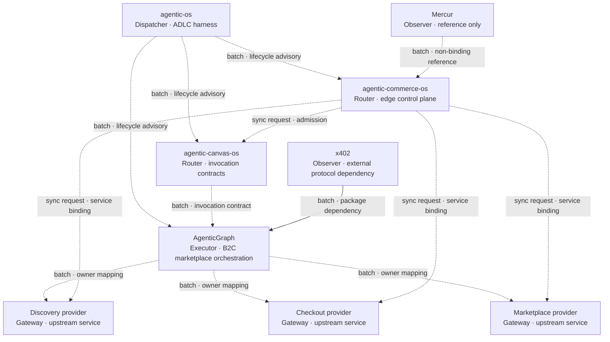
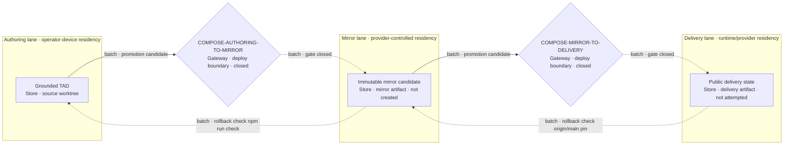

# Composition architecture

This lazy-loaded TAD records four independently governed repositories. It replaces the imported
draft's memory-derived implementation claims with revision-bound evidence. It is not a
multi-repository controller, task list, or promotion authority.

The source input was an uncommitted external artifact identified by the frontmatter digest. Its
stated outcome was a published Division of Work, composition diagram, selection record, and known
gaps. Those document-level outcomes are implemented here; runtime work remains closed because no
joined PRD baseline or code-level acceptance contract exists for this four-repository composition.

## Opening directive

```yaml
context: "Four repositories already expose lifecycle, invocation, domain, and commerce contracts"
intent: "Document their composition without duplicating capability ownership or inventing runtime proof"
directive: "Bind material claims to exact revisions, preserve provider boundaries, and leave execution closed"
role: "system-architect"
action: "document component composition and selection decisions"
outcome: "grounded TAD with ownership, topology, decisions, verification conditions, and explicit gaps"
subject: "agent"
verb: "compose"
object: "architecture"
```

## Constraints

- Each capability has one owner; consumers use its versioned contract instead of duplicating logic.
- Each repository keeps its own claim, lane, review, integration, release, and cleanup evidence.
  `agentic-os` supplies repository-local primitives, not cross-repository authority.
- Provider extensions require an owner-published contract. Protocol mentions and non-binding
  references are not adapters, deployments, dependencies, or receipts.
- Canonical product language is **AgenticGraph**, the primary B2C Marketplace Storefront and
  Orchestration Hub. Architecture keys use `AG_*`; repository and module renames are outside this TAD.
- `AG_REPO` is the revision-bound source alias defined below; it is not a repository rename or runtime id.

## Codebase Grounding Record

Grounding was read-only on 2026-09-03. A `confirmed` disposition proves only the cited current-state
claim at the named revision; it does not grant lifecycle authority or raise delivery readiness.

| Input | Bound revision or digest | Observation |
|---|---|---|
| Imported TAD | `sha256:5e646e3afce86c05415c3f2545282603f3e58d77440382c6ab3fb5dc78e39418` | Untracked input; no committed source revision |
| `agentic-os` | `89256623e4a09a4b8e337c9d3572593c0d188700` | Clean canonical checkout; repository-local ADLC contracts |
| `agentic-canvas-os` | `6340151579ba7d0fecd71be84daa8f7e1ac74f39` | Clean canonical checkout; invocation and composition contracts inspected |
| `AG_REPO` | `9ba90b95bcde38db9f25f6b945ba66cfd264e735` | AgenticGraph source at the immutable [Git locator](https://github.com/huijoohwee/knowgrph/tree/9ba90b95bcde38db9f25f6b945ba66cfd264e735); legacy slug retained only as source identity |
| `agentic-commerce-os` | `d5323bc35a62cf2dace300990d5ee0db228897d8` | Clean canonical checkout; provider contracts and receipt gates inspected |
| Mercur | `3c4b3cc04d0fa4bba597013ab7528c12acdd4013` | Reference input only |
| x402 / Cloudflare integration guide | `eb0d899ead358a88eb3899dd3f5051e990e02299` / `37b9c206ecbb92a87eeab0c6869a1e70675e7154` | Sources checked against the existing AgenticGraph implementation |

| Material claim | Disposition | Evidence and consequence |
|---|---|---|
| `agentic-os` governs worktree/lane lifecycle | `confirmed` | `agentic-os:docs/LANE.md` defines one repository-scoped machine and denies authority to Git projections |
| ACOS owns `/`, `#`, `@`, and frontmatter semantics | `confirmed` | `agentic-canvas-os:docs/FACTS.md`, all three `DICTIONARY-*` owners, and its invocation-contract implementation bind the rules |
| ACOS provides a native external Agents SDK | `contradicted` | It has a provider-neutral facade and blocked native skill harness; `docs/PROGRESSIVE-AGENTS.md` rejects emulating an external SDK |
| Commerce consumes a live ACOS admission contract | `unverified` | Config targets ACOS but pins `415e914d...`, not inspected ACOS `63401515...`; ACOS publishes the receipt schema, not commerce's route/provider contract |
| AgenticGraph owns its domain graph and native marketplace/ledger behavior | `confirmed` | `AG_REPO:ecs/kgcNodeContract.js`, `src/{ledger,marketplace,payout}`, and D1 migration `0016_native_marketplace_settlement.sql` contain the current owners |
| AgenticGraph implements StraitsX and Avalanche as equivalent production payment rails | `contradicted` | StraitsX has an implemented rail and persisted schema; Avalanche appears in verification/configuration and planning surfaces, not as an equivalent rail in the current payment contract |
| Commerce discovery, checkout, marketplace, and receipt seams exist | `confirmed` | `agentic-commerce-os:src/core` owns all three provider contracts, clients, receipts, and fail-closed evidence joins |
| No code exists for the composition | `contradicted` | Product repositories implement most seams, including an AgenticGraph x402 Worker path; the four-repository contract join is missing |
| AgenticGraph x402 implements `commerce.checkout-provider/v1` | `absent` | AgenticGraph has x402 middleware, routes, dependencies, configuration, and readiness gates, but not the commerce contract identifier or adapter; `agentic-commerce-os` has no x402-specific code |

## Division of Work

| Component | Sole owned capability | Consumes | Explicit exclusion |
|---|---|---|---|
| `agentic-os` | Repository-local ADLC records, lane projection, provider observation, exact integration classification | Consumer repository profile and external authority receipts | No cross-repository claim service or product runtime |
| `agentic-canvas-os` | Invocation grammar, frontmatter semantics, composition/interface invariants, provider-neutral agent facade | AgenticGraph runtime catalogs and executors | No payment rails, settlement persistence, or external Agents SDK dependency |
| AgenticGraph | B2C marketplace storefront/orchestration, domain execution/state, payment rails, bundle/vendor splits, and payouts | ACOS invocation contracts and configured providers | D1 marketplace projections are not the authoritative bundle ledger |
| `agentic-commerce-os` | Edge coordination, admission-receipt validation, local projection, provider routing, derived markup, and evidence gates | ACOS admission plus discovery, checkout, and marketplace provider bindings | No ownership of upstream admission, discovery execution, money movement, settlement ledger, or payout execution |
| Mercur | None; non-binding schema/workflow reference only | Nothing | No import, fork, service, store, or compatibility promise |
| x402 | External protocol packages; the current adapter and paid-resource routes are owned by AgenticGraph | AgenticGraph PRD/TAD, configuration, and readiness gates | No commerce-local adapter and no proven checkout-provider contract join |

## Architecture composition

Solid edges are current runtime/dependency relationships. Dotted edges are lifecycle guidance,
non-binding input, or an unverified deployment/contract join and must not be read as proven runtime calls.

**Diagram COMP-1** · Class: Component topology · Notation: `flowchart TB` · Surface: Markdown source · Version: 7 — 2026-09-03
**Caption**: Product repositories retain their current owners; commerce coordinates three upstream
provider classes, but their deployment-selected service joins are not proved. AgenticGraph already
owns an x402 implementation; Mercur remains reference-only.
**Version note**: v7 adopts AgenticGraph product language and `AG_*` architecture keys.



### Component inventory — Diagram COMP-1

| Layer | Component | Node key | File / module | Role · type | Local rung | Delivered rung |
|---|---|---|---|---|---|---|
| Lifecycle | `agentic-os` | `AOS` | `agentic-os:docs/LANE.md` | Dispatcher · ADLC harness | `spec-complete` | `undocumented` |
| Interface | ACOS | `CANVAS` | `agentic-canvas-os:docs/FACTS.md` | Router · invocation contracts | `spec-complete` | `undocumented` |
| Domain | AgenticGraph | `AG` | `AG_REPO:ecs/kgcNodeContract.js`, `src/marketplace` | Executor · B2C marketplace orchestration | `spec-complete` | `undocumented` |
| Control | Commerce | `COMMERCE` | `agentic-commerce-os:src/core` | Router · edge control plane | `spec-complete` | `undocumented` |
| Provider | Discovery | `DISCOVERY` | `AG_REPO:cloudflare/workers/agenticgraph-mcp` | Gateway · upstream service | `spec-complete` | `undocumented` |
| Provider | Checkout | `CHECKOUT` | `AG_REPO:cloudflare/workers/agenticgraph-travel-commerce` | Gateway · upstream service | `spec-complete` | `undocumented` |
| Provider | Marketplace | `MARKET` | `AG_REPO:cloudflare/workers/agenticgraph-marketplace` | Gateway · upstream service | `spec-complete` | `undocumented` |
| Reference | Mercur | `MERCUR` | Pinned external README/license | Observer · reference only | `undocumented` | `undocumented` |
| Protocol | x402 | `X402` | `AG_REPO:cloudflare/workers/agenticgraph-payment/agenticCommerceX402.ts` | Observer · external protocol dependency | `spec-complete` | `undocumented` |

### Connection inventory — Diagram COMP-1

| Source | Target | Connection type | Join state |
|---|---|---|---|
| `AOS` | `CANVAS` | batch · lifecycle advisory | repository-local only |
| `AOS` | `AG` | batch · lifecycle advisory | repository-local only |
| `AOS` | `COMMERCE` | batch · lifecycle advisory | repository-local only |
| `CANVAS` | `AG` | batch · invocation contract | AgenticGraph pins ACOS `087c7246...`; grounded `63401515...` join unverified |
| `COMMERCE` | `CANVAS` | sync request · admission | configured; revision/route contract unverified |
| `AG` | `DISCOVERY` | batch · owner mapping | source/service name confirmed; deployed revision/contract unverified |
| `AG` | `CHECKOUT` | batch · owner mapping | source/service name confirmed; deployed revision/contract unverified |
| `AG` | `MARKET` | batch · owner mapping | source/service name confirmed; deployed revision/contract unverified |
| `COMMERCE` | `DISCOVERY` | sync request · service binding | configured; provider join unverified |
| `COMMERCE` | `CHECKOUT` | sync request · service binding | configured; provider join unverified |
| `COMMERCE` | `MARKET` | sync request · service binding | configured; provider join unverified |
| `MERCUR` | `COMMERCE` | batch · non-binding reference | non-binding |
| `X402` | `AG` | batch · package dependency | confirmed at bound AgenticGraph revision |

## Runtime topology

**Diagram TOP-1** · Class: Runtime topology · Notation: `flowchart TB` · Surface: Markdown source · Version: 3 — 2026-09-03
**Caption**: The Topology pattern specifies four trust boundaries in the Authoring lane. Configured
service names do not prove that their deployed revisions implement the consumer contracts.
**Version note**: v3 adopts AgenticGraph terminology and `AG_*` runtime keys.
**Boundaries**: admission trust; commerce trust; AgenticGraph payment trust; provider trust external to commerce.

```mermaid
flowchart TB
    subgraph admission_zone["Admission trust boundary · provider-owned residency"]
        ACOS_ADM["Configured ACOS target<br/>Gateway · configured service<br/>Authoring lane"]
    end
    subgraph commerce_zone["Commerce trust boundary · configured edge residency"]
        COMMERCE_CORE["Commerce core<br/>Router · Worker<br/>Authoring lane"]
        COMMERCE_STORE["Commerce state<br/>Store · DO SQLite<br/>configured placement · Authoring lane"]
    end
    subgraph agenticgraph_zone["AgenticGraph payment trust boundary · configured edge residency"]
        AG_PAY["AgenticGraph payment<br/>Gateway · Worker<br/>Authoring lane"]
        AG_STORE["Payment state<br/>Store · D1<br/>configured placement · Authoring lane"]
    end
    subgraph provider_zone["Provider trust external to commerce · provider-owned residency"]
        DISCOVERY_RT["Discovery provider<br/>Gateway · service<br/>Authoring lane"]
        CHECKOUT_RT["Checkout provider<br/>Gateway · service<br/>Authoring lane"]
        MARKET_RT["Marketplace provider<br/>Gateway · service<br/>Authoring lane"]
        X402_FAC["x402 facilitator<br/>Gateway · service<br/>Authoring lane"]
    end

    COMMERCE_CORE -.->|"sync request · admission"| ACOS_ADM
    COMMERCE_CORE -.->|"sync request · discovery"| DISCOVERY_RT
    COMMERCE_CORE -.->|"sync request · checkout"| CHECKOUT_RT
    COMMERCE_CORE -.->|"sync request · marketplace"| MARKET_RT
    COMMERCE_CORE -->|"sync request · local persistence"| COMMERCE_STORE
    AG_PAY -->|"sync request · D1 persistence"| AG_STORE
    AG_PAY -->|"sync request · HTTPS facilitator"| X402_FAC
```



| Node | Boundary | Role | Type | Lane | Connects to | Connection type | Data residency |
|---|---|---|---|---|---|---|---|
| `ACOS_ADM` | admission trust | Gateway | configured service | Authoring | `COMMERCE_CORE` inbound | sync request | Provider-owned; unproved here |
| `COMMERCE_CORE` | commerce trust | Router | Worker | Authoring | admission, three providers, local store | sync request | Request-local; state in `COMMERCE_STORE` |
| `COMMERCE_STORE` | commerce trust | Store | DO SQLite | Authoring | `COMMERCE_CORE` inbound | sync request | Configured placement; jurisdiction unproved |
| `AG_PAY` | AgenticGraph payment trust | Gateway | Worker | Authoring | `AG_STORE`, `X402_FAC` | sync request | Request-local; state in `AG_STORE` |
| `AG_STORE` | AgenticGraph payment trust | Store | D1 | Authoring | `AG_PAY` inbound | sync request | Configured placement; jurisdiction unproved |
| `DISCOVERY_RT` | provider trust external to commerce | Gateway | service | Authoring | `COMMERCE_CORE` inbound | sync request | Provider-owned; unproved here |
| `CHECKOUT_RT` | provider trust external to commerce | Gateway | service | Authoring | `COMMERCE_CORE` inbound | sync request | Provider-owned; unproved here |
| `MARKET_RT` | provider trust external to commerce | Gateway | service | Authoring | `COMMERCE_CORE` inbound | sync request | Provider-owned; unproved here |
| `X402_FAC` | provider trust external to commerce | Gateway | service | Authoring | `AG_PAY` inbound | sync request | Provider-owned; unproved here |

### Connection inventory — Diagram TOP-1

| Source | Target | Connection type | Join state |
|---|---|---|---|
| `COMMERCE_CORE` | `ACOS_ADM` | sync request · admission | configured; revision/route contract unverified |
| `COMMERCE_CORE` | `DISCOVERY_RT` | sync request · discovery | configured; deployed revision/contract unverified |
| `COMMERCE_CORE` | `CHECKOUT_RT` | sync request · checkout | configured; deployed revision/contract unverified |
| `COMMERCE_CORE` | `MARKET_RT` | sync request · marketplace | configured; deployed revision/contract unverified |
| `COMMERCE_CORE` | `COMMERCE_STORE` | sync request · local persistence | confirmed source relationship |
| `AG_PAY` | `AG_STORE` | sync request · D1 persistence | confirmed source relationship |
| `AG_PAY` | `X402_FAC` | sync request · HTTPS facilitator | configured; delivery state unverified |

### Component inventory — Diagram TOP-1

| Layer | Component | Node key | File / module | Role · type | Local rung | Delivered rung |
|---|---|---|---|---|---|---|
| Admission | Configured ACOS target | `ACOS_ADM` | `agentic-canvas-os:agent-api/src/{app,adapter-registration}.js`; expected route absent | Gateway · configured service | `spec-complete` | `undocumented` |
| Control | Commerce core | `COMMERCE_CORE` | `agentic-commerce-os:src/core` | Router · Worker | `spec-complete` | `undocumented` |
| State | Commerce state | `COMMERCE_STORE` | `agentic-commerce-os:src/core/{checkout-session,revenue-ledger}.ts` | Store · DO SQLite | `spec-complete` | `undocumented` |
| Payment | AgenticGraph payment | `AG_PAY` | `AG_REPO:cloudflare/workers/agenticgraph-payment` | Gateway · Worker | `spec-complete` | `undocumented` |
| State | Payment state | `AG_STORE` | `AG_REPO:cloudflare/workers/agenticgraph-payment/agenticCommercePersistence.ts` | Store · D1 | `spec-complete` | `undocumented` |
| Provider | Discovery | `DISCOVERY_RT` | `AG_REPO:cloudflare/workers/agenticgraph-mcp`; contract join unproved | Gateway · service | `spec-complete` | `undocumented` |
| Provider | Checkout | `CHECKOUT_RT` | `AG_REPO:cloudflare/workers/agenticgraph-travel-commerce`; contract join unproved | Gateway · service | `spec-complete` | `undocumented` |
| Provider | Marketplace | `MARKET_RT` | `AG_REPO:cloudflare/workers/agenticgraph-marketplace`; contract join unproved | Gateway · service | `spec-complete` | `undocumented` |
| Provider | x402 facilitator | `X402_FAC` | `AG_REPO:cloudflare/workers/agenticgraph-payment/wrangler.toml` | Gateway · service | `spec-complete` | `undocumented` |

## Diagram register

No canvas projection was requested or recorded. Projected element counts therefore remain zero; source
node/edge completeness is carried by each companion inventory.

| Diagram | Class | Notation | Surface | Projects | Nodes | Edges | Clusters | Version |
|---|---|---|---|---|---|---|---|---|
| `COMP-1` | Component topology | `flowchart TB` | Markdown source | no | 0 | 0 | 0 | 7 |
| `TOP-1` | Runtime topology | `flowchart TB` | Markdown source | no | 0 | 0 | 0 | 3 |
| `LANE-1` | Lane & deploy boundary | `flowchart LR` | Markdown source | no | 0 | 0 | 0 | 3 |

## Interface invariants

1. Commerce uses `commerce.discovery-provider/v1`, `commerce.checkout-provider/v1`, and
   `commerce.marketplace-provider/v1`; it accepts only exact, digest-valid evidence and receipts, and
   authoritative mutation stays upstream.
2. AgenticGraph's Bundle Graph store owns bundle/vendor splits and ordered settlement events. D1 holds
   versioned reference data and non-authoritative projections.
3. On the ACOS-to-AgenticGraph application surface, ACOS owns invocation and safety contracts while
   AgenticGraph owns its runtime, persistence, payments, deployment, and rollback. Commerce separately owns
   its edge control plane, DO state, and repository-specific deploy/rollback boundary.
4. The existing AgenticGraph x402 adapter remains upstream. Any commerce integration must use the
   checkout-provider boundary and preserve its guardrail, receipt, and evidence semantics; diagram
   edges transfer no lifecycle authority.

## Embedded decision records

### DR-1 — Mercur is reference-only

Mercur core is MIT-licensed and documents seller, commission, split-order, and payout concepts. Its
first-party deployment uses Node.js, PostgreSQL, and Redis; no first-party Workers path was found.
Decision: use public workflow concepts as non-binding input only. Do not import, fork, deploy, or claim
schema compatibility. Automated split payouts are not treated as an MIT-core capability.

Primary evidence: [Mercur license](https://github.com/mercurjs/mercur/blob/3c4b3cc04d0fa4bba597013ab7528c12acdd4013/LICENSE)
and [architecture and deployment](https://github.com/mercurjs/mercur/blob/3c4b3cc04d0fa4bba597013ab7528c12acdd4013/README.md#architecture).

### DR-2 — Retain the upstream x402 implementation; defer the commerce join

| Constraint | Disposition |
|---|---|
| Open protocol/license | `pass` — Apache-2.0 reference implementation and published protocol |
| Edge compatibility | `pass` — HTTP flow plus Fetch/Hono and Workers integration guidance |
| Network portability | `conditional` — each scheme/network/facilitator combination needs an explicit implementation |
| AgenticGraph owner implementation | `confirmed` — accepted PRD/TAD, x402 packages, middleware-backed routes, configuration, and readiness scripts exist at the bound revision |
| Commerce provider join | `fail-contract-absent` — AgenticGraph does not expose `commerce.checkout-provider/v1`, and commerce has no x402-specific adapter |
| Production readiness | `fail-closed` — the checked-in `payTo` value is an explicit zero-address placeholder pending operator configuration and deployment |

Decision: preserve the AgenticGraph implementation and add no duplicate commerce-local adapter. A future
cross-repository baseline must define and prove the checkout-provider join before commerce can consume it.

Primary evidence: [x402 principles](https://github.com/x402-foundation/x402/blob/eb0d899ead358a88eb3899dd3f5051e990e02299/README.md#principles),
[protocol v2](https://github.com/x402-foundation/x402/blob/eb0d899ead358a88eb3899dd3f5051e990e02299/specs/x402-specification-v2.md), and
[Workers integration](https://github.com/cloudflare/cloudflare-docs/blob/37b9c206ecbb92a87eeab0c6869a1e70675e7154/src/content/docs/agents/tools/payments/x402/index.mdx).

## Evidence references

| ID | Invocable check | Recorded result | Surface | Scope |
|---|---|---|---|---|
| `ER-GROUND-001` | Exact-revision source inspection named in the grounding record | Claim dispositions recorded on 2026-09-03 | Authoring | Establishes document inputs only |
| `ER-AUTHORING-001` | `npm run check` | 505 tests passed; readiness, documentation, and module gates passed on 2026-09-03 | Authoring | Validates this repository candidate; satisfies no cross-repository VCC |
| `ER-AUTHORING-ABSENCE-002` | `git ls-remote --heads origin refs/heads/agent/huis-macbook-pro-3.local/compose-arch` | Empty result on 2026-09-03 | Authoring | Absence observation only; not promotion or rollback evidence |

## Verification conditions

| VCC | Condition | Independent check | Current result |
|---|---|---|---|
| `VCC-COMP-OWNERSHIP-01` | Every runtime capability in Diagram `COMP-1` has one owner and consumers use the named contract | Repository-owned contract/evidence suites at exact candidate revisions | Unsatisfied; no joined cross-repository candidate exists |
| `VCC-COMP-AUTHORITY-02` | Each changed repository has its own current claim, lane, review, integration proof, and release boundary | Authenticated consumer lifecycle evaluator | Unsatisfied; this document grants none of those receipts |
| `VCC-X402-03` | The existing AgenticGraph x402 path satisfies its production configuration gates and a versioned checkout-provider adapter preserves commerce receipt/evidence semantics | AgenticGraph readiness tests plus provider-owner and commerce receipt/gate suites | Unsatisfied; production `payTo` is a placeholder and the cross-repository adapter is absent |

`local_rung: spec-complete` follows from the stated VCCs with no satisfying Evidence Reference.
`delivered_rung: undocumented` remains unchanged because no protected integration or delivery-surface
evidence exists for this TAD.

## Known gaps

- No joined four-repository PRD baseline, acceptance criteria, PRD-to-TAD join, or RAO task list exists;
  the narrower AgenticGraph x402 PRD/TAD does not authorize this composition, so execution is closed.
- No authenticated cross-repository claim or atomic integration controller exists. Each repository must
  be admitted and integrated independently in dependency order.
- ACOS-to-commerce service intent is configured, but the exact admission route/provider-contract join
  remains unverified and is therefore dotted in Diagram `COMP-1`.
- Provider deployment identities require deployment evidence and are not inferred here.
- Avalanche appears in AgenticGraph verification and planning surfaces, but this grounding did not prove it
  as a production payment rail equivalent to the implemented StraitsX rail.
- No Mercur schema or new x402 runtime effect is authorized here.

## Lane topology and deploy boundaries

**Diagram LANE-1** · Class: Lane & deploy boundary · Notation: `flowchart LR` · Surface: Markdown source · Version: 3 — 2026-09-03
**Caption**: The Lane Topology & Deploy Boundary pattern keeps both adjacent promotions closed.
**Version note**: v3 binds closed gateways to invocable rollback checks without treating absence as proof.



| Lane | Current state | Mutation rights | Data residency | Current rung |
|---|---|---|---|---|
| Authoring | Grounded TAD in isolated worktree | Source, tests, local Git state | Operator device | `spec-complete` |
| Mirror | Not created | Publish-only from approved authoring state | Provider-controlled; exact location unrecorded | `undocumented` |
| Delivery | Not attempted | Publish-only from approved mirror | Runtime/provider-owned; exact location unrecorded | `undocumented` |

### Deploy Boundary Register

| Boundary | From lane | To lane | Evidence Reference | Operator instruction | Rollback statement | State |
|---|---|---|---|---|---|---|
| `COMPOSE-AUTHORING-TO-MIRROR` | Authoring | Mirror | `ER-AUTHORING-001` | none | Restore the prior authoring commit and run `npm run check` | `closed` |
| `COMPOSE-MIRROR-TO-DELIVERY` | Mirror | Delivery | none; no mirror evidence recorded | none | Restore the immutable mirror; require `git ls-remote --exit-code origin refs/heads/main` to equal its SHA | `closed` |
