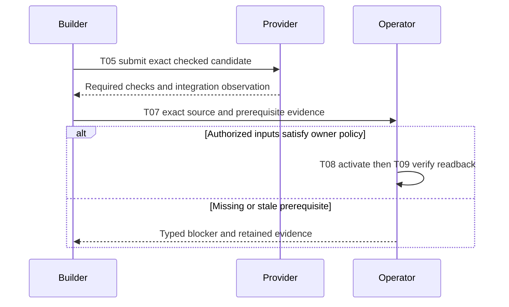
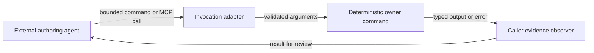
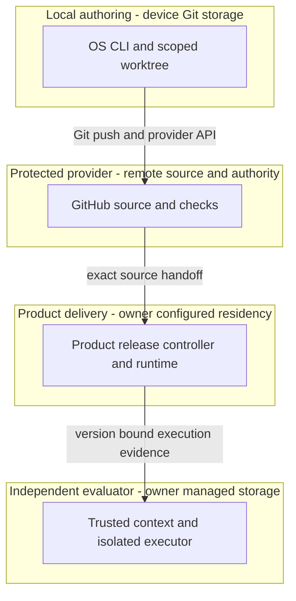

# Reference implementation — As-built ADLC pipeline
This document owns source-to-completion governance; acceptance grants no deployment authority.
Current pins live in [`catalog/composition-source-lock.json`](../catalog/composition-source-lock.json);
[TECH-STACK.md](TECH-STACK.md) owns refresh commands. Historical evidence retains its exact subject.
[TECH-STACK.md](TECH-STACK.md) owns technology selection, product composition and deployment topology. [FEATURES.md](FEATURES.md) owns the derived feature index; [catalog/features.json](../catalog/features.json) owns commercial ranking input. The website [guidelines][guideline], [templates][templates], [continuity module][continuity] and [CID contract][cid] own authoring semantics. This guide adds pipeline requirements and traceability, without copying those contracts or product requirements.
The [maturity rubric][maturity], [source assessment][maturity-grounding] and [naming][document-naming]
load on demand; readiness, experience and demand remain distinct. Historical evidence retains its subject.
## Identity and opening directive
[PRD](#prd), [TAD](#tad), [ADR](#adr), [MVP](#mvp) and [GTM](#gtm) join `PRD-TAD-ADR-ADLC-PIPELINE-001@1.4.2`. TAD consumes that PRD; ADR binds that TAD. Resolve companions through [source bindings](#codebase-grounding-record). Requirement changes re-derive affected design, decisions, RAO and evidence before execution.
**SSOT and precedence.** This joined PRD/TAD/ADR is the single source of truth for the from-0-to-1 pipeline: every T01–T09 transition consumes one criterion, design row and decision from it by continuity ID and exact revision. On conflict, precedence is this document → [TECH-STACK.md](TECH-STACK.md) (composition, topology, stack decisions) → [FEATURES.md](FEATURES.md) (derived index) → README, workflow and runtime documents (navigation and commands only). Consumers reference this document and never restate, widen or contradict it; `docs/adlc-guidelines.md` binds them to that rule, and a competing statement is a `duplicate-owner` finding under the shared authoring set. A missing or stale join blocks only the affected transition.
**DIR-PIPELINE-01** — Context: the source bindings expose independently owned authoring, lifecycle and product release controls, with Commerce integration gaps G08–G10 below. Intent: a solo operator can complete the smallest authorized outcome without losing work or mistaking source checks for delivery. Directive: document the existing source-to-production path, bind each acceptance condition to its owner and check, and expose missing production evidence. Role/Subject: ADLC pipeline architect. Action: specify the implemented pipeline and its owner handoffs. Outcome: one reviewable specification with criterion-to-design-to-check joins. Verb/Object: specify / the implemented pipeline and its owner handoffs. This prose consumes the shared CID/RAO/SVO fields, not a new serialization.
## PRD
**Continuity:** `PRD-TAD-ADR-ADLC-PIPELINE-001` · PRD `1.4.2`.
### Problem, personas and minimum outcome
A solo operator loses time locating source owners, repeating validation and recovering stale worktrees. A successful source merge can also be mistaken for a successful product release. Existing scoped lanes, exact integration observations and source-bound check discovery address these engineering problems; customer willingness to pay remains unvalidated.
As a **builder**, I want requirements, source owners and checks joined before editing so I can implement one bounded change. As an **operator**, I want exact candidates and separate release receipts so I can promote and recover the intended version. As a **reviewer**, I want acceptance evidence tied to its actual scope so I can reject a false completion. The downstream buyer journey is discovery → deliberate confirmation → settlement → receipt/readback; F01–F05 own that product behavior.

The minimum outcome is one source-owned change that can be authored, checked, integrated and handed to the product's release/evidence owner. A runtime outcome additionally needs that owner's deployed acceptance results. A paid loop additionally needs actual payment and replay receipts.

**P01 inspiration pain:** the operator asks for native feature changes informed by an external repository
but needs a grounded proposal before implementation. Hook: an outside capability suggests value; break:
reference material alone does not establish local capability or permission; fix: reuse the local plan and
request authorization for its concrete delta; close: complete the authorized scope and prepare release
evidence. The 2026-09-14 user request establishes this workflow need; demand and savings are unmeasured.
Reuse the existing authoring/handover path; add only the missing default, without a new runtime component.

### Acceptance and verification contract

Each `AC-Pnn` states Given/When/Then. Its `VCC-Pnn` is the stated check plus the observable outcome and constraint in the same row. Checks are starting points: no named file, structural match or passing subset satisfies outcomes it did not exercise. Scope is this pipeline; feature IDs refer to the unchanged composition index.

| Criterion / condition | Given → when → then; scope constraint | Owner check and feature join | TAD / ADR |
|---|---|---|---|
| AC-P01 / VCC-P01 | Given exact input revisions, when the author resolves intent to design, then every criterion has one owner, a grounded component, a check and an exact five-role handover join; external inspiration follows the native feature default, including implementation authorization, existing MCP/invocation reuse, measured resource use and source-use constraints. Preserve shared CID meanings and product intent. | OS `npm run check` plus source/companion/criterion join review, the native inspiration acceptance cases and the shared frontmatter parser; F20. | T01 / ADR-P01, ADR-P04, ADR-P05 |
| AC-P02 / VCC-P02 | Given the bounded candidate catalog, when constraints and evidence are ranked, then selection has admissible evidence or explicitly returns no selection; missing demand must not invent a payer or block disjoint technical work. | `node --test __tests__/rank.test.mjs __tests__/rank-security.test.mjs`; F16. | T02 / ADR-P02 |
| AC-P03 / VCC-P03 | Given a trusted profile and requested paths, when a lane starts, then the selected successor is hydrated and current ownership rechecked before writes; only a disjoint registered scope is provisioned and conflicting scope is refused; canonical stays an observation surface. | `node --test __tests__/lean-sprint-completion.test.mjs`; F12. | T03 / ADR-P02, ADR-P04 |
| AC-P04 / VCC-P04 | Given owner source and result bindings, when checks are discovered and composition inspected, then mismatched or absent evidence is reported without executing sibling code or upgrading its coverage; reuse existing MCP/invocation routes, bounded reads and matching check receipts. | `node --test __tests__/check-discovery.test.mjs __tests__/composition-runtime-check.test.mjs`; F17/F18. | T04 / ADR-P02, ADR-P05 |
| AC-P05 / VCC-P05 | Given a checked scoped diff, when it is published, then the owner handover and exact reserved changes are bound to the selected protected candidate; later edits use a successor and a cached local record grants no provider authority. | `node --test __tests__/lean-sprint-completion.test.mjs __tests__/lane-cache-publication-race.test.mjs`; F12/F13. | T05 / ADR-P02, ADR-P04 |
| AC-P06 / VCC-P06 | Given an integrated candidate, when completion or cleanup is requested, then exact integration and each authorized cleanup effect remain independently verified and the observed result informs one successor Context; dirty or changed targets retain owner bytes. | `node --test __tests__/integration-cleanup-proof.test.mjs __tests__/completion.test.mjs __tests__/cleanup.test.mjs __tests__/canonical-sync-race.test.mjs`; F13/F25. | T06 / ADR-P02, ADR-P04 |
| AC-P07 / VCC-P07 | Given selected operation requirements, when flight evaluates their presence and freshness, then only the selected scope is gated and the result grants no effects; no manifest means no invented enrollment. | `node --test __tests__/lifecycle-flight.test.mjs`; F18/F19. | T07 / ADR-P03 |
| AC-P08 / VCC-P08 | Given an eligible Free/FOSS executor and exact release inputs, when Commerce activates and independently evaluates them, then release, isolated execution, lifecycle identity and readback agree; preserve admission and never substitute a local runner test for a deployed transport. | Commerce [release safety][commerce-release-test], [executor test][commerce-executor-test], [context test][commerce-context-test], then live owner receipts; F07–F09/F19. **Unfinished** at G08–G10. | T08 / ADR-P03 |
| AC-P09 / VCC-P09 | Given those deployed owner versions and a valid confirmation, when the buyer completes and replays checkout, then receipt/readback matches and no second money effect occurs; offline drafts never authorize offline settlement. | F01–F05 owner checks and TECH-STACK runtime VCCs, followed by actual provider and replay evidence. **Unverified here**; demand remains separate. | T09 / ADR-P03 |
PRD→TAD coverage is **9/9 criteria**, TAD→PRD is **9/9 steps**, and Directive→RAO coverage is **9/9 derived outcomes** through T01–T09. These ratios measure linked specification coverage, not passed acceptance conditions.

### Priority, economics and open questions

**Must:** reuse T01–T07 and the completion primitive T06; close the product-owned T08 gaps before the T09 runtime demonstration. **Should:** improve measured iteration cost, the P04-M shared-memory invocation handoff and optional generated publication F21. **Could:** live agent-state memory tiers (the separately accepted [shared-memory startup](MEMORY.md) covers curated context only), merchant/shopping roles and spatial extensions F22–F24 after demand or a measured bottleneck. **Won't in this revision:** new orchestration controllers, copied schemas, paid infrastructure, new dependencies, invented provider receipts or customer selection. ROI score for every tier is **unmeasured**; ordering reflects dependency closure and existing-code reuse, not a commercial winner.

Historical timing, clonability and cost observations remain in the
[predecessor metrics](https://github.com/huijoohwee/agentic-os/blob/934f44fd30df4b23829a29df6cbe8d6456f7616d/guides/PRD-TAD-ADR-MVP-GTM.md#priority-economics-and-open-questions).
This successor adds no runtime dependency; the handover routing delta is recorded in MVP within the
40,960-byte always-load cap. The shared-memory proposal adds at most 8 KiB to the 63,046-byte on-demand baseline;
it remains below 600 lines and reuses historical evidence links instead of another planning module. Restart time, TCO, ROI and willingness to pay
remain unmeasured. Selection uses existing bounded admissibility and evidence, never invented demand.
## TAD

**Continuity:** `PRD-TAD-ADR-ADLC-PIPELINE-001` · TAD `1.4.2` consumes PRD `1.4.2`, decisions ADR `1.4.2`.

### Journey-to-system and RAO steps

T01–T09 are independently closable task references within DIR-PIPELINE-01, not new lifecycle states. In each row, Role is Subject; the first verb and remaining target in Action give SVO. Outcome is the referenced acceptance condition, not the object of a different instruction. Context is the source binding and prerequisites; all inherit the opening intent. Re-run only changed joins and dependent evidence.

| Step / stage | Role and action (SVO) | Input → output / component | Prerequisites and outcome |
|---|---|---|---|
| T01 / specify | Author resolves requirements | Grounded intent + companion revisions → joined PRD/TAD/ADR; shared authoring rules | Bounded objective; P01. Native inspiration default below; author/agent workflow, no automatic compiler |
| T02 / select | Ranker evaluates candidates | Digest-bound JSON + admissibility evidence → selection or explicit refusal; [ranker][rank] | Commercial use of T01; P02. Safe technical work need not select a payer |
| T03 / scope | Lane adapter reserves paths | Canonical profile + declared write set → registered branch/worktree; [worktree][worktree] | T01 and source ownership; P03. Local reservation is not a cross-device authenticated lease |
| T04 / verify | Check observer binds evidence | Owner descriptors/results → unsigned discovery report; [checks][checks], [composition][composition] | T03 candidate; P04. Owner runners execute required affected checks and final gates |
| T05 / publish | Publisher binds candidate | Exact scoped diff + checks → immutable published head/provider handoff; [CLI][cli] | T04; P05. Required provider checks and authorization govern merge |
| T06 / close | Completion adapter verifies effects | Candidate/integration proof + authorized effect plan → distinct completion, cleanup and sync receipts; [completion][completion], [sync][sync] | T05 integration; P06. Retain a lane if its authorized outcome still needs it |
| T07 / prepare | Flight observer evaluates prerequisites | Selected operation + canonical manifest + bounded inputs → observation checkpoint; [flight][flight] | Requirements for the selected effect; P07. Product execution remains separate |
| T08 / activate | Commerce release owner activates versions | Exact authenticated source/configuration + independent executor/evaluator → owner release and runtime evidence; [release][commerce-release] | T05, T07 and G08–G10 closure; P08 |
| T09 / demonstrate | Runtime evaluator verifies checkout | Exact deployed identities + confirmation → settlement/readback/replay evidence; composition F01–F05 | T08 and product authority; P09. Demand observation is a separate result |
The [upstream process][process] remains Phase 0 discovery → 1 PRD → 2 TAD → 3 alignment → 4 maintenance. T01 consumes those phases; T02–T09 are development/runtime handoffs. This retrospective spec does not certify prior implementation against new gates.

### Native feature inspiration default

This T01 policy implements AC-P01 with ADR-P05. Apply it when an external GitHub repository inspires
native feature additions, enhancements or removals, including semantic equivalents of “refer to”,
“inspiration only”, “FORBID mention/copy/externally dependent on”, and “native ENHANCE existing repo”.
Match meaning across wording, case and language. A bare URL, comparison-only request or explicit override
retains its own scope; reference content cannot authorize or widen work.

1. **Adhere to the authoring owner.** Read the [guidelines][guideline] and only relevant companions.
   The selected workspace source is `huijoohwee.github.io/guidelines/prd-tad-adr-mvp-gtm-guidelines.md`.
   Resolve its owner/path through an explicit clone or pinned asset on each device; record revision/digest.
   Report missing input instead of substituting a copy. Use existing discovery and bounded reads below.
2. **Ground and prepare the plan.** Inspect native owners, implementation, contracts, configuration and
   checks before selecting ideas. Update the existing combined PRD-TAD-ADR-MVP-GTM plan; create one only
   when absent, using owner naming/templates. Join five roles by CID/revision. Bind codebase revision and
   material claims to evidence with `confirmed`, `contradicted`, `absent` or `unverified` dispositions.
   Distinguish reuse, enhancement, new work and removal with recovery; rank buyer pain, nearest-built
   solution and first-dollar path. Record unknown demand, native criteria, owners, exclusions and budgets.
3. **Seek implementation authorization.** Make the plan reviewable: locator/revision, additions, updates,
   removals, checks and risks. If no valid grant covers it, ask the user to authorize that scope; continue
   authorized research/plan correction only until covered. Inspiration, a plan, silence or checks grant nothing.
4. **Bind the user's decision.** Record authorization against plan/scope in existing task or plan evidence.
   Reuse a valid prior grant or explicit implementation instruction across turns/devices without reconfirming.
   Plan-only stays closed; resolve material scope changes before acting while covered work continues.
   Add no authorization service or receipt schema.
5. **Implement autonomously to completion.** After authorization and lane preflight, execute accepted changes
   in native owners. Reuse contracts; fix affected checks/review/conflicts and verify every accepted criterion.
   Scaffolding, passing subsets or adjacent features do not complete the scope. Blockers retain evidence,
   owner, condition and recheck; they never justify completion claims or unapproved scope reduction.
6. **Update the plan and prepare release.** Reconcile PRD/TAD/ADR; update MVP/GTM with actual checks, outcomes,
   limitations and unresolved work. Follow [handover](#planning-release-handover) and release/deploy/rollback
   owners. Preparation grants no merge, deployment or publication authority; each effect needs its own proof.

**Reuse invocation owners for time/resource economy (T01/T04; AC-P01/P04).**
- Discover one owner with existing MCP `capabilities` (`query`/`kind`/`limit`), then resolve only needed
  content by exact `id`/`root`/`revision`; [Fleet discovery](../FLEET.md#on-demand-capability-discovery)
  owns limits and caching. Prefer metadata first; cache content by repository/revision/path/digest.
- Reuse the [invocation core](INVOCATION-CORE.md), [dictionary](INVOCATION-DICTIONARIES.md) and executable
  [catalog](../catalog/invocation.json): `/` selects a command, `#` its semantic and `@` an opaque binding.
  For check discovery use MCP `checks` with `input`, or `/checks '#read-only' '@input:./checks-input.json'`
  through the existing CLI. This reads owner references/results; it does not run tests or grant authority.
- Select one existing transport per action: MCP for agent calls, local module/CLI for same-host work;
  retain the supported local fallback when MCP is unavailable. Do not duplicate calls across transports,
  invent `/capabilities` or aliases, rebuild adapters/catalogs, or treat dictionary entries as executable.
- Run the owner's affected/dependency-aware checks; reuse receipts only for matching inputs/environment
  and required coverage. Refresh invalidated evidence and volatile authority; retain required final checks.
  Narrow truncated results, honor owner deadlines/byte caps, and stop unchanged failing retries.
- In MVP/GTM record elapsed time, calls, bytes read, suites selected/skipped/reused and observed cost/tokens;
  label unavailable values unmeasured. Parsing has no model calls; that does not make tool execution free.

Honor no-mention/copy/dependency restrictions in research, plans, code, tests, build configuration, comments, commits, PRs and reports. Use native neutral terms; reproduce no reference code/assets/prose/branding, vendor no reference packages/submodules/services, and require no reference fetch at build/runtime.
Concepts do not prove native capability. Keep required provenance private where permitted with a neutral evidence locator; resolve conflicting obligations before adoption, without concealing reuse or removing legal attribution.

**ASSET-META-01; explicit 2026-09-21 enhancement authorization.** PRD: creators need discoverable text-authored editable assets. TAD: extend only canonical command/semantic dictionaries with `/asset.create @text #procedural-asset`; Graph owns validated construction, deterministic controls, persistence and GLB export; Canvas owns skill/preset contracts and exact-pin projections. ADR: reuse `@text`, preserve image-only contracts, require separate text evidence and editable companions, and grant no execution, source-evaluation, provider or deployment authority. MVP: validate grammar, catalog digest, offline packaging and unchanged image routes, then hand off the protected revision; consumer runtime proof remains separate. GTM: reduce creator handoffs; demand, savings and revenue remain unvalidated. Check: invocation-core plus affected `npm run check`. Budget: four files, 8 kB added source, 45 active minutes, zero dependencies or always-load delta; provider waits stay separate. Rollback: reviewed source revert; preserve existing authored assets.

Existing flow diagrams consume this inside T01/T04; startup reaches it through handover. No new runtime, keyword parser or authorization engine is introduced. Live agent traces must prove behavioral/economic gains.

### Planning release handover

For external-repo inspiration, apply the [native feature default](#native-feature-inspiration-default) at start.
This bounded authoring behavior implements AC-P01/P03/P05/P06 through T01/T03/T05/T06 and ADR-P04.
Shared [planning roles][planning-record] and [artifact continuity][handover-continuity] own the semantics;
this guide owns the lifecycle checkpoints. The predecessor is
`PRD-TAD-ADR-ADLC-PIPELINE-001@1.1.2` at OS `934f44fd30df4b23829a29df6cbe8d6456f7616d`.
Only these affected joins are re-derived; historical grounding and runtime evidence retain their subjects.

1. **Before land (T01/T05):** update the affected capability's existing plan in the implementation lane.
   PRD states pain and payer evidence, including unknown demand/economics; TAD and ADR consume its
   criteria; MVP scope and GTM evidence derive from them. Join all five roles at one CID/revision.
   Record changed criterion/design/decision IDs, source paths, exact dependency revisions, reused/new
   boundaries and current validation conditions. Different capabilities retain their own CIDs.
2. Prepare a compact handover in that plan's existing evidence section or evidence companion; split
   only for an actual size/review need. Cite the accepted plan, guideline pin, affected repositories,
   criterion → check → result → evidence locator, evaluator, surface, limitations and unresolved work.
   Evidence introduces no requirements. Scope changes create a successor Context and preserve history.
3. Run affected planning/continuity checks, the [Fleet ownership check](../FLEET.md#cross-repository-source-ownership)
   and each changed repository's required checks. A named command is a check plan, not a passed result.
   Reuse evidence only for its exact subject, dependencies and surface. Conflicting owners, stale joins
   or missing Must evidence block the affected transition. Commit and use protected `land`; CI receipts
   bind the actual candidate SHA/tree outside its committed bytes. Never predict merge/deploy success.
4. **After merge (T06):** observe the protected merge and required check results; append immutable evidence
   through the existing evidence or PR owner. Include deployment identity only for a separately
   authorized deployment with passed release checks. Use native `finish`, then applicable cleanup and
   canonical-sync workflows. Record actual worktree outcome/recovery locator; retained branches,
   archive, integration and authenticated lease retirement are separate observations.
5. Create one new immutable Context under the enrolled workspace's `sources.todo.path` and existing
   `todo/YYYY-MM/` contract. Reuse its four-column CID/RAO/SVO row and `continuity_id@revision`;
   cite the predecessor, exact source/merge refs, result locators, unresolved findings, one next bounded
   intent, owner, prerequisites and named completion check. Update authored Kanban state through its
   owner and regenerate the ledger projection. Do not create a second handover schema or task registry.
6. **Next start (T03):** reuse the [workspace](WORKSPACE.md) receipt already returned by startup, without
   another sync. Read the selected successor and its exact plan/evidence on demand at `sourceRevision`;
   use [memory](MEMORY.md) for relevant retained decisions. Resolve enrollment from protected
   `.agentic-os-workspace.json`; recheck live ownership, source freshness and applicable authority before
   writes. Context, a cache, an MCP response or transport access grants no execution authority.

Essential mode here permits `.todo` and `.memory`; startup does not publish local edits. Publish through
that private owner's publication workflow and verify the receiving revision before claiming availability.
Artifact bodies stay local; keep private evidence private and never widen the allowlist for a handover.

[Implementation allocation](../FLEET.md) retains the existing owners: Graph owns Launch Copilot's plan and
runbook when its reviewed successor exists; `81rv10` and the public entry consume that runbook. Canvas,
Commerce and GameXR update only changed capability contracts and dependency joins. Register an artifact
only after it exists. Generated production mirrors receive protected projections from source owners.
Use pinned local source reads or the existing discovery/MCP surface; there is no new runtime, service,
model call, catalog, dependency or poller. Source authority and freshness remain independent of transport.

### Five flow patterns

**Diagram PIPE-J1** · Class: Journey stage map · Notation: flowchart LR · Version: 1 — 2026-09-09 · Surface: markdown-canvas
**Caption:** The builder hands an integrated change to the operator, who obtains separate delivery evidence.

| PIPE-J1 node | Journey inventory / acceptance |
|---|---|
| intent | Bounded engineering objective; P01–P03 |
| candidate | Source-owned implementation/checks; P04–P05 |
| integrated | Provider integration observed; P05–P06 |
| release | Product deployment boundary; P07–P08 |
| evidence | Runtime demonstration; P09 |
**Diagram PIPE-W1** · Class: User workflow · Notation: sequenceDiagram · Version: 1 — 2026-09-09 · Surface: text-only
**Caption:** A protected source merge precedes owner activation, while failed prerequisites preserve the candidate.

| PIPE-W1 participant | Happy / alternate / error inventory |
|---|---|
| Builder | Author/check/publish; successor for later edits; preserve dirty work |
| Provider | Protected exact-head merge; pending check waits; changed head invalidates observation |
| Operator | Product release and proof; retry only under owner replay policy; missing inputs stop affected activation |
**Diagram PIPE-D1** · Class: Data flow · Notation: flowchart LR · Version: 1 — 2026-09-09 · Surface: markdown-canvas
**Caption:** Source-bound observations and authenticated receipts remain distinct data products.

| PIPE-D1 node | Data inventory / residency |
|---|---|
| spec | Versioned Markdown; owning Git repository |
| source | Commit/write-set identity; local Git and selected remote |
| checks | Declared command, revision, outcome, coverage; caller-owned bounded files/output |
| receipt | Authority result; authenticated provider and caller evidence store |
| proof | Version/configuration-bound results; product/evaluator owner; no secrets in Markdown |
**Diagram PIPE-H1** · Class: Orchestration / harness flow · Notation: flowchart LR · Version: 1 — 2026-09-09 · Surface: markdown-canvas
**Caption:** An external authoring agent invokes deterministic tools and receives observations; the CLI does not run an LLM loop.

| PIPE-H1 node | Harness inventory / input → output / cost and fallback |
|---|---|
| agent | Session objective + shared CID → scoped calls; model tokens belong to caller, unmeasured here; stop/escalate on unresolved decision |
| adapter | CLI argv or MCP tool arguments → validated command; [invocation][invocation] / [MCP][mcp]; no model calls; typed invalid-argument error |
| executor | Profile-bound command → bounded JSON/text; existing timeout/cancellation; no model cost; fail closed |
| observer | Command result → reviewer-visible evidence; no authentication inferred; absent/interrupted result stays unknown |
This document adds no AI-powered runtime component. For the external authoring/review cycle, cap corrections at **3 iterations**, break on no reduction in blockers across **2 consecutive cycles**, and escalate the affected decision. These are session execution constraints, not claimed CLI-enforced global loop or token limits. Product agent cost logs, typed harness contracts and fallbacks remain with F10 and TECH-STACK.

**Diagram PIPE-T1** · Class: Runtime topology · Notation: flowchart TB · Version: 1 — 2026-09-09 · Surface: markdown-canvas
**Caption:** Local authoring, protected provider authority and product runtime evaluation have separate trust boundaries.

| PIPE-T1 node | Role / type / lane / source | Residency and status |
|---|---|---|
| harness | Orchestrator / CLI / authoring / [CLI][cli] | Local clone/worktree; local `spec-complete`, delivered `undocumented` in this spec |
| github | Authority adapter / remote service / authoring integration / [authority][authority] | Remote provider policy; local `spec-complete`, delivered `undocumented` |
| runtime | Product owner / release service / delivery / [Commerce release][commerce-release] | Current deployment unverified; local `spec-complete`, delivered `undocumented`; G10 gap |
| verifier | Independent evaluator / process service / delivery evidence / [runtime context][commerce-context] | Must be outside candidate worktrees; enrollment unverified; local `spec-complete`, delivered `undocumented` |
| Diagram register | Class | Notation / surface | Projects | Nodes / edges / clusters | Version |
|---|---|---|---|---|---|
| PIPE-J1 | Journey stage map | flowchart LR / markdown-canvas | yes | 5 / 4 / 0 | 1 |
| PIPE-W1 | User workflow | sequenceDiagram / text-only | no | 0 / 0 / 0 | 1 |
| PIPE-D1 | Data flow | flowchart LR / markdown-canvas | yes | 5 / 4 / 0 | 1 |
| PIPE-H1 | Orchestration / harness flow | flowchart LR / markdown-canvas | yes | 4 / 4 / 0 | 1 |
| PIPE-T1 | Runtime topology | flowchart TB / markdown-canvas | yes | 4 / 3 / 4 | 1 |
### Interfaces, quality attributes and recovery

| Contract / attribute | Implemented behavior and limit | Evidence / limitation |
|---|---|---|
| Governance root | `claim`, `continue`, `integrate`, `retire` construct unsigned requests; receipt hashes bind bytes, not actors | [governance][governance], [contract tests][governance-test]; authenticated/fenced verification belongs to adapters |
| Repository identity | Committed `.agentic-os.json` plus clone-common setup trust anchors canonical identity; full Git revision consumer pins | [governance guide][governance-guide]; local TOFU is not a lease or promotion grant |
| Invocation / MCP | Shared `/`, `@`, `#` grammar; stdio tools `doctor`, `status`, `checks`, `reap`, `lane` | [invocation][invocation], [MCP][mcp]; no claim every CLI mutation is an MCP tool |
| Check discovery | `agentic-os/check-discovery-input/v1` maps up to 32 owner roots; optional `agentic-os/check-result-observation/v1` binds reported coverage | [checks][checks]; 64 KiB input/results, 128 KiB owner files, output below 500 kB, 30-second CLI deadline; no owner execution or network calls |
| Composition grounding | Lock-selected source bytes compared without executing sibling runtime code | [composition][composition], [source lock][source-lock]; a pass proves static joins only |
| Flight | `pre`, `in`, `post` checkpoints use v1 requirements or v2 operation subsets | [flight][flight]; `observationOnly: true`, `authorizesEffects: false`; root baseline has no enrolled manifest; no process start/probe/stop |
| Concurrency and integrity | Local disjoint reservations; exact provider head and live authority checks where applicable; ancestry or exact mode/type/blob integration identity | [worktree][worktree], [authority][authority], [patch identity][patch]; patch-ID alone is diagnostic; local reservations do not solve authenticated cross-device leases |
| Resources and offline operation | Lazy guides, bounded readers, zero runtime dependencies; local inspection survives offline | [budgets][budgets]; provider publication/revalidation requires connectivity; user mobile/offline drafts remain product F05 |
| Finish / cleanup | Finish observes `agentic-os/sprint-finish/v1`, reports `grantsAuthority: false` and retains worktree; cleanup adapters verify separate effects | [completion][completion], [cleanup][cleanup]; registered path removal requires exact eligibility and authorization, never blanket pruning |
| Canonical recovery | Read-only plan binds target, inventory and recovery ref; dirty inventory copies then stops; only empty inventory can advance under explicit exclusivity | [sync][sync]; ignored paths retained, branch update compare-and-swap; external quiescence is asserted, not OS-proven; interruption retains named recovery artifacts |
Source integration and product deployment are distinct. T06 may close a source-only lane after its authorized value is integrated; it cannot close a runtime outcome whose evidence is pending. On stale scope or provider heads, observe again and use the owning successor/recovery path. Never treat a failed command as permission to reset, force-prune or retry a potentially completed money effect.

### Deployment boundary register

The document grants no effects. Existing user authorization continues to apply to its exact scope; runtime effects need their own current owner inputs and receipts. Source release follows [START-WORKFLOW][start] and [RELEASE-WORKFLOW][release]; product owners retain deployment and rollback policy.

| Boundary | From → to | Evidence and operator instruction | Recovery / state |
|---|---|---|---|
| Specification integration | Authoring → protected OS source | Exact candidate, full `npm run check`, required provider checks; standing user instruction authorizes green PR completion | Successor/reviewed revert; closed until candidate checks and authorization match |
| Product activation | Protected source → delivery | T08 owner source/configuration and authority; no product activation instruction is granted by this document | Commerce owner forward recovery; closed here, G08–G10 unresolved |
| Product publication | Graph source → verified product → generated mirror | F21 and owner release workflow; mirror never authors product source | Owner deploy/verify/mirror sequence and rollback; closed here |
| Runtime acceptance | Delivery → verified evidence | T09 exact release identity, trusted evaluator and provider/replay readback | Preserve failed evidence; owner correction and re-evaluation; closed here |
| Completion | Integrated lane → exact cleanup → canonical sync | T06 integration observation plus each separately authorized effect | Recovery ref/private preservation receipt; closed until target and authority revalidate |
## ADR

**Continuity:** `PRD-TAD-ADR-ADLC-PIPELINE-001` · ADR `1.4.2` binds PRD/TAD `1.4.2`. These records document current architecture and this documentation placement. They do not adopt a new runtime or reopen existing stack decisions.

| Decision | Context and decision / alternatives | Rationale, consequences and recovery |
|---|---|---|
| ADR-P01 — One pipeline specification | **Accepted, 2026-09-09.** Keep one lazy combined document with explicit revisions. Alternatives: enlarge TECH-STACK; create separate PRD/TAD/ADR files; FOSS alternative: use the same Markdown/Git toolchain split by artifact. | SRP separates pipeline governance from product topology and feature inventory; one file minimizes review/token cost. Cost: links need refresh. Recover through Git history and a joined successor; never duplicate the schema. TECH-STACK DR-10/11 remain the composition-owner decisions. |
| ADR-P02 — Reuse deterministic owner controls | **Accepted as-built, 2026-09-09.** Reuse native records, lane/check/authority adapters and ranking. Alternatives: another autonomous meta-controller; manual FOSS Git and shell commands. | Existing contracts reduce implementation/TCO and preserve concurrency semantics. Manual Git is a fallback, but loses automatic scope/evidence checks; a second controller adds competing authority. No LLM dependency or new always-loaded module. Recovery remains with the exact owner adapter. TECH-STACK DR-7/8 remain unchanged. |
| ADR-P03 — Keep product activation and proof owner-bound | **Accepted as-built boundary, 2026-09-09.** Free-only policy and independent evidence constrain T08/T09; the current local Podman runner is reusable but not a complete hosted transport. Alternatives: existing paid Containers path (ineligible under current policy); FOSS Podman/workerd on an existing host (transport/availability proof pending). | No new subscription or weakened isolation to manufacture completion. Host, credential and lifecycle binding evidence remains required. Product/runtime gaps do not disable source work or force a customer choice. TECH-STACK DR-6/11 own recovery and stack constraints. |
| ADR-P04 — Owner-bound release and restart | **Accepted for this successor, 2026-09-13.** T01/T03/T05/T06 consume the existing capability plan, Fleet registry and private Context/Kanban contracts. Alternatives: a central copied product plan or a new handover service. | One source per capability preserves exact revisions and private evidence; short workflow links keep loading bounded. Validate P01/P03/P05/P06 by source/join review, Fleet and owner checks. Reopen only on measured restart failure; recover with preserved prior records and a joined successor. |
| ADR-P05 — Plan native inspiration before implementation | **Accepted, 2026-09-14 user instruction.** Extend T01/T04 and existing plan/handover with the native feature default; reuse MCP, invocation/check owners and exact prior authorization. Alternatives: immediate implementation from a reference, one new plan per prompt, or a runtime keyword gate. | Grounding and a concrete scope decision preserve native ownership and user control within this existing specification. Semantic interpretation stays with the authoring agent; no new adapter, catalog, dependency or copied guideline. Measure gains; never infer them from a shorter token form. Recovery is a reviewed successor/revert; new scope requires its own covered decision. |
The predecessor's [TCO comparison](https://github.com/huijoohwee/agentic-os/blob/934f44fd30df4b23829a29df6cbe8d6456f7616d/guides/PRD-TAD-ADR-MVP-GTM.md#adr)
retains the local FOSS, existing-host and excluded paid-container alternatives with unmeasured economics.
All decisions retain zero new paid services, existing owner contracts and explicit evidence boundaries.

## Codebase grounding record

The exact original input table, G01–G14 observations and source-specific limitations remain in the
[accepted predecessor grounding](https://github.com/huijoohwee/agentic-os/blob/934f44fd30df4b23829a29df6cbe8d6456f7616d/guides/PRD-TAD-ADR-MVP-GTM.md#codebase-grounding-record).
They are historical evidence, not current dependency pins or retrospective conformance proof.
Current composition pins remain in `catalog/composition-source-lock.json`.

For the retained P08/P09 scope: G08 names Commerce's hosted-transport gap, G09 its retired lifecycle
verifier dependency, G10 missing live evaluator/release binding evidence, and G12 unverified paid-loop
and demand evidence. These historical findings are not closed by this documentation successor;
re-observe their owning source before a product transition. G13 records the prior clonability defect
and G14 the observed absence of abandon/widen lane events; only the current lifecycle owner may change
those behaviors. P01/P03/P05/P06 now use the bounded handover above at this exact specification revision.
## MVP

### Shared-memory invocation (P04-M, authorized implementation)

All five roles below join `PRD-TAD-ADR-ADLC-PIPELINE-001@1.4.2`, refining AC-P04/T04; ADR-P06 is accepted under the 2026-09-21 explicit P04-M1–M5 authorization.
The unchanged native-inspiration cases and handover checks remain in the [exact predecessor](https://github.com/huijoohwee/agentic-os/blob/3559f18aeef6b0f2eb13bb95820f426a8e4e2301/guides/PRD-TAD-ADR-MVP-GTM.md#native-inspiration-acceptance-cases). Current T01 policy still governs authorization and source restrictions.
**PRD / directive:** the operator retrieves a cited prior decision and prepares one reviewed learning proposal from the same shared source across tasks/devices. Pain: CLI-only recall is easy to miss in an MCP-driven task; switching stores can surface duplicate or stale context. This is an observed access gap, not measured customer demand. Reuse `TASK-MEMORY-001`, whose [memory guide](MEMORY.md#task-operating-model-task-memory-001100) remains the retrieval/publication contract owner; this proposal owns only its discovery/invocation handoff.

| Rank / slice | Buyer pain → nearest native solution → first-dollar hypothesis |
|---|---|
| 1 / Must | Repeated briefing and missed decisions → expose existing pinned CLI search/read/capture through the local MCP boundary and existing catalog → test an operator continuity pilot; a $1 assisted setup offer is a hypothesis, with no payer, payment or conversion evidence. |
| 2 / Later | Browser/mobile access to the same decisions → existing Graph WebMCP/control surface after an authenticated local bridge and private-data boundary are specified → test only after the local pilot demonstrates demand. |
| 3 / Later | Runtime learning quality → existing Graph persistent state and reviewed skill-evolution/Toolkit owners → require a comparable evaluated cohort before expansion; no new agent or memory backend. |

**TAD / grounding:** inspection is source-level unless an executed observation is identified. These inputs are observations, not new dependency pins or integration authority.

| Evidence / disposition | Exact owner and consequence |
|---|---|
| Confirmed / portable shared knowledge | OS `3559f18aeef6b0f2eb13bb95820f426a8e4e2301`: `bin/agentic-os-memory.mjs`, `bin/agentic-os-memory-task.mjs`, `guides/MEMORY.md`. Startup selected shared source `de28c45787e5988c17ad545eae189143cd7ae2c9`, reused its accepted index and returned three curated records. A live pinned `memory search --query=memory` returned cited records without refreshing. |
| Absent / discovery and MCP handoff | At that OS revision, `capabilities --query=memory --limit=5` returned zero entries; `src/mcp-server.mjs` and `catalog/invocation.json` expose no task-memory tool/route. Shared dictionaries already declare `/memory.search`, `#memory-search`, `#truth`, `#vcc`, `@agent`, `@memory-store`, `@operator`; reuse their meanings. |
| Confirmed / durable runtime already exists | Graph `b242ab5d82c49155808a86b45565c797f8e04f61`: `mcp/persistent-memory-store.js`, `persistent-memory-runtime.js`, `persistent-memory-contract.mjs` provide a separate scope/revision/idempotency contract and executable memory tuples. This code is not a Git knowledge publisher. Existing working-tree edits in unrelated workspace seeds remain owner-bound. |
| Confirmed / learning contracts already exist | Canvas `141e14604665ddfa1fdec8bfd5d532f6dc4f9298`, `docs/PRD-TAD-ADR-MVP-GTM.md`, owns memory/learning product requirements; OS `runtime/agents/agent-toolkit-optimizer.js` and Graph `mcp/skill-evolution-runtime.js` are retained learning owners, not duplicated by this proposal. Runtime/provider effectiveness remains unverified here. |
| Confirmed / authoring source; bounded review | Website `1b2820d8d1da5246d8d6adedd99a2e39ba1eb4fd` exposes guideline `3.1.0` with lifecycle status `proposed`, blob `54831bcac50031d566df825c4bad705d6805babf`. Its current guidance informed discovery; this bounded successor does not certify adoption of every new guideline or alter historical pinned evidence. |
| Contradicted / already solved end-to-end | CLI persistence and a runtime memory store do not establish shared MCP retrieval, browser parity, current facts or learning gains. The three retrieved records include historical ownership; citations must be checked against current source before effects. |

**TAD / data and invocation boundary:** explicit workspace enrollment → accepted Git revision → existing local CLI owner → bounded MCP response → caller-selected cited context. Default durable knowledge is `GitHub/.workspace/.memory`; clone-local derived caches stay under `.workspace/.git`. No vendor-memory lookup, import, symlink, rewrite, fallback or union. The selected private source never becomes an unauthenticated browser endpoint. Runtime state retains its own owner and is not auto-exported into curated knowledge.
**TAD / dispatch:** MCP `memory` exposes explicit `search`, `read`, `capture` operations, delegating unchanged to `agentic-os memory`. Require the full accepted `revision`; search/read retain existing query/path/page limits. Capture accepts a caller-selected bounded local handoff and returns a proposal only. Reuse the MCP argv runner, argument rejection, timeout and cancellation; no shell, implicit sync or source mutation. `/memory.search #memory-search #truth #vcc @agent:<label> @memory-store:workspace @operator:<label> @input:<file>` resolves only the enrolled workspace store; the bounded 4 KiB JSON input carries search fields without `operation`. All eight tokens are required in any order and checked against the catalog digest; labels are context, never authenticated authority; Graph's existing exact-scope route remains distinct. Capture stays an explicit operation: `/experience.capture` has a richer contract and must not be falsely aliased to a memory-log proposal. Discovery advertises the existing memory guide, not its private content.

| Criterion → T04 design → check | Required observable result |
|---|---|
| P04-M1 / single source → existing enrollment/parser → `memory-task.test.mjs` + MCP boundary tests | Same full SHA and query yield equivalent CLI/MCP records, citations and freshness/authority flags. Missing enrollment, conflicting enrollment or invalid revision fails; no host-memory fallback. |
| P04-M2 / bounded offline recall → existing search/read → task-memory and MCP integration tests | Warm cache works offline, peer refresh cannot alter a caller's pinned snapshot, oversized/unsafe input fails, unrelated source/working-tree bytes remain unchanged, zero model/network calls occur during retrieval. |
| P04-M3 / reviewed learning → existing capture → task-memory and MCP tests | Handoff yields the same `baseBlob`, `baseSha256`, append and `sourceWritten: false`; identical ID replay is already-present, conflicting ID or stale proposal is rejected. Publication and rehydration require the existing private owner workflow. |
| P04-M4 / consistent invocation → existing catalogs/dispatcher → invocation, MCP and Fleet tests | Discovery resolves the pinned public guide; exact `/memory.search #memory-search #truth #vcc @agent @memory-store @operator` declarations bind typed arguments through the existing grammar. Wrong store, digest or unregistered binding fails before dispatch; CLI/MCP/tuple results match. No browser execution is claimed. |
| P04-M5 / honest improvement → timed pilot and owner verification | One prior decision is located in a new task and one intentionally authored lesson completes capture → separately authorized publication → retrieval on a second clone. Record missed/stale decisions, active time, call/read bytes and actual token usage when available; unset measurements stay unknown. Source/test success alone does not prove net improvement. |

**ADR-P06 (accepted):** expose the existing memory owner with thin native adapters. Rejected: a second memory store, automatic transcript harvesting, implicit retrieval from vendor folders, autonomous memory publication, new embedding/model services, or copying the runtime memory engine into OS. Consequences: lexical recall and explicit refresh remain; learning quality still depends on source evidence and review. Rollback removes only the optional transport/catalog additions and preserves shared records, runtime state and historical citations.
**MVP / authorization:** the user explicitly authorized P04-M1–M5 on 2026-09-21 against the plan merged in OS `b8e9c3a137f77cf5cb9c69c4697ba7e1db55ae1e` (PR #245). Implementation scope: at most three existing runtime modules (`src/mcp-server.mjs`, `bin/agentic-os-invocation.mjs`, `bin/agentic-os-argv.mjs`), existing invocation/Fleet catalog entries, affected MCP/invocation/Fleet tests, `test/impact-contracts.json` if needed, this plan and `guides/MEMORY.md`. Cap: 12 files, 24 KiB added, each file <600 lines and chunk <500 kB, zero new runtime modules/dependencies/always-load bytes; two 45-minute active sprints including local validation. Refresh scope if the cap cannot satisfy every Must criterion. Provider waits depend on exact checks/merge conditions, with recheck on change rather than an ETA.
**MVP / validation and delivery:** the catalog owns the transport schema; native argument rules are reused to retain the unchanged module budgets. Run `npm run check:plan`, affected `npm run check`, Fleet ownership and `npm run evals`; bind results to actual changed bytes. Transport behavior requires new MCP/tuple tests, not merely the existing CLI suite. Use `docs/RELEASE-WORKFLOW.md` for protected integration; deployment and rollback remain consumer-owned. No shared-memory publication, vendor setting change, Graph/Canvas edit, public website change, skill promotion or runtime deployment is included in the proposed first slice. Existing records are context, never grants.
**GTM / learn loop:** offer one operator an opt-in local continuity pilot; compare five matched task restarts against the CLI baseline. Continue only if decision accuracy does not regress and measured active effort falls; otherwise fix observed routing/recall friction or stop expansion. Test the $1 offer only with explicit outreach/payment authority; WTP, TAM/SAM/SOM, revenue and unit economics remain unvalidated. Browser/mobile, autonomous skill improvement and production claims need their own source/evaluator evidence and scope decision.
**Handover:** implementation base OS `812536315f7912a7b387ea159f2c88016e7fd7f2`, selected memory source `de28c45787e5988c17ad545eae189143cd7ae2c9`; producer `device-0232231d4a19--shared-memory-invocation`. Plan checks are recorded against the actual diff outside these bytes. P04-M1–M4 require the new transport tests and existing owner checks. P04-M5 uses a timed two-clone fixture publication plus live pinned recall (one cited decision, 1,065 response bytes, 554 ms, accepted cache reused); actual shared-source publication remains outside this slice, and human savings, token consumption and the five-restart user pilot remain unmeasured. Source integration and production proof retain separate receipts.

### Verification, demonstration and maintenance

**Source-specification scope:** verify YAML identity, companion versions, P01–P09/T01–T09/ADR joins, cited blobs, diagram counts and navigation; run OS `npm run check`. `spec-complete` means VCCs are defined. The website guideline checker validates its owning set; this consumer needs explicit join review. Authoring, independent/provider checks and deployment evidence remain separate.

The unchanged [applicable-rule trace](https://github.com/huijoohwee/agentic-os/blob/934f44fd30df4b23829a29df6cbe8d6456f7616d/guides/PRD-TAD-ADR-MVP-GTM.md#mvp)
retains its historical 12-rule bounded review. This successor additionally consumes the pinned
[planning record][planning-record] five-role/four-cell contract and [continuity][handover-continuity]
evidence/successor rules. Neither structural checks nor source links certify full guideline conformance.

**Demo skeleton:** trusted clean checkout → joined intent → scoped lane → bounded change → complete owner checks → publication/integration → authorized completion. Record TTV, argv, exact source, coverage and results. Continue through P08/P09 only with owner evidence; retain failures. The measured walkthrough covers setup through lane start; later steps remain unmeasured.
## GTM

For the P01 inspiration default, first measure one proposal-to-authorized-completion cycle for an
existing builder: planning minutes, calls, read bytes, check reuse and accepted criteria. Paid demand, first-dollar
conversion and savings remain unvalidated; this workflow update introduces no charge or hosted service.

Consume P02/P09 and the [Commerce grounding][maturity-grounding]: prove priced acceptance and collected
payment separately from sandbox settlement. No commercial winner is selected here.

For P01/P03/P05/P06, measure one restart from the selected successor: active discovery minutes,
source reads, check reuse and missed decisions. Baseline and savings are unmeasured; no payer or WTP
is established by the handover. Feed measured findings into the next immutable Context.

**Roadmap:** reuse controls; close G08–G10 in Commerce without restoring the retired verifier; collect P09 provider/replay evidence and independent demand. Expand on measured value; maintain Phase 4 bounds, immutable sources and successor ADRs.

[guideline]: https://github.com/huijoohwee/huijoohwee.github.io/blob/e8d2a10a8d3e5735c43edf350a22523df05fdf91/guidelines/prd-tad-adr-mvp-gtm-guidelines.md
[templates]: https://github.com/huijoohwee/huijoohwee.github.io/blob/e8d2a10a8d3e5735c43edf350a22523df05fdf91/guidelines/prd-tad-adr-mvp-gtm-templates.md
[cid]: https://github.com/huijoohwee/huijoohwee.github.io/blob/7bb36e9df2dfe14497c789b531bbc674c3d8da91/guidelines/cid-guidelines.md#shared-field-contract
[continuity]: https://github.com/huijoohwee/huijoohwee.github.io/blob/7bb36e9df2dfe14497c789b531bbc674c3d8da91/guidelines/adlc-artifact-continuity.md
[process]: https://github.com/huijoohwee/huijoohwee.github.io/blob/e8d2a10a8d3e5735c43edf350a22523df05fdf91/guidelines/prd-tad-adr-mvp-gtm-process-flows.md
[rank]: https://github.com/huijoohwee/agentic-os/blob/92b8f5fb6bfa3211ac83a4809acb6bca8495ee8d/src/rank.mjs
[worktree]: https://github.com/huijoohwee/agentic-os/blob/92b8f5fb6bfa3211ac83a4809acb6bca8495ee8d/src/worktree.mjs
[checks]: https://github.com/huijoohwee/agentic-os/blob/92b8f5fb6bfa3211ac83a4809acb6bca8495ee8d/bin/agentic-os-checks.mjs
[composition]: https://github.com/huijoohwee/agentic-os/blob/92b8f5fb6bfa3211ac83a4809acb6bca8495ee8d/bin/composition-runtime-check.mjs
[cli]: https://github.com/huijoohwee/agentic-os/blob/92b8f5fb6bfa3211ac83a4809acb6bca8495ee8d/bin/agentic-os.mjs
[completion]: https://github.com/huijoohwee/agentic-os/blob/92b8f5fb6bfa3211ac83a4809acb6bca8495ee8d/src/completion.mjs
[sync]: https://github.com/huijoohwee/agentic-os/blob/92b8f5fb6bfa3211ac83a4809acb6bca8495ee8d/src/canonical-sync.mjs
[flight]: https://github.com/huijoohwee/agentic-os/blob/92b8f5fb6bfa3211ac83a4809acb6bca8495ee8d/bin/agentic-os-auxiliary.mjs
[invocation]: https://github.com/huijoohwee/agentic-os/blob/92b8f5fb6bfa3211ac83a4809acb6bca8495ee8d/src/invocation.mjs
[mcp]: https://github.com/huijoohwee/agentic-os/blob/92b8f5fb6bfa3211ac83a4809acb6bca8495ee8d/src/mcp-server.mjs
[authority]: https://github.com/huijoohwee/agentic-os/blob/92b8f5fb6bfa3211ac83a4809acb6bca8495ee8d/src/github-transition-authority.mjs
[governance]: https://github.com/huijoohwee/agentic-os/blob/92b8f5fb6bfa3211ac83a4809acb6bca8495ee8d/src/governance.mjs
[governance-test]: https://github.com/huijoohwee/agentic-os/blob/92b8f5fb6bfa3211ac83a4809acb6bca8495ee8d/__tests__/governance-contract.test.mjs
[governance-guide]: https://github.com/huijoohwee/agentic-os/blob/92b8f5fb6bfa3211ac83a4809acb6bca8495ee8d/docs/GOVERNANCE.md
[source-lock]: https://github.com/huijoohwee/agentic-os/blob/92b8f5fb6bfa3211ac83a4809acb6bca8495ee8d/catalog/composition-source-lock.json
[patch]: https://github.com/huijoohwee/agentic-os/blob/92b8f5fb6bfa3211ac83a4809acb6bca8495ee8d/src/patch-identity.mjs
[budgets]: https://github.com/huijoohwee/agentic-os/blob/92b8f5fb6bfa3211ac83a4809acb6bca8495ee8d/docs/BUDGETS.md
[cleanup]: https://github.com/huijoohwee/agentic-os/blob/92b8f5fb6bfa3211ac83a4809acb6bca8495ee8d/src/cleanup.mjs
[start]: https://github.com/huijoohwee/agentic-os/blob/92b8f5fb6bfa3211ac83a4809acb6bca8495ee8d/docs/START-WORKFLOW.md
[release]: https://github.com/huijoohwee/agentic-os/blob/92b8f5fb6bfa3211ac83a4809acb6bca8495ee8d/docs/RELEASE-WORKFLOW.md
[commerce-release]: https://github.com/huijoohwee/agentic-commerce-os/blob/4774a4fc1543c4bcb1b912fe79c78c61384efc7c/scripts/production-release/production-controller.ts
[commerce-release-test]: https://github.com/huijoohwee/agentic-commerce-os/blob/4774a4fc1543c4bcb1b912fe79c78c61384efc7c/test/domain/production-release-safety.test.ts
[commerce-executor-test]: https://github.com/huijoohwee/agentic-commerce-os/blob/4774a4fc1543c4bcb1b912fe79c78c61384efc7c/test/operational/isolated-process.test.ts
[commerce-context]: https://github.com/huijoohwee/agentic-commerce-os/blob/4774a4fc1543c4bcb1b912fe79c78c61384efc7c/scripts/evidence-runtime-context.ts
[commerce-context-test]: https://github.com/huijoohwee/agentic-commerce-os/blob/4774a4fc1543c4bcb1b912fe79c78c61384efc7c/test/shared/evidence-runtime-context.test.ts

[maturity]: https://github.com/huijoohwee/huijoohwee.github.io/blob/16f253b20d975f84d6b05bbd1eb0bcefece7ff00/guidelines/prd-tad-adr-mvp-gtm-maturity.md
[maturity-grounding]: https://github.com/huijoohwee/huijoohwee.github.io/blob/16f253b20d975f84d6b05bbd1eb0bcefece7ff00/guidelines/prd-tad-adr-mvp-gtm-codebase-grounding.md#experience-and-first-dollar--reference-implementation
[document-naming]: https://github.com/huijoohwee/huijoohwee.github.io/blob/16f253b20d975f84d6b05bbd1eb0bcefece7ff00/guidelines/conventions-and-syntax-guidelines.md#document-locators-and-format

Experience assessment for `PRD-TAD-ADR-ADLC-PIPELINE-001@1.4.2` in the authoring environment: Core Requirements & Functionality, Innovation & Theme Alignment, Technical Execution & Integration, and Usefulness & Agentic Experience are all **unassessed**. No user-study evidence is attached; the document owner must record one timed pilot and criterion-specific observations before rating them. Keep token usage, active minutes, provider waits and actual cost separate; no savings or revenue follows from structural checks.

[planning-record]: https://github.com/huijoohwee/huijoohwee.github.io/blob/e8d2a10a8d3e5735c43edf350a22523df05fdf91/guidelines/prd-tad-adr-mvp-gtm-planning-record.md
[handover-continuity]: https://github.com/huijoohwee/huijoohwee.github.io/blob/e8d2a10a8d3e5735c43edf350a22523df05fdf91/guidelines/adlc-artifact-continuity.md
### WORKFLOW-OBS-001 · Lifecycle observation

PRD: a solo operator can identify time/resource bottlenecks from preparation through checks, CI,
integration, cleanup, synchronization and runtime using existing receipts. TAD: the validation observation
CLI lazily calls the receipt projector; source bindings and bounded native trace output remain separate
from execution and authority. ADR: preserve each phase's original evidence digest/revision; never sum
nested resource measurements or infer missing phases, timing, credentials or completion. MVP: exact
local receipt import, full phase coverage with explicitly bounded step detail, native Canvas-compatible
JSON and advisory ranked feedback. GTM: shorten diagnosis and time to first verified run; willingness to
pay and measured time savings remain unvalidated. Acceptance: `__tests__/workflow-observation.test.mjs`
and `npm run check`; operating limits and invocation are in `guides/VALIDATION-ECONOMY.md`. Rollback:
remove the opt-in manifest use; existing validation, integration, cleanup and runtime owners are unchanged.

### APEX-OBS-001 · Import-first observation
PRD: a solo operator can open workflow evidence without configuring a runtime first. TAD: the
[preset catalog](../runtime/agents/docs/PROMPT-PRESETS.md) retains the canonical `/canvas.view.set`
command, `#canvas-view` semantic and `@canvas-view` binding; Graph owns file selection, bounded native
trace parsing, the existing dashboard, synchronized editor panes and D3 rendering. ADR: selecting the
preset loads an empty full-width dashboard; only explicit connection reads a runtime. Local imports
remain observations with original timestamps and unknown measurements, never execution authority.
MVP: import → inspect spans/resources → review evaluation/comparison → export; use the same view
through native Chat or `agentic-graph.control_local_canvas_view`. GTM: reduce setup and diagnosis time;
savings and willingness to pay remain unvalidated. Acceptance: Graph's desktop/mobile mission smoke
proves full-width inert entry, import, shared selection and authored-byte preservation. Rollback the
preset description independently of runtime routes; no new provider, dependency or invocation registry.

### WORKFLOW-OBS-002 · Durable lifecycle and release closure
PRD / AC-LOOP-01: a solo operator's authorized Dev → Prod request must survive a green merge,
worktree cleanup and turn changes until the consumer verifies deployment and runtime. Paid demand and
measured savings remain unknown. TAD / T-LOOP-01: reuse the existing START root, `workflow collect`,
archive and `workflow recommend` owners; add bounded `closure` progress, pending phases and next owner.
Keep `.workspace/.artifacts/workflows` immutable, source-bound and available after quarantine. Required
preparation/checks/CI/integration/cleanup/synchronization/runtime phases retain their original receipts.
ADR / ADR-LOOP-01: external agents continue covered actions through existing owners; no new executor,
provider, authorization issuer, dependency or polling service. Production deployment/runtime references
must agree on repository/revision. An `end` marker, green CI or empty worktree inventory cannot substitute
for missing/failed evidence. Coverage remains an observation; consumers authenticate terminal receipts.
MVP: same-root start → scoped implementation → protected integration → governed cleanup/sync → canonical
review → authorized consumer release → live verification → end successor. `workflow recommend` exposes
`closure`; continue covered owner actions without asking again, observe exact runs, repair failures
in a scoped successor and refresh invalidated evidence. Prepare the candidate before asking for uncovered
approval. Retain every member/target and original receipt; old progress stays unknown until recollected.
Apply [productive waits](AUTONOMOUS-GOAL-PURSUIT.md#productive-external-waits): unchanged state yields
to disjoint work; no idle loops. Verify `__tests__/pipeline-watch.test.mjs`.
MCP and `/workflow.*` keep existing routes. Tests: workflow archive/boundary/collection suites,
then affected `npm run check`; reject incomplete, failed and mismatched release closure and prove complete
coverage remains non-authoritative. Budget: seven files, 20 KB, 30 active minutes; provider waits separate.
Always-load cost falls by 59 bytes to 40,898; no new module, dependency or always-load guide is introduced.
GTM: pilot this loop in Graph's protected release; record source/check/release/canonical/cleanup evidence,
active effort and provider waits separately. Claim no savings without a comparable baseline. Rollback:
revert the source enhancement; preserved archives, source refs, production and effect owners stay intact.
### WORKFLOW-OBS-003 · Complete capture and next-context advice
PRD / RAO: a solo operator carries one ADLC workflow's worktree evidence and economics advice into the
next workflow, session, turn or thread. SVO: the operator collects one immutable JSON manifest that
references phase receipts, every captured span page and recommendations; reported model identity,
prompt/completion tokens and estimated USD retain their source digest. TAD: extend the existing lazy
workflow collector, trace projector and native cost-log validator; store bounded JSON pages beneath
`.workspace/.artifacts/workflows`, discover only registered `.worktrees`, and expose the same owner
through CLI/MCP and `/workflow.recommend #read-only @input:<manifest>`. ADR: paging never discards
captured spans; upstream gaps stay explicit, source clocks stay separate, unreported values stay null,
and estimates never become cash charges. Advice is read-only, source-bound and revalidated against
the next context; it neither switches models nor edits code nor bypasses mandatory checks.
MVP: collect → retain one manifest → export each page → recommend → authorized change → remeasure
on the same quality cohort. GTM: reduce repeat diagnosis and unnecessary validation; willingness to
pay and measured savings remain unvalidated. Acceptance: archive, projector and invocation/MCP tests
plus `npm run check`; reject digest drift, duplicate spans, false completeness and invalid cost logs.
Rollback: stop optional collection/recommendation calls; preserve old manifests and original receipts.
### WORKFLOW-OBS-004 · One planning-to-production workflow across worktrees
PRD / RAO: the same planning intent may span several repositories/worktrees; one immutable root
must retain their relationship through START-WORKFLOW to RELEASE-WORKFLOW, deployment and runtime.
SVO: the operator declares a workflow ID, source-bound PRD-TAD-ADR-MVP-GTM planning digest, worktree
members and production targets. TAD: extend the existing collector with a reference-only group root;
reuse child archives, native JSON observation envelopes, bounded SSE snapshot/DONE framing and the
existing Canvas SSE reader. No duplicated span pages, second dashboard, watcher or model call.
ADR: membership is explicit and each child context binds the workflow/worktree ID. Root revisions
link the previous immutable root; member identities cannot silently disappear. Deployment and runtime
receipts are separate production evidence references. Their bytes and source labels are retained;
provider-native verification remains authoritative, and receipt coverage never grants release authority.
MVP: planning → collect each participating worktree → collect one root → JSON/SSE page export →
existing Canvas/Markdown inspection → recommend per member → authorized improvement → remeasure.
GTM: shorten cross-worktree diagnosis and handoff; savings/WTP stay unvalidated until measured.
Acceptance: cross-member pagination, identity rejection, immutable revision linkage, planning/digest
checks, missing production evidence, existing SSE parser compatibility and required checks pass.
Rollback: stop optional group exports; retain all immutable roots and independent child receipts.

### WORKFLOW-OBS-005 · Resolve one root and retain measurement provenance
PRD / RAO / SVO: the operator imports one immutable workflow manifest to inspect every captured
span across its worktrees, with source-reported resources/model identity and scoped timing. Explicit
user FIX authorization covers this successor. TAD: the existing local bridge resolves a uploaded
root by digest in the owner's workspace; the native exporter verifies referenced pages and streams
bounded JSON/SSE pages to the existing Canvas projection. No arbitrary file path or new datastore.
ADR: preserve immutable archive bytes; reproject lifecycle fields from digest-verified receipts when
reading older archives. Reused measurements remain historical, not current consumption. Worktree
clocks retain their scope; no global timeline is invented. Root lifecycle/invocation metadata and child
measurement/evaluation coverage expose missing phases and source-bound model advice without summing costs.
MVP: one root → verified pages → tree/resources/model → evidence export; a missing page or digest
mismatch fails the complete import. Release economy: fill available execution slots within each
existing validation stage, retain exact input checks, cache eligibility, failures and time limits.
GTM: reduce incomplete diagnosis and idle validation capacity; WTP and savings remain unvalidated.
Checks: workflow archive/observation tests, affected owner checks, browser import and scoped timing.
Rollback: revert this reader/scheduler change; all original manifests and receipts remain readable.

### WORKFLOW-OBS-006 · Evidence available at start
PRD / RAO / SVO: the operator binds the selected committed planning document when starting a lane
and receives an immutable evidence root before provisioning. TAD: `start --plan=<path>` lazily calls
the existing collector, retaining one group root and its initial child; all absent phases remain missing.
ADR: explicit planning selection, deterministic input identity, no invented preparation/resource receipt,
no duplicate store or poller. The 2026-09-17 enhancement instruction covers this implementation.
MVP: start → returned root → existing JSON/SSE export → collect real receipts into immutable successors.
GTM: reduce manual first-manifest assembly; payer evidence and measured savings remain unvalidated.
Checks: workflow collection plus affected startup/CLI checks; rollback by omitting the optional plan flag.
