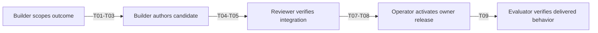
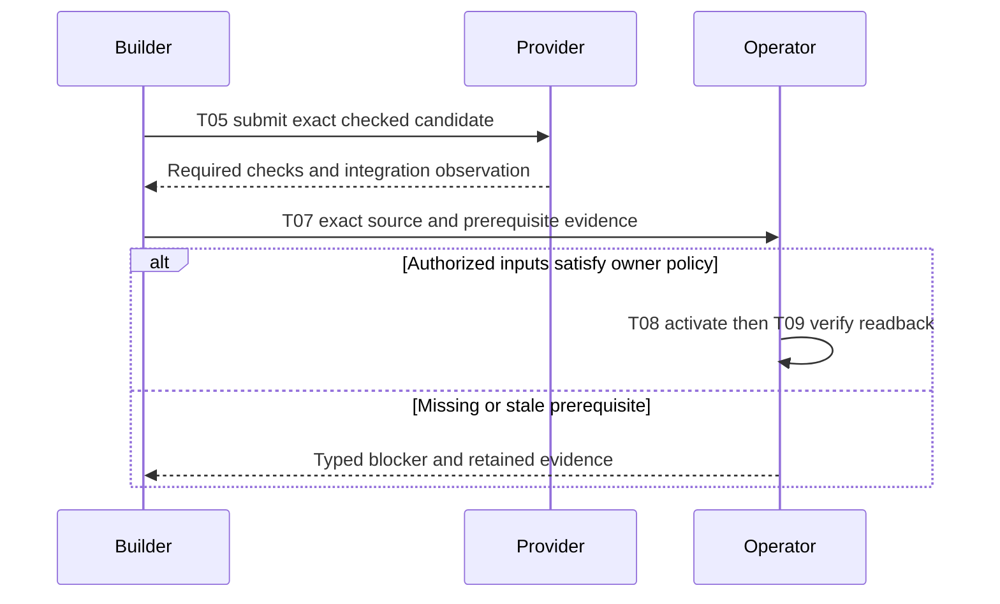
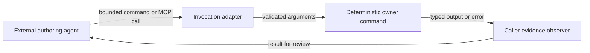
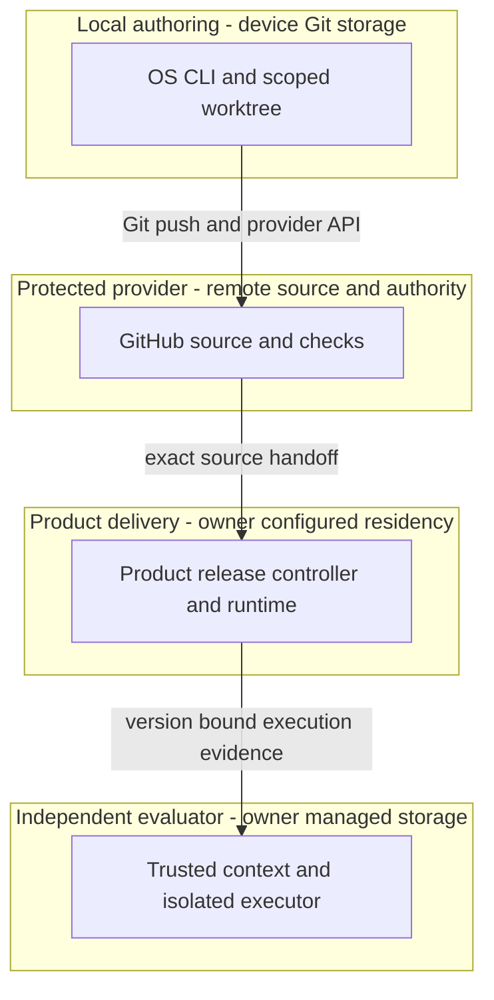

# Reference implementation — As-built ADLC pipeline

This document owns source-to-completion governance; acceptance grants no deployment authority.
Current pins live in [`catalog/composition-source-lock.json`](../catalog/composition-source-lock.json);
[TECH-STACK.md](TECH-STACK.md) owns refresh commands. Historical evidence retains its exact subject.

[TECH-STACK.md](TECH-STACK.md) owns technology selection, product composition and deployment topology. [FEATURES.md](FEATURES.md) owns the derived feature index; [catalog/features.json](../catalog/features.json) owns commercial ranking input. The website [guidelines][guideline], [templates][templates], [continuity module][continuity] and [CID contract][cid] own authoring semantics. This guide adds pipeline requirements and traceability, without copying those contracts or product requirements.

The [maturity rubric][maturity], [source assessment][maturity-grounding] and [naming][document-naming]
load on demand; readiness, experience and demand remain distinct. Historical evidence retains its subject.

## Identity and opening directive

[PRD](#prd), [TAD](#tad), [ADR](#adr), [MVP](#mvp) and [GTM](#gtm) join `PRD-TAD-ADR-ADLC-PIPELINE-001@1.2.0`. TAD consumes that PRD; ADR binds that TAD. Resolve companions through [source bindings](#codebase-grounding-record). Requirement changes re-derive affected design, decisions, RAO and evidence before execution.

**SSOT and precedence.** This joined PRD/TAD/ADR is the single source of truth for the from-0-to-1 pipeline: every T01–T09 transition consumes one criterion, design row and decision from it by continuity ID and exact revision. On conflict, precedence is this document → [TECH-STACK.md](TECH-STACK.md) (composition, topology, stack decisions) → [FEATURES.md](FEATURES.md) (derived index) → README, workflow and runtime documents (navigation and commands only). Consumers reference this document and never restate, widen or contradict it; `docs/adlc-guidelines.md` binds them to that rule, and a competing statement is a `duplicate-owner` finding under the shared authoring set. A missing or stale join blocks only the affected transition.

**DIR-PIPELINE-01** — Context: the source bindings expose independently owned authoring, lifecycle and product release controls, with Commerce integration gaps G08–G10 below. Intent: a solo operator can complete the smallest authorized outcome without losing work or mistaking source checks for delivery. Directive: document the existing source-to-production path, bind each acceptance condition to its owner and check, and expose missing production evidence. Role/Subject: ADLC pipeline architect. Action: specify the implemented pipeline and its owner handoffs. Outcome: one reviewable specification with criterion-to-design-to-check joins. Verb/Object: specify / the implemented pipeline and its owner handoffs. This prose consumes the shared CID/RAO/SVO fields, not a new serialization.

## PRD

**Continuity:** `PRD-TAD-ADR-ADLC-PIPELINE-001` · PRD `1.2.0`.

### Problem, personas and minimum outcome

A solo operator loses time locating source owners, repeating validation and recovering stale worktrees. A successful source merge can also be mistaken for a successful product release. Existing scoped lanes, exact integration observations and source-bound check discovery address these engineering problems; customer willingness to pay remains unvalidated.

As a **builder**, I want requirements, source owners and checks joined before editing so I can implement one bounded change. As an **operator**, I want exact candidates and separate release receipts so I can promote and recover the intended version. As a **reviewer**, I want acceptance evidence tied to its actual scope so I can reject a false completion. The downstream buyer journey is discovery → deliberate confirmation → settlement → receipt/readback; F01–F05 own that product behavior.

The minimum outcome is one source-owned change that can be authored, checked, integrated and handed to the product's release/evidence owner. A runtime outcome additionally needs that owner's deployed acceptance results. A paid loop additionally needs actual payment and replay receipts.

### Acceptance and verification contract

Each `AC-Pnn` states Given/When/Then. Its `VCC-Pnn` is the stated check plus the observable outcome and constraint in the same row. Checks are starting points: no named file, structural match or passing subset satisfies outcomes it did not exercise. Scope is this pipeline; feature IDs refer to the unchanged composition index.

| Criterion / condition | Given → when → then; scope constraint | Owner check and feature join | TAD / ADR |
|---|---|---|---|
| AC-P01 / VCC-P01 | Given exact input revisions, when the author resolves intent to design, then every criterion has one owner, a grounded component, a check and an exact five-role handover join; preserve shared CID meanings and product intent. | OS `npm run check` plus source/companion/criterion join review and the shared frontmatter parser; F20. | T01 / ADR-P01, ADR-P04 |
| AC-P02 / VCC-P02 | Given the bounded candidate catalog, when constraints and evidence are ranked, then selection has admissible evidence or explicitly returns no selection; missing demand must not invent a payer or block disjoint technical work. | `node --test __tests__/rank.test.mjs __tests__/rank-security.test.mjs`; F16. | T02 / ADR-P02 |
| AC-P03 / VCC-P03 | Given a trusted profile and requested paths, when a lane starts, then the selected successor is hydrated and current ownership rechecked before writes; only a disjoint registered scope is provisioned and conflicting scope is refused; canonical stays an observation surface. | `node --test __tests__/lean-sprint-completion.test.mjs`; F12. | T03 / ADR-P02, ADR-P04 |
| AC-P04 / VCC-P04 | Given owner source and result bindings, when checks are discovered and composition inspected, then mismatched or absent evidence is reported without executing sibling code or upgrading its coverage. | `node --test __tests__/check-discovery.test.mjs __tests__/composition-runtime-check.test.mjs`; F17/F18. | T04 / ADR-P02 |
| AC-P05 / VCC-P05 | Given a checked scoped diff, when it is published, then the owner handover and exact reserved changes are bound to the selected protected candidate; later edits use a successor and a cached local record grants no provider authority. | `node --test __tests__/lean-sprint-completion.test.mjs __tests__/lane-cache-publication-race.test.mjs`; F12/F13. | T05 / ADR-P02, ADR-P04 |
| AC-P06 / VCC-P06 | Given an integrated candidate, when completion or cleanup is requested, then exact integration and each authorized cleanup effect remain independently verified and the observed result informs one successor Context; dirty or changed targets retain owner bytes. | `node --test __tests__/integration-cleanup-proof.test.mjs __tests__/completion.test.mjs __tests__/cleanup.test.mjs __tests__/canonical-sync-race.test.mjs`; F13/F25. | T06 / ADR-P02, ADR-P04 |
| AC-P07 / VCC-P07 | Given selected operation requirements, when flight evaluates their presence and freshness, then only the selected scope is gated and the result grants no effects; no manifest means no invented enrollment. | `node --test __tests__/lifecycle-flight.test.mjs`; F18/F19. | T07 / ADR-P03 |
| AC-P08 / VCC-P08 | Given an eligible Free/FOSS executor and exact release inputs, when Commerce activates and independently evaluates them, then release, isolated execution, lifecycle identity and readback agree; preserve admission and never substitute a local runner test for a deployed transport. | Commerce [release safety][commerce-release-test], [executor test][commerce-executor-test], [context test][commerce-context-test], then live owner receipts; F07–F09/F19. **Unfinished** at G08–G10. | T08 / ADR-P03 |
| AC-P09 / VCC-P09 | Given those deployed owner versions and a valid confirmation, when the buyer completes and replays checkout, then receipt/readback matches and no second money effect occurs; offline drafts never authorize offline settlement. | F01–F05 owner checks and TECH-STACK runtime VCCs, followed by actual provider and replay evidence. **Unverified here**; demand remains separate. | T09 / ADR-P03 |
PRD→TAD coverage is **9/9 criteria**, TAD→PRD is **9/9 steps**, and Directive→RAO coverage is **9/9 derived outcomes** through T01–T09. These ratios measure linked specification coverage, not passed acceptance conditions.

### Priority, economics and open questions

**Must:** reuse T01–T07 and the completion primitive T06; close the product-owned T08 gaps before the T09 runtime demonstration. **Should:** improve measured iteration cost and optional generated publication F21. **Could:** live agent-state memory tiers (the separately accepted [shared-memory startup](MEMORY.md) covers curated context only), merchant/shopping roles and spatial extensions F22–F24 after demand or a measured bottleneck. **Won't in this revision:** new orchestration controllers, copied schemas, paid infrastructure, new dependencies, invented provider receipts or customer selection. ROI score for every tier is **unmeasured**; ordering reflects dependency closure and existing-code reuse, not a commercial winner.

Historical timing, clonability and cost observations remain in the
[predecessor metrics](https://github.com/huijoohwee/agentic-os/blob/934f44fd30df4b23829a29df6cbe8d6456f7616d/guides/PRD-TAD-ADR-MVP-GTM.md#priority-economics-and-open-questions).
This successor adds no runtime dependency and changes always-load guidance by 0 bytes within the
40,960-byte cap. The guide stays under 400 lines/45 kB. Restart time, TCO, ROI and willingness to pay
remain unmeasured. Selection uses existing bounded admissibility and evidence, never invented demand.

## TAD

**Continuity:** `PRD-TAD-ADR-ADLC-PIPELINE-001` · TAD `1.2.0` consumes PRD `1.2.0`, decisions ADR `1.2.0`.

### Journey-to-system and RAO steps

T01–T09 are independently closable task references within DIR-PIPELINE-01, not new lifecycle states. In each row, Role is Subject; the first verb and remaining target in Action give SVO. Outcome is the referenced acceptance condition, not the object of a different instruction. Context is the source binding and prerequisites; all inherit the opening intent. Re-run only changed joins and dependent evidence.

| Step / stage | Role and action (SVO) | Input → output / component | Prerequisites and outcome |
|---|---|---|---|
| T01 / specify | Author resolves requirements | Grounded intent + companion revisions → joined PRD/TAD/ADR; shared authoring rules | Bounded objective; P01. Author/agent workflow, no automatic compiler |
| T02 / select | Ranker evaluates candidates | Digest-bound JSON + admissibility evidence → selection or explicit refusal; [ranker][rank] | Commercial use of T01; P02. Safe technical work need not select a payer |
| T03 / scope | Lane adapter reserves paths | Canonical profile + declared write set → registered branch/worktree; [worktree][worktree] | T01 and source ownership; P03. Local reservation is not a cross-device authenticated lease |
| T04 / verify | Check observer binds evidence | Owner descriptors/results → unsigned discovery report; [checks][checks], [composition][composition] | T03 candidate; P04. Owner runners separately execute the applicable full suites |
| T05 / publish | Publisher binds candidate | Exact scoped diff + checks → immutable published head/provider handoff; [CLI][cli] | T04; P05. Required provider checks and authorization govern merge |
| T06 / close | Completion adapter verifies effects | Candidate/integration proof + authorized effect plan → distinct completion, cleanup and sync receipts; [completion][completion], [sync][sync] | T05 integration; P06. Retain a lane if its authorized outcome still needs it |
| T07 / prepare | Flight observer evaluates prerequisites | Selected operation + canonical manifest + bounded inputs → observation checkpoint; [flight][flight] | Requirements for the selected effect; P07. Product execution remains separate |
| T08 / activate | Commerce release owner activates versions | Exact authenticated source/configuration + independent executor/evaluator → owner release and runtime evidence; [release][commerce-release] | T05, T07 and G08–G10 closure; P08 |
| T09 / demonstrate | Runtime evaluator verifies checkout | Exact deployed identities + confirmation → settlement/readback/replay evidence; composition F01–F05 | T08 and product authority; P09. Demand observation is a separate result |
The [upstream process][process] remains Phase 0 discovery → 1 PRD → 2 TAD → 3 alignment → 4 maintenance. T01 consumes those phases; T02–T09 are development/runtime handoffs. This retrospective spec does not certify prior implementation against new gates.

### Planning release handover

This bounded authoring behavior implements AC-P01/P03/P05/P06 through T01/T03/T05/T06 and ADR-P04.
Shared [planning roles][planning-record] and [artifact continuity][handover-continuity] own the semantics;
this guide owns the lifecycle checkpoints. The predecessor is
`PRD-TAD-ADR-ADLC-PIPELINE-001@1.1.2` at OS `934f44fd30df4b23829a29df6cbe8d6456f7616d`.
Only these affected joins are re-derived; historical grounding and runtime evidence retain their subjects.

1. **Before land (T01/T05):** update the affected capability's existing plan in the implementation lane.
   PRD states pain and payer evidence, including unknown demand/economics; TAD and ADR consume its
   criteria; MVP scope and GTM evidence derive from them. Join all five roles at one CID/revision.
   Record changed criterion/design/decision IDs, source paths, exact dependency revisions, reused/new
   boundaries and current validation conditions. Different capabilities retain their own CIDs.
2. Prepare a compact handover in that plan's existing evidence section or evidence companion; split
   only for an actual size/review need. Cite the accepted plan, guideline pin, affected repositories,
   criterion → check → result → evidence locator, evaluator, surface, limitations and unresolved work.
   Evidence introduces no requirements. Scope changes create a successor Context and preserve history.
3. Run affected planning/continuity checks, the [Fleet ownership check](../FLEET.md#cross-repository-source-ownership)
   and each changed repository's required checks. A named command is a check plan, not a passed result.
   Reuse evidence only for its exact subject, dependencies and surface. Conflicting owners, stale joins
   or missing Must evidence block the affected transition. Commit and use protected `land`; CI receipts
   bind the actual candidate SHA/tree outside its committed bytes. Never predict merge/deploy success.
4. **After merge (T06):** observe the protected merge and required check results; append immutable evidence
   through the existing evidence or PR owner. Include deployment identity only for a separately
   authorized deployment with passed release checks. Use native `finish`, then applicable cleanup and
   canonical-sync workflows. Record actual worktree outcome/recovery locator; retained branches,
   archive, integration and authenticated lease retirement are separate observations.
5. Create one new immutable Context under the enrolled workspace's `sources.todo.path` and existing
   `todo/YYYY-MM/` contract. Reuse its four-column CID/RAO/SVO row and `continuity_id@revision`;
   cite the predecessor, exact source/merge refs, result locators, unresolved findings, one next bounded
   intent, owner, prerequisites and named completion check. Update authored Kanban state through its
   owner and regenerate the ledger projection. Do not create a second handover schema or task registry.
6. **Next start (T03):** reuse the [workspace](WORKSPACE.md) receipt already returned by startup, without
   another sync. Read the selected successor and its exact plan/evidence on demand at `sourceRevision`;
   use [memory](MEMORY.md) for relevant retained decisions. Resolve enrollment from protected
   `.agentic-os-workspace.json`; recheck live ownership, source freshness and applicable authority before
   writes. Context, a cache, an MCP response or transport access grants no execution authority.

Essential mode here permits `.todo` and `.memory`; startup does not publish local edits. Publish through
that private owner's publication workflow and verify the receiving revision before claiming availability.
Artifact bodies stay local; keep private evidence private and never widen the allowlist for a handover.

[Implementation allocation](../FLEET.md) retains the existing owners: Graph owns Launch Copilot's plan and
runbook when its reviewed successor exists; `81rv10` and the public entry consume that runbook. Canvas,
Commerce and GameXR update only changed capability contracts and dependency joins. Register an artifact
only after it exists. Generated production mirrors receive protected projections from source owners.
Use pinned local source reads or the existing discovery/MCP surface; there is no new runtime, service,
model call, catalog, dependency or poller. Source authority and freshness remain independent of transport.

### Five flow patterns

**Diagram PIPE-J1** · Class: Journey stage map · Notation: flowchart LR · Version: 1 — 2026-09-09 · Surface: markdown-canvas
**Caption:** The builder hands an integrated change to the operator, who obtains separate delivery evidence.

| PIPE-J1 node | Journey inventory / acceptance |
|---|---|
| intent | Bounded engineering objective; P01–P03 |
| candidate | Source-owned implementation/checks; P04–P05 |
| integrated | Provider integration observed; P05–P06 |
| release | Product deployment boundary; P07–P08 |
| evidence | Runtime demonstration; P09 |
**Diagram PIPE-W1** · Class: User workflow · Notation: sequenceDiagram · Version: 1 — 2026-09-09 · Surface: text-only
**Caption:** A protected source merge precedes owner activation, while failed prerequisites preserve the candidate.

| PIPE-W1 participant | Happy / alternate / error inventory |
|---|---|
| Builder | Author/check/publish; successor for later edits; preserve dirty work |
| Provider | Protected exact-head merge; pending check waits; changed head invalidates observation |
| Operator | Product release and proof; retry only under owner replay policy; missing inputs stop affected activation |
**Diagram PIPE-D1** · Class: Data flow · Notation: flowchart LR · Version: 1 — 2026-09-09 · Surface: markdown-canvas
**Caption:** Source-bound observations and authenticated receipts remain distinct data products.

| PIPE-D1 node | Data inventory / residency |
|---|---|
| spec | Versioned Markdown; owning Git repository |
| source | Commit/write-set identity; local Git and selected remote |
| checks | Declared command, revision, outcome, coverage; caller-owned bounded files/output |
| receipt | Authority result; authenticated provider and caller evidence store |
| proof | Version/configuration-bound results; product/evaluator owner; no secrets in Markdown |
**Diagram PIPE-H1** · Class: Orchestration / harness flow · Notation: flowchart LR · Version: 1 — 2026-09-09 · Surface: markdown-canvas
**Caption:** An external authoring agent invokes deterministic tools and receives observations; the CLI does not run an LLM loop.

| PIPE-H1 node | Harness inventory / input → output / cost and fallback |
|---|---|
| agent | Session objective + shared CID → scoped calls; model tokens belong to caller, unmeasured here; stop/escalate on unresolved decision |
| adapter | CLI argv or MCP tool arguments → validated command; [invocation][invocation] / [MCP][mcp]; no model calls; typed invalid-argument error |
| executor | Profile-bound command → bounded JSON/text; existing timeout/cancellation; no model cost; fail closed |
| observer | Command result → reviewer-visible evidence; no authentication inferred; absent/interrupted result stays unknown |
This document adds no AI-powered runtime component. For the external authoring/review cycle, cap corrections at **3 iterations**, break on no reduction in blockers across **2 consecutive cycles**, and escalate the affected decision. These are session execution constraints, not claimed CLI-enforced global loop or token limits. Product agent cost logs, typed harness contracts and fallbacks remain with F10 and TECH-STACK.

**Diagram PIPE-T1** · Class: Runtime topology · Notation: flowchart TB · Version: 1 — 2026-09-09 · Surface: markdown-canvas
**Caption:** Local authoring, protected provider authority and product runtime evaluation have separate trust boundaries.

| PIPE-T1 node | Role / type / lane / source | Residency and status |
|---|---|---|
| harness | Orchestrator / CLI / authoring / [CLI][cli] | Local clone/worktree; local `spec-complete`, delivered `undocumented` in this spec |
| github | Authority adapter / remote service / authoring integration / [authority][authority] | Remote provider policy; local `spec-complete`, delivered `undocumented` |
| runtime | Product owner / release service / delivery / [Commerce release][commerce-release] | Current deployment unverified; local `spec-complete`, delivered `undocumented`; G10 gap |
| verifier | Independent evaluator / process service / delivery evidence / [runtime context][commerce-context] | Must be outside candidate worktrees; enrollment unverified; local `spec-complete`, delivered `undocumented` |
| Diagram register | Class | Notation / surface | Projects | Nodes / edges / clusters | Version |
|---|---|---|---|---|---|
| PIPE-J1 | Journey stage map | flowchart LR / markdown-canvas | yes | 5 / 4 / 0 | 1 |
| PIPE-W1 | User workflow | sequenceDiagram / text-only | no | 0 / 0 / 0 | 1 |
| PIPE-D1 | Data flow | flowchart LR / markdown-canvas | yes | 5 / 4 / 0 | 1 |
| PIPE-H1 | Orchestration / harness flow | flowchart LR / markdown-canvas | yes | 4 / 4 / 0 | 1 |
| PIPE-T1 | Runtime topology | flowchart TB / markdown-canvas | yes | 4 / 3 / 4 | 1 |
### Interfaces, quality attributes and recovery

| Contract / attribute | Implemented behavior and limit | Evidence / limitation |
|---|---|---|
| Governance root | `claim`, `continue`, `integrate`, `retire` construct unsigned requests; receipt hashes bind bytes, not actors | [governance][governance], [contract tests][governance-test]; authenticated/fenced verification belongs to adapters |
| Repository identity | Committed `.agentic-os.json` plus clone-common setup trust anchors canonical identity; full Git revision consumer pins | [governance guide][governance-guide]; local TOFU is not a lease or promotion grant |
| Invocation / MCP | Shared `/`, `@`, `#` grammar; stdio tools `doctor`, `status`, `checks`, `reap`, `lane` | [invocation][invocation], [MCP][mcp]; no claim every CLI mutation is an MCP tool |
| Check discovery | `agentic-os/check-discovery-input/v1` maps up to 32 owner roots; optional `agentic-os/check-result-observation/v1` binds reported coverage | [checks][checks]; 64 KiB input/results, 128 KiB owner files, output below 500 kB, 30-second CLI deadline; no owner execution or network calls |
| Composition grounding | Lock-selected source bytes compared without executing sibling runtime code | [composition][composition], [source lock][source-lock]; a pass proves static joins only |
| Flight | `pre`, `in`, `post` checkpoints use v1 requirements or v2 operation subsets | [flight][flight]; `observationOnly: true`, `authorizesEffects: false`; root baseline has no enrolled manifest; no process start/probe/stop |
| Concurrency and integrity | Local disjoint reservations; exact provider head and live authority checks where applicable; ancestry or exact mode/type/blob integration identity | [worktree][worktree], [authority][authority], [patch identity][patch]; patch-ID alone is diagnostic; local reservations do not solve authenticated cross-device leases |
| Resources and offline operation | Lazy guides, bounded readers, zero runtime dependencies; local inspection survives offline | [budgets][budgets]; provider publication/revalidation requires connectivity; user mobile/offline drafts remain product F05 |
| Finish / cleanup | Finish observes `agentic-os/sprint-finish/v1`, reports `grantsAuthority: false` and retains worktree; cleanup adapters verify separate effects | [completion][completion], [cleanup][cleanup]; registered path removal requires exact eligibility and authorization, never blanket pruning |
| Canonical recovery | Read-only plan binds target, inventory and recovery ref; dirty inventory copies then stops; only empty inventory can advance under explicit exclusivity | [sync][sync]; ignored paths retained, branch update compare-and-swap; external quiescence is asserted, not OS-proven; interruption retains named recovery artifacts |
Source integration and product deployment are distinct. T06 may close a source-only lane after its authorized value is integrated; it cannot close a runtime outcome whose evidence is pending. On stale scope or provider heads, observe again and use the owning successor/recovery path. Never treat a failed command as permission to reset, force-prune or retry a potentially completed money effect.

### Deployment boundary register

The document grants no effects. Existing user authorization continues to apply to its exact scope; runtime effects need their own current owner inputs and receipts. Source release follows [START-WORKFLOW][start] and [RELEASE-WORKFLOW][release]; product owners retain deployment and rollback policy.

| Boundary | From → to | Evidence and operator instruction | Recovery / state |
|---|---|---|---|
| Specification integration | Authoring → protected OS source | Exact candidate, full `npm run check`, required provider checks; standing user instruction authorizes green PR completion | Successor/reviewed revert; closed until candidate checks and authorization match |
| Product activation | Protected source → delivery | T08 owner source/configuration and authority; no product activation instruction is granted by this document | Commerce owner forward recovery; closed here, G08–G10 unresolved |
| Product publication | Graph source → verified product → generated mirror | F21 and owner release workflow; mirror never authors product source | Owner deploy/verify/mirror sequence and rollback; closed here |
| Runtime acceptance | Delivery → verified evidence | T09 exact release identity, trusted evaluator and provider/replay readback | Preserve failed evidence; owner correction and re-evaluation; closed here |
| Completion | Integrated lane → exact cleanup → canonical sync | T06 integration observation plus each separately authorized effect | Recovery ref/private preservation receipt; closed until target and authority revalidate |
## ADR

**Continuity:** `PRD-TAD-ADR-ADLC-PIPELINE-001` · ADR `1.2.0` binds PRD/TAD `1.2.0`. These records document current architecture and this documentation placement. They do not adopt a new runtime or reopen existing stack decisions.

| Decision | Context and decision / alternatives | Rationale, consequences and recovery |
|---|---|---|
| ADR-P01 — One pipeline specification | **Accepted, 2026-09-09.** Keep one lazy combined document with explicit revisions. Alternatives: enlarge TECH-STACK; create separate PRD/TAD/ADR files; FOSS alternative: use the same Markdown/Git toolchain split by artifact. | SRP separates pipeline governance from product topology and feature inventory; one file minimizes review/token cost. Cost: links need refresh. Recover through Git history and a joined successor; never duplicate the schema. TECH-STACK DR-10/11 remain the composition-owner decisions. |
| ADR-P02 — Reuse deterministic owner controls | **Accepted as-built, 2026-09-09.** Reuse native records, lane/check/authority adapters and ranking. Alternatives: another autonomous meta-controller; manual FOSS Git and shell commands. | Existing contracts reduce implementation/TCO and preserve concurrency semantics. Manual Git is a fallback, but loses automatic scope/evidence checks; a second controller adds competing authority. No LLM dependency or new always-loaded module. Recovery remains with the exact owner adapter. TECH-STACK DR-7/8 remain unchanged. |
| ADR-P03 — Keep product activation and proof owner-bound | **Accepted as-built boundary, 2026-09-09.** Free-only policy and independent evidence constrain T08/T09; the current local Podman runner is reusable but not a complete hosted transport. Alternatives: existing paid Containers path (ineligible under current policy); FOSS Podman/workerd on an existing host (transport/availability proof pending). | No new subscription or weakened isolation to manufacture completion. Host, credential and lifecycle binding evidence remains required. Product/runtime gaps do not disable source work or force a customer choice. TECH-STACK DR-6/11 own recovery and stack constraints. |
| ADR-P04 — Owner-bound release and restart | **Accepted for this successor, 2026-09-13.** T01/T03/T05/T06 consume the existing capability plan, Fleet registry and private Context/Kanban contracts. Alternatives: a central copied product plan or a new handover service. | One source per capability preserves exact revisions and private evidence; short workflow links keep loading bounded. Validate P01/P03/P05/P06 by source/join review, Fleet and owner checks. Reopen only on measured restart failure; recover with preserved prior records and a joined successor. |
The predecessor's [TCO comparison](https://github.com/huijoohwee/agentic-os/blob/934f44fd30df4b23829a29df6cbe8d6456f7616d/guides/PRD-TAD-ADR-MVP-GTM.md#adr)
retains the local FOSS, existing-host and excluded paid-container alternatives with unmeasured economics.
All decisions retain zero new paid services, existing owner contracts and explicit evidence boundaries.

## Codebase grounding record

The exact original input table, G01–G14 observations and source-specific limitations remain in the
[accepted predecessor grounding](https://github.com/huijoohwee/agentic-os/blob/934f44fd30df4b23829a29df6cbe8d6456f7616d/guides/PRD-TAD-ADR-MVP-GTM.md#codebase-grounding-record).
They are historical evidence, not current dependency pins or retrospective conformance proof.
Current composition pins remain in `catalog/composition-source-lock.json`.

For the retained P08/P09 scope: G08 names Commerce's hosted-transport gap, G09 its retired lifecycle
verifier dependency, G10 missing live evaluator/release binding evidence, and G12 unverified paid-loop
and demand evidence. These historical findings are not closed by this documentation successor;
re-observe their owning source before a product transition. G13 records the prior clonability defect
and G14 the observed absence of abandon/widen lane events; only the current lifecycle owner may change
those behaviors. P01/P03/P05/P06 now use the bounded handover above at this exact specification revision.

## MVP

### Handover verification for this successor
Changed joins: AC-P01/P03/P05/P06 → T01/T03/T05/T06 → ADR-P04; the other criteria and product
runtime contracts retain their scope. Review five-role identity, dependency pins, workflow anchors,
actual workspace publication semantics and immutable successor/board joins. Run OS `npm run check`,
Fleet ownership against explicit roots and private owner planning/workspace checks for the exact task.
The PR retains the candidate/tree, observed results, evaluator limitations and subsequent merge receipt;
this pre-land specification makes no current CI, integration, cleanup or deployment success claim.

### Verification, demonstration and maintenance

**Source-specification scope:** verify YAML identity, companion versions, P01–P09/T01–T09/ADR joins, cited blobs, diagram counts and navigation; run OS `npm run check`. `spec-complete` means VCCs are defined. The website guideline checker validates its owning set; this consumer needs explicit join review. Authoring, independent/provider checks and deployment evidence remain separate.

The unchanged [applicable-rule trace](https://github.com/huijoohwee/agentic-os/blob/934f44fd30df4b23829a29df6cbe8d6456f7616d/guides/PRD-TAD-ADR-MVP-GTM.md#mvp)
retains its historical 12-rule bounded review. This successor additionally consumes the pinned
[planning record][planning-record] five-role/four-cell contract and [continuity][handover-continuity]
evidence/successor rules. Neither structural checks nor source links certify full guideline conformance.

**Demo skeleton:** trusted clean checkout → joined intent → scoped lane → bounded change → complete owner checks → publication/integration → authorized completion. Record TTV, argv, exact source, coverage and results. Continue through P08/P09 only with owner evidence; retain failures. The measured walkthrough covers setup through lane start; later steps remain unmeasured.

## GTM

Consume P02/P09 and the [Commerce grounding][maturity-grounding]: prove priced acceptance and collected
payment separately from sandbox settlement. No commercial winner is selected here.

For P01/P03/P05/P06, measure one restart from the selected successor: active discovery minutes,
source reads, check reuse and missed decisions. Baseline and savings are unmeasured; no payer or WTP
is established by the handover. Feed measured findings into the next immutable Context.

**Roadmap:** reuse controls; close G08–G10 in Commerce without restoring the retired verifier; collect P09 provider/replay evidence and independent demand. Expand on measured value; maintain Phase 4 bounds, immutable sources and successor ADRs.

[guideline]: https://github.com/huijoohwee/huijoohwee.github.io/blob/e8d2a10a8d3e5735c43edf350a22523df05fdf91/guidelines/prd-tad-adr-mvp-gtm-guidelines.md
[templates]: https://github.com/huijoohwee/huijoohwee.github.io/blob/e8d2a10a8d3e5735c43edf350a22523df05fdf91/guidelines/prd-tad-adr-mvp-gtm-templates.md
[cid]: https://github.com/huijoohwee/huijoohwee.github.io/blob/7bb36e9df2dfe14497c789b531bbc674c3d8da91/guidelines/cid-guidelines.md#shared-field-contract
[continuity]: https://github.com/huijoohwee/huijoohwee.github.io/blob/7bb36e9df2dfe14497c789b531bbc674c3d8da91/guidelines/adlc-artifact-continuity.md
[process]: https://github.com/huijoohwee/huijoohwee.github.io/blob/e8d2a10a8d3e5735c43edf350a22523df05fdf91/guidelines/prd-tad-adr-mvp-gtm-process-flows.md
[rank]: https://github.com/huijoohwee/agentic-os/blob/92b8f5fb6bfa3211ac83a4809acb6bca8495ee8d/src/rank.mjs
[worktree]: https://github.com/huijoohwee/agentic-os/blob/92b8f5fb6bfa3211ac83a4809acb6bca8495ee8d/src/worktree.mjs
[checks]: https://github.com/huijoohwee/agentic-os/blob/92b8f5fb6bfa3211ac83a4809acb6bca8495ee8d/bin/agentic-os-checks.mjs
[composition]: https://github.com/huijoohwee/agentic-os/blob/92b8f5fb6bfa3211ac83a4809acb6bca8495ee8d/bin/composition-runtime-check.mjs
[cli]: https://github.com/huijoohwee/agentic-os/blob/92b8f5fb6bfa3211ac83a4809acb6bca8495ee8d/bin/agentic-os.mjs
[completion]: https://github.com/huijoohwee/agentic-os/blob/92b8f5fb6bfa3211ac83a4809acb6bca8495ee8d/src/completion.mjs
[sync]: https://github.com/huijoohwee/agentic-os/blob/92b8f5fb6bfa3211ac83a4809acb6bca8495ee8d/src/canonical-sync.mjs
[flight]: https://github.com/huijoohwee/agentic-os/blob/92b8f5fb6bfa3211ac83a4809acb6bca8495ee8d/bin/agentic-os-auxiliary.mjs
[invocation]: https://github.com/huijoohwee/agentic-os/blob/92b8f5fb6bfa3211ac83a4809acb6bca8495ee8d/src/invocation.mjs
[mcp]: https://github.com/huijoohwee/agentic-os/blob/92b8f5fb6bfa3211ac83a4809acb6bca8495ee8d/src/mcp-server.mjs
[authority]: https://github.com/huijoohwee/agentic-os/blob/92b8f5fb6bfa3211ac83a4809acb6bca8495ee8d/src/github-transition-authority.mjs
[governance]: https://github.com/huijoohwee/agentic-os/blob/92b8f5fb6bfa3211ac83a4809acb6bca8495ee8d/src/governance.mjs
[governance-test]: https://github.com/huijoohwee/agentic-os/blob/92b8f5fb6bfa3211ac83a4809acb6bca8495ee8d/__tests__/governance-contract.test.mjs
[governance-guide]: https://github.com/huijoohwee/agentic-os/blob/92b8f5fb6bfa3211ac83a4809acb6bca8495ee8d/docs/GOVERNANCE.md
[source-lock]: https://github.com/huijoohwee/agentic-os/blob/92b8f5fb6bfa3211ac83a4809acb6bca8495ee8d/catalog/composition-source-lock.json
[patch]: https://github.com/huijoohwee/agentic-os/blob/92b8f5fb6bfa3211ac83a4809acb6bca8495ee8d/src/patch-identity.mjs
[budgets]: https://github.com/huijoohwee/agentic-os/blob/92b8f5fb6bfa3211ac83a4809acb6bca8495ee8d/docs/BUDGETS.md
[cleanup]: https://github.com/huijoohwee/agentic-os/blob/92b8f5fb6bfa3211ac83a4809acb6bca8495ee8d/src/cleanup.mjs
[start]: https://github.com/huijoohwee/agentic-os/blob/92b8f5fb6bfa3211ac83a4809acb6bca8495ee8d/docs/START-WORKFLOW.md
[release]: https://github.com/huijoohwee/agentic-os/blob/92b8f5fb6bfa3211ac83a4809acb6bca8495ee8d/docs/RELEASE-WORKFLOW.md
[commerce-release]: https://github.com/huijoohwee/agentic-commerce-os/blob/4774a4fc1543c4bcb1b912fe79c78c61384efc7c/scripts/production-release/production-controller.ts
[commerce-release-test]: https://github.com/huijoohwee/agentic-commerce-os/blob/4774a4fc1543c4bcb1b912fe79c78c61384efc7c/test/domain/production-release-safety.test.ts
[commerce-executor-test]: https://github.com/huijoohwee/agentic-commerce-os/blob/4774a4fc1543c4bcb1b912fe79c78c61384efc7c/test/operational/isolated-process.test.ts
[commerce-context]: https://github.com/huijoohwee/agentic-commerce-os/blob/4774a4fc1543c4bcb1b912fe79c78c61384efc7c/scripts/evidence-runtime-context.ts
[commerce-context-test]: https://github.com/huijoohwee/agentic-commerce-os/blob/4774a4fc1543c4bcb1b912fe79c78c61384efc7c/test/shared/evidence-runtime-context.test.ts

[maturity]: https://github.com/huijoohwee/huijoohwee.github.io/blob/16f253b20d975f84d6b05bbd1eb0bcefece7ff00/guidelines/prd-tad-adr-mvp-gtm-maturity.md
[maturity-grounding]: https://github.com/huijoohwee/huijoohwee.github.io/blob/16f253b20d975f84d6b05bbd1eb0bcefece7ff00/guidelines/prd-tad-adr-mvp-gtm-codebase-grounding.md#experience-and-first-dollar--reference-implementation
[document-naming]: https://github.com/huijoohwee/huijoohwee.github.io/blob/16f253b20d975f84d6b05bbd1eb0bcefece7ff00/guidelines/conventions-and-syntax-guidelines.md#document-locators-and-format

Experience assessment for `PRD-TAD-ADR-ADLC-PIPELINE-001@1.2.0` in the authoring environment: Core Requirements & Functionality, Innovation & Theme Alignment, Technical Execution & Integration, and Usefulness & Agentic Experience are all **unassessed**. No user-study evidence is attached; the document owner must record one timed pilot and criterion-specific observations before rating them. Keep token usage, active minutes, provider waits and actual cost separate; no savings or revenue follows from structural checks.

[planning-record]: https://github.com/huijoohwee/huijoohwee.github.io/blob/e8d2a10a8d3e5735c43edf350a22523df05fdf91/guidelines/prd-tad-adr-mvp-gtm-planning-record.md
[handover-continuity]: https://github.com/huijoohwee/huijoohwee.github.io/blob/e8d2a10a8d3e5735c43edf350a22523df05fdf91/guidelines/adlc-artifact-continuity.md
