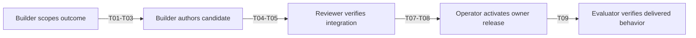
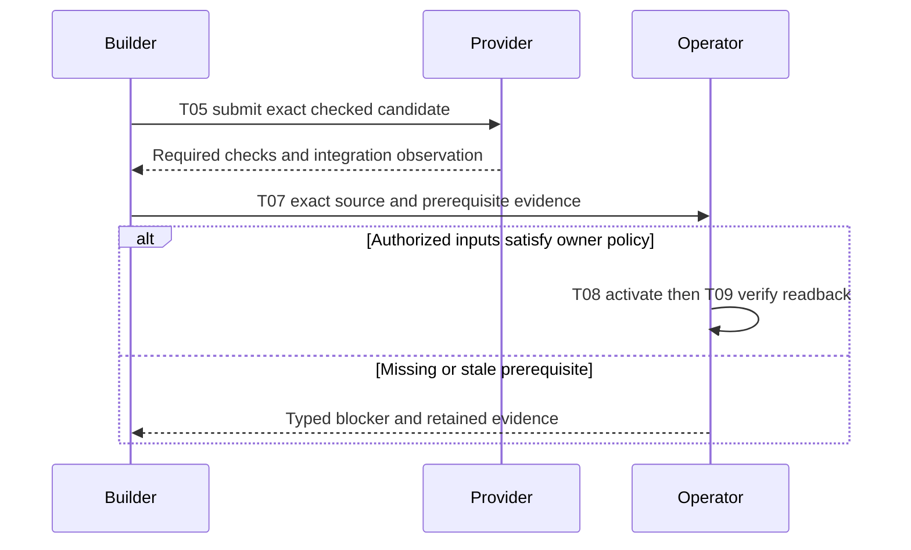
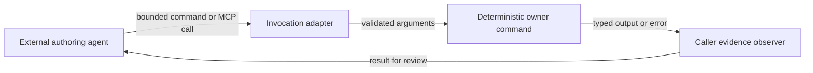
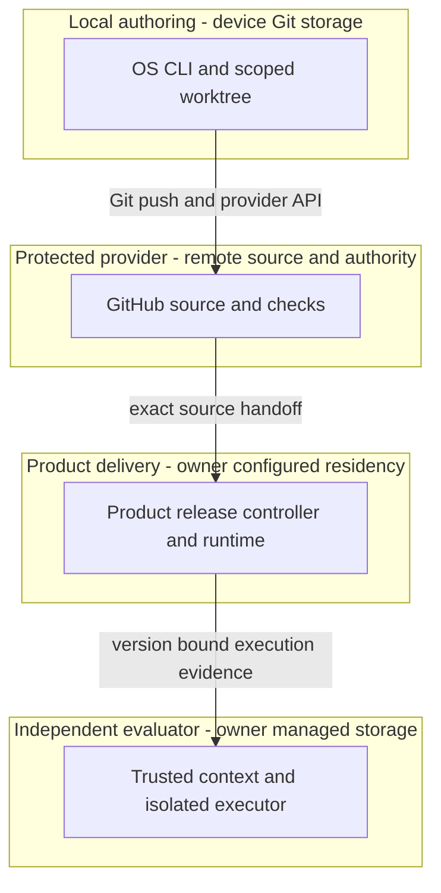

Current composition identities and accepted product revisions live in
[`catalog/composition-source-lock.json`](../catalog/composition-source-lock.json).
Revision-qualified links and grounding tables below record historical evidence, not current pins.
Use `composition:runtime:check` with exact owner roots and `agentic-os pin --consumer=<root>`
for current observations; refreshing a pin does not refresh historical verification evidence.
# Reference implementation — As-built ADLC pipeline

This document owns the **as-built governance path from product intent to source implementation, product release and verified completion**. It describes the implemented controls and explicit handoffs across the seven repositories. It does not introduce a runtime controller or turn an accepted specification into deployment authority.

[TECH-STACK.md](TECH-STACK.md) owns technology selection, product composition and deployment topology. [FEATURES.md](FEATURES.md) owns the derived feature index; [catalog/features.json](../catalog/features.json) owns commercial ranking input. The website [guidelines][guideline], [templates][templates], [continuity module][continuity] and [CID contract][cid] own authoring semantics. This guide adds pipeline requirements and traceability, without copying those contracts or product requirements.

## Identity and opening directive

The stable locator is `guides/PRD-TAD-ADR.md`. The addressable [PRD](#prd), [TAD](#tad) and [ADR](#adr) sections each bind `PRD-TAD-ADR-ADLC-PIPELINE-001` at revision `1.0.0`; TAD consumes that exact PRD and ADR binds that exact TAD. Companion versions resolve through the [source bindings](#codebase-grounding-record), never through the filename alone. Changes to a requirement re-derive affected design, decisions, RAO steps and evidence before dependent execution.

**DIR-PIPELINE-01** — Context: the source bindings expose independently owned authoring, lifecycle and product release controls, with Commerce integration gaps G08–G10 below. Intent: a solo operator can complete the smallest authorized outcome without losing work or mistaking source checks for delivery. Directive: document the existing source-to-production path, bind each acceptance condition to its owner and check, and expose missing production evidence. Role/Subject: ADLC pipeline architect. Action: specify the implemented pipeline and its owner handoffs. Outcome: one reviewable specification with criterion-to-design-to-check joins. Verb/Object: specify / the implemented pipeline and its owner handoffs. This prose consumes the shared CID/RAO/SVO fields, not a new serialization.

## PRD

**Continuity:** `PRD-TAD-ADR-ADLC-PIPELINE-001` · PRD `1.0.0`.

### Problem, personas and minimum outcome

A solo operator loses time locating source owners, repeating validation and recovering stale worktrees. A successful source merge can also be mistaken for a successful product release. Existing scoped lanes, exact integration observations and source-bound check discovery address these engineering problems; customer willingness to pay remains unvalidated.

As a **builder**, I want requirements, source owners and checks joined before editing so I can implement one bounded change. As an **operator**, I want exact candidates and separate release receipts so I can promote and recover the intended version. As a **reviewer**, I want acceptance evidence tied to its actual scope so I can reject a false completion. The downstream buyer journey is discovery → deliberate confirmation → settlement → receipt/readback; F01–F05 own that product behavior.

The minimum outcome is one source-owned change that can be authored, checked, integrated and handed to the product's release/evidence owner. A runtime outcome additionally needs that owner's deployed acceptance results. A paid loop additionally needs actual payment and replay receipts. The harness does not itself execute a universal PRD-to-code compiler or global product deployment.

### Acceptance and verification contract

Each `AC-Pnn` states Given/When/Then. Its `VCC-Pnn` is the stated check plus the observable outcome and constraint in the same row. Checks are starting points: no named file, structural match or passing subset satisfies outcomes it did not exercise. Scope is this pipeline; feature IDs refer to the unchanged composition index.

| Criterion / condition | Given → when → then; scope constraint | Owner check and feature join | TAD / ADR |
|---|---|---|---|
| AC-P01 / VCC-P01 | Given exact input revisions, when the author resolves intent to design, then every criterion has one owner, a grounded component and a check; preserve shared CID meanings and product intent. | OS `npm run check` plus source/companion/criterion join review and the shared frontmatter parser; F20. | T01 / ADR-P01 |
| AC-P02 / VCC-P02 | Given the bounded candidate catalog, when constraints and evidence are ranked, then selection has admissible evidence or explicitly returns no selection; missing demand must not invent a payer or block disjoint technical work. | `node --test __tests__/rank.test.mjs __tests__/rank-security.test.mjs`; F16. | T02 / ADR-P02 |
| AC-P03 / VCC-P03 | Given a trusted profile and requested paths, when a lane starts, then only a disjoint registered scope is provisioned and conflicting scope is refused; canonical stays an observation surface. | `node --test __tests__/lean-sprint-completion.test.mjs`; F12. | T03 / ADR-P02 |
| AC-P04 / VCC-P04 | Given owner source and result bindings, when checks are discovered and composition inspected, then mismatched or absent evidence is reported without executing sibling code or upgrading its coverage. | `node --test __tests__/check-discovery.test.mjs __tests__/composition-runtime-check.test.mjs`; F17/F18. | T04 / ADR-P02 |
| AC-P05 / VCC-P05 | Given a checked scoped diff, when it is published, then the exact reserved changes are bound to the selected protected candidate; later edits use a successor and a cached local record grants no provider authority. | `node --test __tests__/lean-sprint-completion.test.mjs __tests__/lane-cache-publication-race.test.mjs`; F12/F13. | T05 / ADR-P02 |
| AC-P06 / VCC-P06 | Given an integrated candidate, when completion or cleanup is requested, then exact integration and each authorized cleanup effect remain independently verified; dirty or changed targets retain owner bytes. | `node --test __tests__/integration-cleanup-proof.test.mjs __tests__/completion.test.mjs __tests__/cleanup.test.mjs __tests__/canonical-sync-race.test.mjs`; F13/F25. | T06 / ADR-P02 |
| AC-P07 / VCC-P07 | Given selected operation requirements, when flight evaluates their presence and freshness, then only the selected scope is gated and the result grants no effects; no manifest means no invented enrollment. | `node --test __tests__/lifecycle-flight.test.mjs`; F18/F19. | T07 / ADR-P03 |
| AC-P08 / VCC-P08 | Given an eligible Free/FOSS executor and exact release inputs, when Commerce activates and independently evaluates them, then release, isolated execution, lifecycle identity and readback agree; preserve admission and never substitute a local runner test for a deployed transport. | Commerce [release safety][commerce-release-test], [executor test][commerce-executor-test], [context test][commerce-context-test], then live owner receipts; F07–F09/F19. **Unfinished** at G08–G10. | T08 / ADR-P03 |
| AC-P09 / VCC-P09 | Given those deployed owner versions and a valid confirmation, when the buyer completes and replays checkout, then receipt/readback matches and no second money effect occurs; offline drafts never authorize offline settlement. | F01–F05 owner checks and TECH-STACK runtime VCCs, followed by actual provider and replay evidence. **Unverified here**; demand remains separate. | T09 / ADR-P03 |

PRD→TAD coverage is **9/9 criteria**, TAD→PRD is **9/9 steps**, and Directive→RAO coverage is **9/9 derived outcomes** through T01–T09. These ratios measure linked specification coverage, not passed acceptance conditions.

### Priority, economics and open questions

**Must:** reuse T01–T07 and the completion primitive T06; close the product-owned T08 gaps before the T09 runtime demonstration. **Should:** improve measured iteration cost and optional generated publication F21. **Could:** memory tiers, merchant/shopping roles and spatial extensions F22–F24 after demand or a measured bottleneck. **Won't in this revision:** new orchestration controllers, copied schemas, paid infrastructure, new dependencies, invented provider receipts or customer selection. ROI score for every tier is **unmeasured**; ordering reflects dependency closure and existing-code reuse, not a commercial winner.

| Metric | Baseline | Target / measurement point |
|---|---|---|
| Local / delivered rung | `spec-complete` / `undocumented` for this pipeline specification | Recompute only from recorded VCC results; product delivery remains owner-evidenced |
| Builder TTV steps | Estimate: setup, observe, start, author, check, land, verify integration = 7 groups | Walk a clean environment before treating 7 as observed; cleanup and product deployment measured separately |
| Builder TTV elapsed | Unmeasured | Measure active author/check minutes separately from provider waits on the next clean walkthrough |
| Rework / CI cycles | No longitudinal baseline | Record attempts per exact candidate; reduce repeat work without skipping owner suites |
| Incremental runtime dependencies / always-load bytes | 0 / 0 for this document | Remain 0 / 0; two authored files, this guide under 400 lines and 45 kB |
| Token cost / month | Harness CLI makes no model calls; agent usage unmeasured | Attribute external agent usage to the session; no invented token telemetry or free inference claim |
| Monthly TCO / ROI | Cash, hardware, electricity and maintenance not measured | Zero new paid services; separate deployment variants in ADR-P03; measure before ranking a commercial winner |
| Revenue / payer / WTP | Pending; no selected payer or priced offer | Record actual paid acceptance independently; no demand claim from a technical pass |

Constraints → outranking → argumentation reuse the existing ranker: hard admissibility precedes Pareto comparison and grounded arguments. Feedback changes evidence and re-runs that bounded comparison. The feature index records `no-admissible-candidate` for its source-bound catalog observation. That result blocks a commercial selection, not this authorized engineering outcome. The domain objects here are requirement, exact source candidate, evidence observation and effect receipt; this improves engineering traceability, not a claimed new marketplace breakthrough.

Open questions: an eligible always-on execution host/transport, independent evaluator enrollment, equivalent lifecycle claim/lease/fence verifier, current release bindings, shared Graph/GameXR project routing and the real payer/offer. G08–G10 identify affected runtime transitions. None authorizes guessing credentials or deleting source. Technical work can proceed while demand validation stays explicitly pending.

## TAD

**Continuity:** `PRD-TAD-ADR-ADLC-PIPELINE-001` · TAD `1.0.0` consumes PRD `1.0.0`, decisions ADR `1.0.0`.

### Journey-to-system and RAO steps

T01–T09 are independently closable task references within DIR-PIPELINE-01, not new lifecycle states. In each row, Role is Subject; the first verb and remaining target in Action give SVO. Outcome is the referenced acceptance condition, not the object of a different instruction. Context is the source binding and prerequisites; all inherit the opening intent. Re-run only changed joins and dependent evidence.

| Step / stage | Role and action (SVO) | Input → output / component | Prerequisites and outcome |
|---|---|---|---|
| T01 / specify | Author resolves requirements | Grounded intent + companion revisions → joined PRD/TAD/ADR; shared authoring rules | Bounded objective; P01. Author/agent workflow, no automatic compiler |
| T02 / select | Ranker evaluates candidates | Digest-bound JSON + admissibility evidence → selection or explicit refusal; [ranker][rank] | Commercial use of T01; P02. Safe technical work need not select a payer |
| T03 / scope | Lane adapter reserves paths | Canonical profile + declared write set → registered branch/worktree; [worktree][worktree] | T01 and source ownership; P03. Local reservation is not a cross-device authenticated lease |
| T04 / verify | Check observer binds evidence | Owner descriptors/results → unsigned discovery report; [checks][checks], [composition][composition] | T03 candidate; P04. Owner runners separately execute the applicable full suites |
| T05 / publish | Publisher binds candidate | Exact scoped diff + checks → immutable published head/provider handoff; [CLI][cli] | T04; P05. Required provider checks and authorization govern merge |
| T06 / close | Completion adapter verifies effects | Candidate/integration proof + authorized effect plan → distinct completion, cleanup and sync receipts; [completion][completion], [sync][sync] | T05 integration; P06. Retain a lane if its authorized outcome still needs it |
| T07 / prepare | Flight observer evaluates prerequisites | Selected operation + canonical manifest + bounded inputs → observation checkpoint; [flight][flight] | Requirements for the selected effect; P07. Product execution remains separate |
| T08 / activate | Commerce release owner activates versions | Exact authenticated source/configuration + independent executor/evaluator → owner release and runtime evidence; [release][commerce-release] | T05, T07 and G08–G10 closure; P08 |
| T09 / demonstrate | Runtime evaluator verifies checkout | Exact deployed identities + confirmation → settlement/readback/replay evidence; composition F01–F05 | T08 and product authority; P09. Demand observation is a separate result |

The upstream process remains Phase 0 problem discovery → Phase 1 PRD → Phase 2 TAD → Phase 3 review/alignment → Phase 4 living documents ([owner process][process]). T01 represents these authoring seams; T02–T09 are runtime/development handoffs, not replacement phase numbering. This retrospective specification does not imply previous implementations passed a newly authored gate.

### Five flow patterns

**Diagram PIPE-J1** · Class: Journey stage map · Notation: flowchart LR · Version: 1 — 2026-09-09 · Surface: markdown-canvas
**Caption:** The builder hands an integrated change to the operator, who obtains separate delivery evidence.

| PIPE-J1 node | Journey inventory / acceptance |
|---|---|
| intent | Bounded engineering objective; P01–P03 |
| candidate | Source-owned implementation/checks; P04–P05 |
| integrated | Provider integration observed; P05–P06 |
| release | Product deployment boundary; P07–P08 |
| evidence | Runtime demonstration; P09 |

**Diagram PIPE-W1** · Class: User workflow · Notation: sequenceDiagram · Version: 1 — 2026-09-09 · Surface: text-only
**Caption:** A protected source merge precedes owner activation, while failed prerequisites preserve the candidate.

| PIPE-W1 participant | Happy / alternate / error inventory |
|---|---|
| Builder | Author/check/publish; successor for later edits; preserve dirty work |
| Provider | Protected exact-head merge; pending check waits; changed head invalidates observation |
| Operator | Product release and proof; retry only under owner replay policy; missing inputs stop affected activation |

**Diagram PIPE-D1** · Class: Data flow · Notation: flowchart LR · Version: 1 — 2026-09-09 · Surface: markdown-canvas
**Caption:** Source-bound observations and authenticated receipts remain distinct data products.

| PIPE-D1 node | Data inventory / residency |
|---|---|
| spec | Versioned Markdown; owning Git repository |
| source | Commit/write-set identity; local Git and selected remote |
| checks | Declared command, revision, outcome, coverage; caller-owned bounded files/output |
| receipt | Authority result; authenticated provider and caller evidence store |
| proof | Version/configuration-bound results; product/evaluator owner; no secrets in Markdown |

**Diagram PIPE-H1** · Class: Orchestration / harness flow · Notation: flowchart LR · Version: 1 — 2026-09-09 · Surface: markdown-canvas
**Caption:** An external authoring agent invokes deterministic tools and receives observations; the CLI does not run an LLM loop.

| PIPE-H1 node | Harness inventory / input → output / cost and fallback |
|---|---|
| agent | Session objective + shared CID → scoped calls; model tokens belong to caller, unmeasured here; stop/escalate on unresolved decision |
| adapter | CLI argv or MCP tool arguments → validated command; [invocation][invocation] / [MCP][mcp]; no model calls; typed invalid-argument error |
| executor | Profile-bound command → bounded JSON/text; existing timeout/cancellation; no model cost; fail closed |
| observer | Command result → reviewer-visible evidence; no authentication inferred; absent/interrupted result stays unknown |

This document adds no AI-powered runtime component. For the external authoring/review cycle, cap corrections at **3 iterations**, break on no reduction in blockers across **2 consecutive cycles**, and escalate the affected decision. These are session execution constraints, not claimed CLI-enforced global loop or token limits. Product agent cost logs, typed harness contracts and fallbacks remain with F10 and TECH-STACK.

**Diagram PIPE-T1** · Class: Runtime topology · Notation: flowchart TB · Version: 1 — 2026-09-09 · Surface: markdown-canvas
**Caption:** Local authoring, protected provider authority and product runtime evaluation have separate trust boundaries.

| PIPE-T1 node | Role / type / lane / source | Residency and status |
|---|---|---|
| harness | Orchestrator / CLI / authoring / [CLI][cli] | Local clone/worktree; local `spec-complete`, delivered `undocumented` in this spec |
| github | Authority adapter / remote service / authoring integration / [authority][authority] | Remote provider policy; local `spec-complete`, delivered `undocumented` |
| runtime | Product owner / release service / delivery / [Commerce release][commerce-release] | Current deployment unverified; local `spec-complete`, delivered `undocumented`; G10 gap |
| verifier | Independent evaluator / process service / delivery evidence / [runtime context][commerce-context] | Must be outside candidate worktrees; enrollment unverified; local `spec-complete`, delivered `undocumented` |

| Diagram register | Class | Notation / surface | Projects | Nodes / edges / clusters | Version |
|---|---|---|---|---|---|
| PIPE-J1 | Journey stage map | flowchart LR / markdown-canvas | yes | 5 / 4 / 0 | 1 |
| PIPE-W1 | User workflow | sequenceDiagram / text-only | no | 0 / 0 / 0 | 1 |
| PIPE-D1 | Data flow | flowchart LR / markdown-canvas | yes | 5 / 4 / 0 | 1 |
| PIPE-H1 | Orchestration / harness flow | flowchart LR / markdown-canvas | yes | 4 / 4 / 0 | 1 |
| PIPE-T1 | Runtime topology | flowchart TB / markdown-canvas | yes | 4 / 3 / 4 | 1 |

### Interfaces, quality attributes and recovery

| Contract / attribute | Implemented behavior and limit | Evidence / limitation |
|---|---|---|
| Governance root | `claim`, `continue`, `integrate`, `retire` construct unsigned requests; receipt hashes bind bytes, not actors | [governance][governance], [contract tests][governance-test]; authenticated/fenced verification belongs to adapters |
| Repository identity | Committed `.agentic-os.json` plus clone-common setup trust anchors canonical identity; full Git revision consumer pins | [governance guide][governance-guide]; local TOFU is not a lease or promotion grant |
| Invocation / MCP | Shared `/`, `@`, `#` grammar; stdio tools `doctor`, `status`, `checks`, `reap`, `lane` | [invocation][invocation], [MCP][mcp]; no claim every CLI mutation is an MCP tool |
| Check discovery | `agentic-os/check-discovery-input/v1` maps up to 32 owner roots; optional `agentic-os/check-result-observation/v1` binds reported coverage | [checks][checks]; 64 KiB input/results, 128 KiB owner files, output below 500 kB, 30-second CLI deadline; no owner execution or network calls |
| Composition grounding | Lock-selected source bytes compared without executing sibling runtime code | [composition][composition], [source lock][source-lock]; a pass proves static joins only |
| Flight | `pre`, `in`, `post` checkpoints use v1 requirements or v2 operation subsets | [flight][flight]; `observationOnly: true`, `authorizesEffects: false`; root baseline has no enrolled manifest; no process start/probe/stop |
| Concurrency and integrity | Local disjoint reservations; exact provider head and live authority checks where applicable; ancestry or exact mode/type/blob integration identity | [worktree][worktree], [authority][authority], [patch identity][patch]; patch-ID alone is diagnostic; local reservations do not solve authenticated cross-device leases |
| Resources and offline operation | Lazy guides, bounded readers, zero runtime dependencies; local inspection survives offline | [budgets][budgets]; provider publication/revalidation requires connectivity; user mobile/offline drafts remain product F05 |
| Finish / cleanup | Finish observes `agentic-os/sprint-finish/v1`, reports `grantsAuthority: false` and retains worktree; cleanup adapters verify separate effects | [completion][completion], [cleanup][cleanup]; registered path removal requires exact eligibility and authorization, never blanket pruning |
| Canonical recovery | Read-only plan binds target, inventory and recovery ref; dirty inventory copies then stops; only empty inventory can advance under explicit exclusivity | [sync][sync]; ignored paths retained, branch update compare-and-swap; external quiescence is asserted, not OS-proven; interruption retains named recovery artifacts |

Source integration and product deployment are distinct. T06 may close a source-only lane after its authorized value is integrated; it cannot close a runtime outcome whose evidence is pending. On stale scope or provider heads, observe again and use the owning successor/recovery path. Never treat a failed command as permission to reset, force-prune or retry a potentially completed money effect.

### Deployment boundary register

The document grants no effects. Existing user authorization continues to apply to its exact scope; runtime effects need their own current owner inputs and receipts. Source release follows [START-WORKFLOW][start] and [RELEASE-WORKFLOW][release]; product owners retain deployment and rollback policy.

| Boundary | From → to | Evidence and operator instruction | Recovery / state |
|---|---|---|---|
| Specification integration | Authoring → protected OS source | Exact candidate, full `npm run check`, required provider checks; standing user instruction authorizes green PR completion | Successor/reviewed revert; closed until candidate checks and authorization match |
| Product activation | Protected source → delivery | T08 owner source/configuration and authority; no product activation instruction is granted by this document | Commerce owner forward recovery; closed here, G08–G10 unresolved |
| Product publication | Graph source → verified product → generated mirror | F21 and owner release workflow; mirror never authors product source | Owner deploy/verify/mirror sequence and rollback; closed here |
| Runtime acceptance | Delivery → verified evidence | T09 exact release identity, trusted evaluator and provider/replay readback | Preserve failed evidence; owner correction and re-evaluation; closed here |
| Completion | Integrated lane → exact cleanup → canonical sync | T06 integration observation plus each separately authorized effect | Recovery ref/private preservation receipt; closed until target and authority revalidate |

## ADR

**Continuity:** `PRD-TAD-ADR-ADLC-PIPELINE-001` · ADR `1.0.0` binds PRD/TAD `1.0.0`. These records document current architecture and this documentation placement. They do not adopt a new runtime or reopen existing stack decisions.

| Decision | Context and decision / alternatives | Rationale, consequences and recovery |
|---|---|---|
| ADR-P01 — One pipeline specification | **Accepted, 2026-09-09.** Keep one lazy combined document with explicit revisions. Alternatives: enlarge TECH-STACK; create separate PRD/TAD/ADR files; FOSS alternative: use the same Markdown/Git toolchain split by artifact. | SRP separates pipeline governance from product topology and feature inventory; one file minimizes review/token cost. Cost: links need refresh. Recover through Git history and a joined successor; never duplicate the schema. TECH-STACK DR-10/11 remain the composition-owner decisions. |
| ADR-P02 — Reuse deterministic owner controls | **Accepted as-built, 2026-09-09.** Reuse native records, lane/check/authority adapters and ranking. Alternatives: another autonomous meta-controller; manual FOSS Git and shell commands. | Existing contracts reduce implementation/TCO and preserve concurrency semantics. Manual Git is a fallback, but loses automatic scope/evidence checks; a second controller adds competing authority. No LLM dependency or new always-loaded module. Recovery remains with the exact owner adapter. TECH-STACK DR-7/8 remain unchanged. |
| ADR-P03 — Keep product activation and proof owner-bound | **Accepted as-built boundary, 2026-09-09.** Free-only policy and independent evidence constrain T08/T09; the current local Podman runner is reusable but not a complete hosted transport. Alternatives: existing paid Containers path (ineligible under current policy); FOSS Podman/workerd on an existing host (transport/availability proof pending). | No new subscription or weakened isolation to manufacture completion. Host, credential and lifecycle binding evidence remains required. Product/runtime gaps do not disable source work or force a customer choice. TECH-STACK DR-6/11 own recovery and stack constraints. |

| TCO dimension | Current OS local FOSS + free hosted Git provider | FOSS execution on existing host — candidate variant | Managed paid Containers — excluded variant |
|---|---|---|---|
| Infrastructure / month | No new paid plan; current hardware/electricity unmeasured | Hardware, uptime and electricity unmeasured; no adoption assumed | Ineligible under current zero-spend policy; no price estimate needed |
| Egress / month | No assumed charges; quota eligibility needs current account evidence | Network cost/quotas unverified | Not evaluated for adoption |
| Tokens / month | CLI 0 model calls; external agent usage unmeasured | Product model usage unmeasured; explicit free eligibility required | Not evaluated for adoption |
| Operations / vendor risk | Local maintenance plus hosted-provider dependency | Host/transport maintenance; FOSS portability, uptime responsibility | Recurring billing/provider dependence conflicts with policy |
| 12-month delta / ROI | Unmeasured; this doc adds no runtime dependency | Unmeasured; compare before activation | Rejected by constraint before outranking |

Five lenses apply to all three decisions: smallest reusable outcome, zero new paid services, lazy context/token usage, existing harness contracts and explicit concurrency/evidence boundaries. Free hosted services are not described as FOSS software. Unknown licensing or cost blocks adopting that component, not dependency-disjoint work. No current vendor price, quota or product recommendation is asserted here.

## Codebase grounding record

**Input binding:** this generated specification `1.0.0` consumes TECH-STACK `1.6.0` and FEATURES `1.0.0` at OS `32df6dd02e708250cc04b05ccc9c742bcf11eedd`; guidelines `2.4.0` at site `7bb36e9df2dfe14497c789b531bbc674c3d8da91`. Material claims are scoped to these exact snapshots. Linked implementation/test files establish existence and contract intent, not successful execution or deployment. Refresh volatile identities and configuration at their consuming transition.

| Source owner | Exact revision | Responsibility in this specification |
|---|---|---|
| agentic-os | `32df6dd02e708250cc04b05ccc9c742bcf11eedd` | Lifecycle, invocation, evidence tooling and companion guides |
| agentic-commerce-os | `4774a4fc1543c4bcb1b912fe79c78c61384efc7c` | Commerce control plane, executor integration, evaluation and release |
| agentic-canvas-os | `954de91689abc1ab99a783e54f5ca7ac61387449` | Agent/admission owner; current [package scripts][canvas-package] |
| agentic-graph | `4e9056ce12fc68a19ddec1381f2aee8b76de36ae` | Discovery, settlement, marketplace state and generated publication, referenced through FEATURES |
| huijoohwee.github.io | `7bb36e9df2dfe14497c789b531bbc674c3d8da91` | Shared guidelines and schemas |
| huijoohwee | `b7b6c39ce0b5844a43042026a910f7552477c8ff` | Generated projection only; no governance or product authority |
| GameXR | `7609bebd4b72efa2038b9f222e22ca56d13370ed` | Optional spatial client F22; not a mandatory commerce dependency |

| Claim | Disposition | Source-grounded evidence and implication |
|---|---|---|
| G01 Requirements can be joined by shared CID/RAO/SVO | confirmed | [Shared fields][cid], [continuity][continuity]; T01 follows the authoring seam, not a code generator |
| G02 Native ranking can return no selection | confirmed | [ranker][rank] and its tests; T02 preserves missing demand |
| G03 Scoped lane and protected publication controls exist | confirmed | [worktree][worktree], [CLI][cli], P03/P05 tests; local evidence does not authenticate a lease |
| G04 Check discovery and composition inspection are observation-only | confirmed | [checks][checks], [composition][composition]; P04 does not claim owner execution |
| G05 Pure governance records grant no effects | confirmed | [governance][governance], [authority][authority]; provider verification is separate |
| G06 Exact integration, preserved completion and canonical recovery exist | confirmed | [patch][patch], [completion][completion], [cleanup][cleanup], [sync][sync]; P06 scope remains exact |
| G07 Flight is optional and operation-scoped | confirmed | [flight][flight], flight tests; no `.agentic-os-flight.json` in the scoped OS baseline; P07 does not imply enrollment |
| G08 Local isolated execution implies a complete production transport | contradicted | [isolated runner][commerce-executor] exists; [release][commerce-release] still uses the legacy container release path; local behavior cannot prove T08 transport |
| G09 Commerce can use the current Canvas lifecycle verifier unchanged | contradicted | [runtime context][commerce-context] requires `worktree:lifecycle:check`; [Canvas scripts][canvas-package] lack it and context reports `lifecycle_verifier_unavailable`; migrate equivalent claim/lease/fence/runtime-identity verification |
| G10 Independent evaluator enrollment and current release/configuration are established | unverified | [runtime context][commerce-context] requires externally managed trust anchor, trusted Git, Canvas root and isolated executor outside candidate worktrees; no live readback is supplied by this spec |
| G11 OS automatically compiles this spec and deploys every product | absent | The scoped [CLI][cli] and [public API][governance] expose deterministic primitives; authoring, product activation and evaluation stay separate owner actions |
| G12 The composed paid checkout and real demand are verified | unverified | FEATURES F01–F05 and F08/F09/F19 preserve gaps; no current paid-loop or WTP receipt is introduced |

G08/G09 are confirmed integration defects for P08, G10 is missing live evidence and G12 blocks P09 satisfaction or a demand claim. They do not block this retrospective source specification. The next technical delta belongs to Commerce's executor/lifecycle/release owners; update that owner's requirements and evidence before deriving implementation tasks from this guide.

## Verification, demonstration and maintenance

**Source-specification scope:** verify YAML identity, exact companion versions, P01–P09/T01–T09/ADR joins, cited Git blobs, diagram projection counts and README navigation; run OS `npm run check`. The document's `spec-complete` rung states that its pipeline VCCs are defined; none is claimed satisfied by merely generating this file. Prior product checks and the feature-index merge are not fresh deployment proof. The website `scripts/check-prd-tad-adr-guideline.mjs` validates the shared guideline set, not arbitrary consumer specs; this document also requires explicit join review. Independent review/provider checks remain separate from the authoring pass.

**Applicable-rule trace:** 12/12 selected artifact-bearing rules link to artifacts below; 0 advisory rules are selected. These are a bounded conformance slice, not an exhaustive audit of every guideline/companion rule or a claim that all runtime criteria pass. Rule IDs use the governing section plus document-order ordinal; the quoted phrases identify the pinned rule text.

| Artifact-bearing Rule ID / text excerpt | Artifact |
|---|---|
| `directive-grammar-cid#1` — “Keep each directive and dispatched message resolvable” | Opening directive and T01–T09 inherited fields |
| `directive-grammar-cid#7` — “Decompose independently closable outcomes” | Nine acceptance rows and nine RAO steps |
| `artifact-continuity-authoring-seam#1` — “Declare stable continuity IDs and exact revisions” | Frontmatter and each PRD/TAD/ADR section |
| `artifact-continuity-authoring-seam#3` — “Default to one combined” | This combined document |
| `artifact-continuity-authoring-seam#5` — “Before baseline, produce an embedded or linked” | G01–G12 and exact input/source bindings |
| `flow-patterns#1` — “Trace every feature through all five flow patterns” | T01–T09 and PIPE-J1/W1/D1/H1/T1 |
| `flow-patterns#2` — “Render each flow pattern” | Five diagrams and inventories |
| `readiness-ladder#3` — “Report local and delivered readiness” | Separate frontmatter keys and PIPE-T1 inventory |
| `concurrent-collaboration--work-tree-integrity#2` — “Enforce single-writer-per-capability” | Owner boundaries, scoped lane provenance and T03 |
| `artifact-continuity-authoring-seam#6` — “Close PRD-to-TAD coverage” | 9/9 trace ratios and ADR joins |
| `artifact-continuity-authoring-seam#7` — “Re-run Directive-to-RAO coverage” | Revision propagation in Identity and opening directive |
| `artifact-continuity-authoring-seam#8` — “Require joined independent evidence” | Acceptance contract and closed runtime boundaries |

**Demo skeleton:** from a profile-trusted clean checkout, inspect the joined intent, open one scoped lane, author a bounded source change, run the owner's complete applicable checks, publish and observe exact integration, then perform separately authorized completion. Record TTV steps/time, command argv, source identity, coverage and outcomes. For runtime demonstration continue through P08/P09 only when their owner evidence is available; retain explicit failures rather than recording a synthetic success. This is a reproducible demonstration plan, not a completed clean-environment TTV run.

**Roadmap:** reuse the implemented controls; close G08–G10 within Commerce without reintroducing the retired verifier as a shim; collect P09 provider/replay evidence; evaluate demand independently; expand only on measured value. Maintenance uses the Phase 4 bound stated under PIPE-H1, immutable source references and successor decisions when material architecture changes. No periodic polling, new daemon or always-loaded checklist is added by this specification.

[guideline]: https://github.com/huijoohwee/huijoohwee.github.io/blob/7bb36e9df2dfe14497c789b531bbc674c3d8da91/guidelines/prd-tad-adr-guidelines.md
[templates]: https://github.com/huijoohwee/huijoohwee.github.io/blob/7bb36e9df2dfe14497c789b531bbc674c3d8da91/guidelines/prd-tad-adr-templates.md
[cid]: https://github.com/huijoohwee/huijoohwee.github.io/blob/7bb36e9df2dfe14497c789b531bbc674c3d8da91/guidelines/cid-guidelines.md#shared-field-contract
[continuity]: https://github.com/huijoohwee/huijoohwee.github.io/blob/7bb36e9df2dfe14497c789b531bbc674c3d8da91/guidelines/adlc-artifact-continuity.md
[process]: https://github.com/huijoohwee/huijoohwee.github.io/blob/7bb36e9df2dfe14497c789b531bbc674c3d8da91/guidelines/prd-tad-adr-process-flows.md
[rank]: https://github.com/huijoohwee/agentic-os/blob/32df6dd02e708250cc04b05ccc9c742bcf11eedd/src/rank.mjs
[worktree]: https://github.com/huijoohwee/agentic-os/blob/32df6dd02e708250cc04b05ccc9c742bcf11eedd/src/worktree.mjs
[checks]: https://github.com/huijoohwee/agentic-os/blob/32df6dd02e708250cc04b05ccc9c742bcf11eedd/bin/agentic-os-checks.mjs
[composition]: https://github.com/huijoohwee/agentic-os/blob/32df6dd02e708250cc04b05ccc9c742bcf11eedd/bin/composition-runtime-check.mjs
[cli]: https://github.com/huijoohwee/agentic-os/blob/32df6dd02e708250cc04b05ccc9c742bcf11eedd/bin/agentic-os.mjs
[completion]: https://github.com/huijoohwee/agentic-os/blob/32df6dd02e708250cc04b05ccc9c742bcf11eedd/src/completion.mjs
[sync]: https://github.com/huijoohwee/agentic-os/blob/32df6dd02e708250cc04b05ccc9c742bcf11eedd/src/canonical-sync.mjs
[flight]: https://github.com/huijoohwee/agentic-os/blob/32df6dd02e708250cc04b05ccc9c742bcf11eedd/bin/agentic-os-auxiliary.mjs
[invocation]: https://github.com/huijoohwee/agentic-os/blob/32df6dd02e708250cc04b05ccc9c742bcf11eedd/src/invocation.mjs
[mcp]: https://github.com/huijoohwee/agentic-os/blob/32df6dd02e708250cc04b05ccc9c742bcf11eedd/src/mcp-server.mjs
[authority]: https://github.com/huijoohwee/agentic-os/blob/32df6dd02e708250cc04b05ccc9c742bcf11eedd/src/github-transition-authority.mjs
[governance]: https://github.com/huijoohwee/agentic-os/blob/32df6dd02e708250cc04b05ccc9c742bcf11eedd/src/governance.mjs
[governance-test]: https://github.com/huijoohwee/agentic-os/blob/32df6dd02e708250cc04b05ccc9c742bcf11eedd/__tests__/governance-contract.test.mjs
[governance-guide]: https://github.com/huijoohwee/agentic-os/blob/32df6dd02e708250cc04b05ccc9c742bcf11eedd/docs/GOVERNANCE.md
[source-lock]: https://github.com/huijoohwee/agentic-os/blob/32df6dd02e708250cc04b05ccc9c742bcf11eedd/catalog/composition-source-lock.json
[patch]: https://github.com/huijoohwee/agentic-os/blob/32df6dd02e708250cc04b05ccc9c742bcf11eedd/src/patch-identity.mjs
[budgets]: https://github.com/huijoohwee/agentic-os/blob/32df6dd02e708250cc04b05ccc9c742bcf11eedd/docs/BUDGETS.md
[cleanup]: https://github.com/huijoohwee/agentic-os/blob/32df6dd02e708250cc04b05ccc9c742bcf11eedd/src/cleanup.mjs
[start]: https://github.com/huijoohwee/agentic-os/blob/32df6dd02e708250cc04b05ccc9c742bcf11eedd/docs/START-WORKFLOW.md
[release]: https://github.com/huijoohwee/agentic-os/blob/32df6dd02e708250cc04b05ccc9c742bcf11eedd/docs/RELEASE-WORKFLOW.md
[commerce-release]: https://github.com/huijoohwee/agentic-commerce-os/blob/4774a4fc1543c4bcb1b912fe79c78c61384efc7c/scripts/production-release/production-controller.ts
[commerce-release-test]: https://github.com/huijoohwee/agentic-commerce-os/blob/4774a4fc1543c4bcb1b912fe79c78c61384efc7c/test/domain/production-release-safety.test.ts
[commerce-executor]: https://github.com/huijoohwee/agentic-commerce-os/blob/4774a4fc1543c4bcb1b912fe79c78c61384efc7c/scripts/isolated-process.ts
[commerce-executor-test]: https://github.com/huijoohwee/agentic-commerce-os/blob/4774a4fc1543c4bcb1b912fe79c78c61384efc7c/test/operational/isolated-process.test.ts
[commerce-context]: https://github.com/huijoohwee/agentic-commerce-os/blob/4774a4fc1543c4bcb1b912fe79c78c61384efc7c/scripts/evidence-runtime-context.ts
[commerce-context-test]: https://github.com/huijoohwee/agentic-commerce-os/blob/4774a4fc1543c4bcb1b912fe79c78c61384efc7c/test/shared/evidence-runtime-context.test.ts
[canvas-package]: https://github.com/huijoohwee/agentic-canvas-os/blob/954de91689abc1ab99a783e54f5ca7ac61387449/package.json
