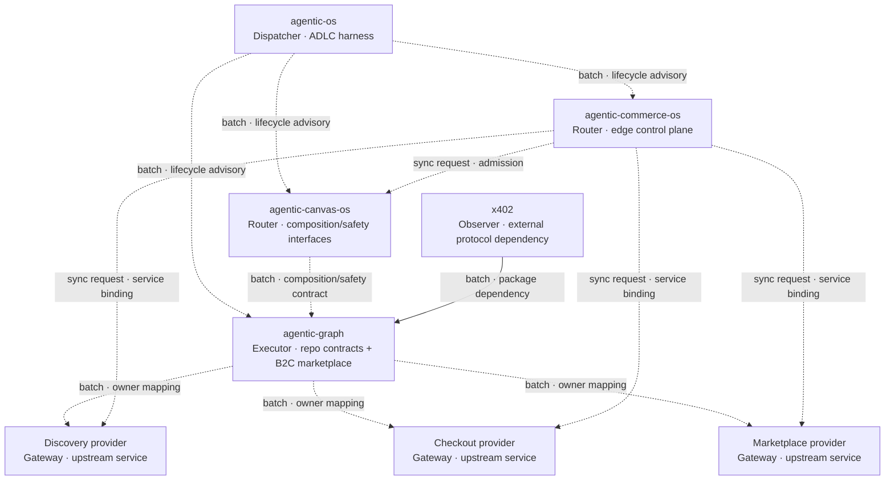
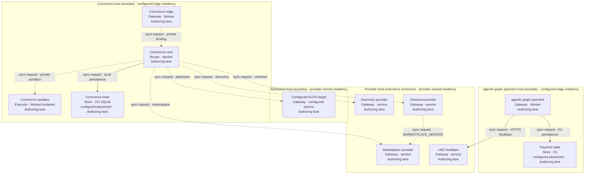

# Reference implementation — Technology Stack and Composition Architecture

Current composition identities and accepted product revisions live in
[`catalog/composition-source-lock.json`](../catalog/composition-source-lock.json).
Revision-qualified links and grounding tables below record historical evidence, not current pins.
Use `composition:runtime:check` with exact owner roots and `agentic-os pin --consumer=<root>`
for current observations; refreshing a pin does not refresh historical verification evidence.

This combined PRD/TAD/ADR owns technology selection, composition and workspace topology for seven independently governed repositories. It consolidates the former website topology document, including its reviewed-source candidate at `topology_input_revision`; that unmerged candidate is input, not integrated evidence. Product/runtime owners remain independent. This guide observes interfaces and acceptance boundaries; it creates no cross-repository controller. Shared semantics and template fields remain owned by [PRD/TAD/ADR Guidelines](../../huijoohwee.github.io/guidelines/prd-tad-adr-guidelines.md) and its [Core Templates](../../huijoohwee.github.io/guidelines/prd-tad-adr-templates.md). The imported baseline and amendment retain their digests below. Their runtime evidence and permissions are historical, candidate-bound records; this documentation consolidation renews none of them.

## Opening directive

```yaml
directive_id: "DIR-DOC-PUBLISH-01"
context: "Four runtime/lifecycle owners and three workspace surfaces expose independently governed contracts"
intent: "Document their composition without duplicating capability ownership or inventing runtime proof"
directive: "Bind material claims to exact revisions, preserve provider boundaries, and leave execution closed"
role: "system-architect"
action: "document component composition and selection decisions"
outcome: "one grounded PRD/TAD/ADR with seven owners, topology, decisions, verification conditions, and explicit gaps"
subject: "agent"
verb: "compose"
object: "architecture"
```

## Runtime-source directive

```yaml
directive_id: "DIR-RUNTIME-READY-01"
operator_request: "IMPLEMENT production runtime ready"
context: "At agentic-os 99dd3d18, agentic-canvas-os 3c597227, agentic-graph 9ba90b95, and agentic-commerce-os d5323bc3, provider joins were absent or unverified; Commerce admission v1 could not bind its authorized full intent to the four-field provider effect"
intent: "Reach production-verifiable composition through the smallest owner-published contracts without duplicating admission, discovery, money movement, settlement, or marketplace state"
directive: "Implement admission provider v3 and the three evidence-bound provider adapters in independent owner lanes, bind their exact source artifacts without executing sibling code, and keep promotion closed until exact authenticated release inputs exist"
role: "solo-founder-ai-orchestrator"
action: "coordinate owner-scoped runtime implementation and independent verification"
outcome: "exact reviewable source candidates bind the intended joins while owner behavior, release, and paid-runtime VCCs remain separately evidenced and fail closed"
subject: "agent"
verb: "implement"
object: "production-runtime-composition"
```

The historical runtime sprint capped four owner lanes; current documentation stays below 600 lines/file. External provider/review waits use condition-based rechecks, not inferred completion times.

## Feature: Governed commerce composition and workspace topology

### Problem Statement, Personas and User Journey Stage
A solo maintainer needs one source map during development and release; duplicate topology documents already disagree on routes and deployment ownership. The buyer journey remains discovery to receipt.

### User Stories
As a maintainer, I want one inspectable owner per capability so that I can select the smallest safe change. As a buyer, I want a confirmed purchase and replay-safe receipt so that retrying cannot charge me twice.

### Acceptance Criteria
Given the seven source revisions, when a maintainer follows the composition map, then commands, routes and owners resolve and historical, intended and deployed states remain distinct (`AC-TOPOLOGY-01`). Verify this with `VCC-TOPOLOGY-01`; runtime acceptance remains in the cross-repository criteria below.

### MoSCoW Priority, Min-Viable Scope and Dependencies
Must: consolidate existing documentation and repair live references, reusing owner code and validators. Should: reconcile deployment-owner policy at its owners; prerequisite: actual provider configuration. Out of scope: runtime changes, product mirror migration, payment, deployment or new dependencies. Documentation integration and exact clean lane cleanup are authorized when required checks pass. Open Questions: shared-project release ownership and live route state remain unresolved below. ROI score and monthly operating TCO are unmeasured; no demand or financial return is inferred.

### Pain-Point-to-Feature Mapping (runtime target; demand unvalidated)

| Field | Requirement |
|---|---|
| Pain point | `unvalidated` — a buyer can discover an offer but cannot complete one governed, replay-safe transaction across the four components |
| Hook | One mobile browser flow exposes discovery, explicit confirmation, settlement, and receipt readback |
| Break | Unjoined provider contracts and an unverifiable admission effect stop the flow before a real first dollar |
| Fix | Reuse each current owner and add only versioned adapters, exact evidence pins, and cross-repository checks |
| Close | A buyer receives one digest-valid settlement receipt; replay causes no second effect |
| Min-time-resource-max-value | Reuse owners within free quotas; fail closed at limits. [Cloudflare Containers require Workers Paid](https://developers.cloudflare.com/containers/platform/pricing/) and are forbidden; replace the sandbox execution owner while preserving isolation and receipts. Demand validation remains separately pending |

### Success metrics

| Metric | Target | Evidence |
|---|---|---|
| Time-to-value | One supported purchase in at most five buyer actions and ten minutes from a clean browser session | Timed production smoke receipt |
| Token economics | Discovery/readiness/receipt readback use zero model calls and zero LLM tokens | Per-route cost log and runtime probe |
| Transaction safety | One money effect for any count of exact confirmation retries | Provider and settlement idempotency suites |
| Infrastructure TCO | Free tiers only: zero spend, no paid plans/addons/overages; FOSS software | Bound configuration, license and quota inventory; unknowns block adoption |
| Documentation TTV | Baseline: two conflicting sources; target: one guide and direct references this increment | `VCC-TOPOLOGY-01` |
| Readiness | Historical local `dev-proven` / delivered `undocumented`; topology increment targets `spec-complete` / `undocumented` | Source/document checks only |
| Delivery | Every exact candidate and deployed version is joined to review, release, rollback, and runtime receipts | Per-repository lifecycle and delivery evidence |

### Five-flow trace

| Flow pattern | Requirement and owning surface |
|---|---|
| User journey | Buyer discovers → reviews → confirms → receives settlement state; the browser never holds provider credentials |
| Workflow | Commerce reserves admission/checkout authority before an owner effect and completes it only after exact echoed evidence |
| Data flow | Digests bind intent → provider request → owner receipt → settlement readback without copying authoritative state |
| Orchestration/harness | MCP handles discovery; typed service bindings handle admission, checkout, and marketplace; each emits zero-model cost evidence |
| Topology | Authoring, mirror, and delivery lanes remain distinct; Diagrams `COMP-1`, `TOP-1` and the Deploy Boundary Register bind component and promotion paths |

### Demo skeleton

| Beat | Bound | Observable result |
|---|---:|---|
| Hook | 30 s | Open the mobile storefront and submit one supported discovery intent |
| Probe | 60 s | Show exact offer/provider revision and confirmation total |
| Reveal | 90 s | Confirm once and surface the digest-valid settlement receipt satisfying `VCC-RUNTIME-X402-03` |
| Confirm | 30 s | Replay the same confirmation and show the identical receipt with no second effect |
| Close | 30 s | Read marketplace settlement and runtime evidence from zero-token routes |

Monetization: mechanism proof, priced WTP validation and collected payment are independent evidence. No new payer research or payment occurred here; buyer demand and ROI remain unvalidated.

## Constraints

- One capability owner; independent repository claim, review, integration, release and cleanup receipts.
- `agentic-os` is the lifecycle/orchestration, admission-vocabulary, and composition source-lock SSOT.
- ACOS, Commerce, and Graph remain separate runtime, state, and deployment owners. This decision
  does not physically migrate any of those repositories or their deployable assets into `agentic-os`.
- A provider mention is no adapter, dependency, deployment or receipt; extensions require owner contracts.
- `AG_REPO` identifies `huijoohwee/agentic-graph` source provenance; architecture keys use `AG_*`.
- Shared invocation/safety contracts stay separate from Graph collaboration grammar and domain schemas.

## Codebase Grounding Record

Baseline grounding was read-only on 2026-09-03; the admission/marketplace refresh below is 2026-09-04. A `confirmed` disposition proves only the cited revision and grants no lifecycle or delivery authority. The following baseline claims are historical; the 2026-09-09 topology snapshot does not refresh their owner-suite, source-lock or delivery evidence. Repository:path locators resolve at the named revision; relative sibling links assume the canonical GitHub workspace, not an isolated worktree path.

| Input | Bound revision or digest | Observation |
|---|---|---|
| Imported TAD and amendment | `sha256:5e646e…39418` / `sha256:4abee8…b7a7e` | Untracked inputs; no committed source revision |
| `agentic-os` | `99dd3d18d573c2ccf7616e29dad15aad94359b84` | Clean canonical checkout; repository-local ADLC contracts and the released document baseline |
| `agentic-canvas-os` | `3c597227dbb1101a2d5d75cb83a8496e22357a0e` | Clean canonical checkout; invocation and composition contracts grounded there |
| `AG_REPO` | `9ba90b95bcde38db9f25f6b945ba66cfd264e735` | `agentic-graph` source at the immutable [Git locator](https://github.com/huijoohwee/agentic-graph/tree/9ba90b95bcde38db9f25f6b945ba66cfd264e735); GitHub repository identity is `huijoohwee/agentic-graph` |
| `agentic-commerce-os` | `d5323bc35a62cf2dace300990d5ee0db228897d8` | Clean canonical checkout; provider contracts and receipt gates inspected |
| Runtime refresh baseline | `agentic-os` `499296c7830ca62f30a6b6ac4181474e2511bae9`; ACOS `8e4d934123c01380059e1b1894c520c472fd4e23`; `AG_REPO` `286b00b5c229605547abfa3cfb127e433f8362f9`; Commerce `2857054241ba5bb5f35ffeba4e668590bbd8fb86` | Exact clean baseline revisions observed on 2026-09-04; no candidate, integration, or delivery authority inferred |
| Composition source lock | `agentic-os:catalog/composition-source-lock.json` | Candidate-local canonical lock binds exact owner origins, revisions, trees, tracked contract/fixture blobs, and the Commerce production topology manifest; it grants no runtime authority |
| External marketplace reference | `3c4b3cc04d0fa4bba597013ab7528c12acdd4013` | Private grounding-log reference only; no composed component |
| x402 / Cloudflare integration guide | `eb0d899ead358a88eb3899dd3f5051e990e02299` / `37b9c206ecbb92a87eeab0c6869a1e70675e7154` | Sources checked against the existing `agentic-graph` implementation |

| Material claim | Disposition | Evidence and consequence |
|---|---|---|
| `agentic-os` governs worktree/lane lifecycle | `confirmed` | `agentic-os:docs/LANE.md` defines one repository-scoped machine and denies authority to Git projections |
| ACOS is the sole owner of `/`, `#`, `@`, and all frontmatter semantics | `contradicted` | At the imported baseline ACOS supplied shared dictionaries/safety; current dictionary ownership is OS (stack inventory below). `AG_REPO:docs/collaboration-runtime-contract.md` is `agentic-graph`'s machine SSOT for its collaboration frontmatter and PR grammar |
| ACOS provides a native external Agents SDK | `contradicted` | It has a provider-neutral facade and blocked native skill harness; `docs/PROGRESSIVE-AGENTS.md` rejects emulating an external SDK |
| `agentic-graph` uses no external Agents SDK | `contradicted` | `AG_REPO:cloudflare/workers/agentic-graph-mcp/package.json` depends on Cloudflare's `agents` package for its MCP Worker |
| Commerce consumes a live ACOS admission contract | `static-source-confirmed; runtime-unverified` | Exact provider/consumer artifact blobs and identical canonical v3 / receipt v2 fixtures align; behavior is owner-suite evidence and protected deployment readback is still required |
| `agentic-graph` owns its domain graph and native marketplace/ledger behavior | `confirmed` | `AG_REPO:contracts/kgc-document.schema.js`, `ecs/kgcNodeContract.js`, `src/{ledger,marketplace,payout}`, and D1 migration `0016_native_marketplace_settlement.sql` contain the current owners |
| `agentic-graph` implements StraitsX and Avalanche as equivalent production payment rails | `contradicted` | StraitsX has an implemented rail and persisted schema; Avalanche appears in verification/configuration and planning surfaces, not as an equivalent rail in the current payment contract |
| Commerce discovery, checkout, marketplace, and receipt seams exist | `confirmed` | `agentic-commerce-os:src/core` owns all three provider contracts, clients, receipts, and fail-closed evidence joins |
| Marketplace binding names are interchangeable across repositories | `contradicted` | Commerce consumes `MARKETPLACE_PROVIDER`; `agentic-graph` travel commerce separately consumes `MARKETPLACE_SERVICE` |
| No code exists for the composition | `contradicted` | Owner lanes implement all four source joins and fail-closed evidence gates; the central observer binds their source but does not execute it, and protected integration remains separate |
| `agentic-graph` x402 implements `commerce.checkout-provider/v1` | `owner-suite-evidenced; delivery-unverified` | The exact owner candidate's adapter, route, settlement-readback, and replay suites pass locally; a nonzero operator payee and paid production receipt remain external |
| Commerce ACOS permit binds the provider POST payload | `owner-suite-evidenced` | Owner suites cover Commerce translation and ACOS full-intent digest enforcement; the central observer attests only their exact artifacts and identical fixture |
| Commerce discovery constraints map to the live owner input | `owner-suite-evidenced` | The owner suite covers one structured route projection and generic-synthesis rejection; protected deployed-version readback remains pending |

### Historical topology source snapshot — 2026-09-09

| Repository | Inspected canonical revision |
|---|---|
| `agentic-os` | `e89e96089c3a75b99d30135bb2c6f5a3eccc8036` (base before this edit) |
| `huijoohwee.github.io` | `95ed40c3605feab075fd5da7182c29b892dd9dd5` |
| `agentic-canvas-os` | `efd892678083302d46e9a8205bc02b8b39c46c1a` |
| `agentic-commerce-os` | `50d0047fe140595c7086e1a122ffa76ab20a29bd` |
| `agentic-graph` | `ac194fbd0c33a1899399ba9afbfa1bb7a886cf23` |
| `huijoohwee` | `b7b6c39ce0b5844a43042026a910f7552477c8ff` |
| `GameXR` | `718298dec9928f30bd24e349a7527aba2c85bfb1` |

## Technology stack — reference implementation

This section supersedes the website stack narrative at `techstack_input_revision`. File locators below resolve within each named repository at the inspected revisions; they are source evidence, not deployment or license certification for transitive dependencies.

| Capability / sole source | Implemented technology and locator | Adoption boundary |
|---|---|---|
| Lifecycle and invocation — OS `678290f3bc041d9af80bfa74960fe7464863ed6d` | Native Node ESM, `package.json`, `src/invocation.mjs`, `catalog/dictionaries`, `src/rank.mjs`, `bin/agentic-os-mcp.mjs` | MIT; no runtime dependencies. Shared `/`, `@`, `#` resolution is deterministic; model-assisted implementation has a separate cost budget |
| Agent facade — Canvas `954de91689abc1ab99a783e54f5ca7ac61387449` | Worker/SQLite DO bindings in `wrangler.jsonc`; browser in `web`; `scripts/invocation-resolve.mjs` imports `agentic-os/invocation` | Consume the pinned shared package. Root manifest declares no license; verify applicable licenses before adoption, rather than inferring FOSS from public source |
| Commerce — `4774a4fc1543c4bcb1b912fe79c78c61384efc7c` | TypeScript Workers and SQLite DOs in `src/core`, MCP SDK/Zod in `package.json`; direct Podman executor in `scripts/isolated-process.ts`, `scripts/sandbox-podman-executor.ts` | MIT owner code. Sandbox SDK remains an existing dependency; its configured Containers deployment is forbidden. The real isolated-process suite proves local execution only |
| Domain graph and marketplace — Graph `eb19100b4604e4d296bf6094f183f255ef0b20a6` | `canvas/package.json`, `cloudflare/workers`, `mcp/package.json`: browser UI, Hono/Workers, D1/Drizzle, Yjs, x402 adapters; `mcp/agentic-canvas-os-docs-contract.mjs` consumes OS invocation | Preserve each domain/state owner and implemented protocol. Existing packages are not blanket approval for new dependencies; verify component licenses and selected host quotas |
| Spatial client — GameXR `7609bebd4b72efa2038b9f222e22ca56d13370ed` | Vite/Three.js and packaged Graph spatial/shared artifacts in `package.json`, `vite.config.ts`; native host in source-owned release guide | MIT; offline/browser work remains separate from shared Pages route/deployment ownership |
| Authoring and navigation — website `8a0702ddca1fb2c9c88f85657d9dc6d91d05df27` | Markdown, JSON/JSON-LD, `guidelines`, `schema/AgenticRAG`; existing Node/Python validation in `package.json` | ISC manifest; common CID/RAO/SVO and schema authority stay here, with direct links to this stack owner |
| Generated delivery — mirror `b7b6c39ce0b5844a43042026a910f7552477c8ff` | Graph-generated browser assets, headers and redirects | A projection, not an independent technology-selection or product-code owner; preserve source-owned release ordering |

### Hosting and resource selection

Constraints → argumentation → outranking selects reuse of an existing qualified owner before a new service. Free hosted services are permitted but are not called FOSS. Unknown license, quota, recurring cost or automatic overage blocks adoption, not unrelated implementation work. Paid plans, Containers hosting, paid add-ons and metered overages are excluded; this document grants no upgrade authority.

| Option | Constraint and tradeoff | Decision |
|---|---|---|
| Existing free edge hosting | Keep only workloads whose required APIs and enforced quotas fit the actual Free plan; local success does not prove host compatibility | Retain eligible Workers/Pages contracts; verify configuration before deployment |
| Already-owned device with FOSS runtime | Podman provides isolated execution without a hosted container subscription; uptime, network transport, recovery and resource limits still need owner evidence | Reuse the implemented runner; Workers-to-Podman transport, rollout migration and independent evaluator remain unfinished |
| Newly provisioned infrastructure or paid hybrid | Subscription, usage or operational cost is unknown/nonzero; extra ownership increases maintenance | Excluded from this increment; no new infrastructure or dependencies |

Dollar savings, ROI scores, scale/MAU figures and monthly cost estimates in the old stack document were scenarios, not measurements. No numeric savings or zero-total-cost claim is carried forward. Deterministic invocation means zero model calls in that resolver, not zero cost for an entire ADLC session. Track actual calls, tokens, wall time, storage and quota use at the owning execution boundary.

### Operator journey and bounded harness

Discover the supported command/catalog → select one owner and scope → implement in a registered lane → run applicable owner checks → integrate the exact green PR → observe completion → prune the exact clean target → synchronize clean canonical. Product deployment and authenticated runtime readback are separate owner operations. OS owns `docs/START-WORKFLOW.md`, `docs/RELEASE-WORKFLOW.md` and lifecycle commands; former Canvas `START-WORKFLOW.md`, `worktree:lifecycle:check` and `session:start:classify` examples are historical, not a current universal CLI.

Federate existing transports without a fifth monolithic proxy or second data owner. MCP/WebMCP clients discover read-only capabilities first and use typed, authenticated mutation contracts only when authorized. Each execution boundary declares input/output/error, identity, cost, retry/idempotency and failure behavior. Bound concurrency, attempts, tokens, context and wall time per task; an implementer cannot supply its own independent evaluator trust anchor. Keep budgets and evaluator claims with executable owner contracts rather than copying the old narrative's numeric defaults.

Local supervisors own ports and process identity; do not adopt or terminate an unrelated listener. Lazy-load only the required catalog, source chunk and check profile; cache derived projections by exact source revision/digest and invalidate on drift. Git documents stay authoritative; memory, generated indexes and resume summaries carry source links and do not become new authority. The future per-agent memory tier remains DR-8 specification-only.

Operator TTV targets inherited from the old document are ≤3 steps/5 minutes to resolve a supported invocation, ≤6 steps/30 minutes to onboard a new target repository, and ≤1 session for the first multi-repository release. These are unmeasured targets, not current timing guarantees; use current owner-native commands and independent release receipts. External-agent read-only discovery and the buyer paid-loop criteria remain distinct journeys.

### Consolidated source and historical evidence

The removed website document is preserved in [its immutable source revision](https://github.com/huijoohwee/huijoohwee.github.io/blob/8a0702ddca1fb2c9c88f85657d9dc6d91d05df27/docs/documents/agentcos-tech-stack-document.md); `techstack_input_digest` binds its complete bytes. This historical record is retained without another active copy or redirect shim.

| Imported material | Current disposition |
|---|---|
| Four lenses: minimum valuable scope, TCO, token economics, harness; stack options; operator/agent journeys | Technology selection and bounded harness above; owner, evidence and economic targets remain distinct |
| Five legacy ADRs: thin harness/no second data owner, Git-backed invocation, discovery-first federation/no fifth proxy, supervisor-owned ports, zero-model orchestration | Reconciled with DR-7/8/10/11, actual OS lifecycle/invocation ownership and current product supervisors; no competing workflow or copied dictionary |
| 2026-08-20 VCC-1/3/4/6 and six-workstream promotion narrative | Historical reports of docs checks, peer digests, local listeners and clean mirrors; no current deployment claim. Exact commands, SHA/digest strings and observations remain in the immutable source |
| VCC-2/2c authority failures, VCC-5 temporary GameXR port, VCC-7 string scans, VCC-8 HTTP 200/406 | Historical partial checks; string absence does not prove zero cost, HTTP status alone does not prove authorization, and a stopped local server does not prove production availability |
| VCC-R release run `30771408324`, failed attempts `30771075357`/`30771147307`, paired source/mirror SHAs | Retained as the old document's dated 2026-08-02 release evidence; no renewal of candidate authority, readiness rung or deployment identity |
| Canvas-as-global-orchestrator, generic mirror-before-deploy, old namespace/commands and inconsistent promotion summaries | Superseded by Division of Work, the actual Graph release sequence, owner-native CLI and separate source/runtime/commercial gates |

## Division of Work

| Component | Sole owned capability | Consumes | Explicit exclusion |
|---|---|---|---|
| `agentic-os` | Lifecycle/orchestration, shared invocation dictionaries/resolution, admission-vocabulary, and source-lock SSOT: repository-local ADLC records, static composition observation, exact integration classification | Exact owner Git identities, tracked artifacts, canonical fixtures/topology, and external authority receipts | No sibling candidate execution, cross-repository claim service, product runtime, or ownership migration |
| `agentic-canvas-os` | Composition/safety interfaces and provider-neutral agent facade | OS shared invocation package; `agentic-graph` runtime catalogs and executors | No ownership of `agentic-graph`'s repository-specific collaboration grammar, payment rails, settlement persistence, or external Agents SDK dependency |
| `agentic-graph` | Repository collaboration grammar, KGC/domain schemas, B2C marketplace storefront/orchestration, domain execution/state, payment rails, bundle/vendor splits, and payouts | OS shared invocation package, ACOS safety interfaces and configured providers | D1 marketplace projections are not the authoritative bundle ledger |
| `agentic-commerce-os` | Edge coordination, admission-receipt validation, local projection, provider routing, derived markup, and evidence gates | ACOS admission plus discovery, checkout, and marketplace provider bindings | No ownership of upstream admission, discovery execution, money movement, settlement ledger, or payout execution |
| `huijoohwee.github.io` | Shared guideline/schema vocabulary and documentation navigation | This guide for composition; `guidelines/prd-tad-adr-guidelines.md` for authoring | No product runtime or deployment controller |
| `huijoohwee` | Generated production projections, validation, headers and redirects | Graph-generated assets and source-owned release policy (`AGENTS.md`, `_redirects`, `package.json`) | No authored Graph app code |
| `GameXR` | Browser-local spatial flight and native visionOS host | Packaged Graph spatial/shared code (`package.json`, `vite.config.ts`, `docs/RELEASE.md`) | No shared-root publication without a routing decision |
| x402 | External protocol packages; the current adapter and paid-resource routes are owned by `agentic-graph` | `agentic-graph` PRD/TAD, configuration, and readiness gates | No Commerce-owned payment rail and no delivered paid-runtime proof |

## Architecture: Component composition

### Overview and Journey → System Mapping
From buyer intent through Commerce to owner admission/discovery/checkout/marketplace and receipt, reuse the five-flow trace and the component/connection inventories below as the journey-to-system map. Orchestration is a bounded sequential request/replay path: discovery and receipt reads use zero model calls, budget 0 prompt + 0 completion tokens/request, and fail closed on invalid evidence. Product providers own their cost logs and optional inference; this guide starts no model or service.

Edges describe owned or intended relationships; the companion join state distinguishes static source from deployed runtime. Dotted edges are lifecycle guidance, non-binding input, or an unverified deployment join and must not be read as observed runtime calls.

**Diagram COMP-1** · Class: Component topology · Notation: `flowchart TB` · Surface: Markdown source · Version: 10 — 2026-09-04 **Caption**: Independent owners compose source-declared providers; deployed joins remain unproved.



### Component inventory — Diagram COMP-1

| Layer | Component | Node key | File / module | Role · type | Local rung | Delivered rung |
|---|---|---|---|---|---|---|
| Lifecycle | `agentic-os` | `AOS` | `agentic-os:docs/LANE.md` | Dispatcher · ADLC harness | `spec-complete` | `undocumented` |
| Interface | `agentic-canvas-os` | `CANVAS` | `agentic-canvas-os:docs/FACTS.md` | Router · composition/safety interfaces | `dev-proven` | `undocumented` |
| Domain | `agentic-graph` | `AG` | `AG_REPO:contracts/kgc-document.schema.js`, `ecs/kgcNodeContract.js`, `src/marketplace` | Executor · repository contracts and B2C marketplace orchestration | `spec-complete` | `undocumented` |
| Control | `agentic-commerce-os` | `COMMERCE` | `agentic-commerce-os:src/core` | Router · edge control plane | `dev-proven` | `undocumented` |
| Provider | `agentic-graph` discovery | `DISCOVERY` | `AG_REPO:cloudflare/workers/agentic-graph-mcp` | Gateway · upstream service | `dev-proven` | `undocumented` |
| Provider | `agentic-graph` checkout | `CHECKOUT` | `AG_REPO:cloudflare/workers/agentic-graph-travel-commerce` | Gateway · upstream service | `dev-proven` | `undocumented` |
| Provider | `agentic-graph` marketplace | `MARKET` | `AG_REPO:cloudflare/workers/agentic-graph-marketplace` | Gateway · upstream service | `dev-proven` | `undocumented` |
| Protocol | x402 | `X402` | `AG_REPO:cloudflare/workers/agentic-graph-payment/agenticCommerceX402.ts` | Observer · external protocol dependency | `spec-complete` | `undocumented` |

### Connection inventory — Diagram COMP-1
All 12 labelled edges are the connection inventory. Lifecycle and shared-contract edges are advisory; provider edges are source-declared, not observed deployed calls. The historical ACOS package pin `087c7246...` was not the grounded `3c597227...` revision; recheck current pins before any consumer change. Admission v3 / receipt v2 artifacts align at the locked baseline. x402 remains an upstream dependency.

## Runtime topology

**Diagram TOP-1** · Class: Runtime topology · Notation: `flowchart TB` · Surface: Markdown source · Version: 7 — 2026-09-04 **Caption**: The Topology pattern specifies four trust boundaries in the Authoring lane. The tracked Commerce manifest fixes expected binding names; neither that manifest nor release code proves deployment. The Worker/container sandbox is the legacy configured topology, forbidden under current Free-only policy; the direct Podman runner below does not yet replace its deployed transport. **Boundaries**: admission trust; commerce trust; `agentic-graph` payment trust; provider trust external to commerce.



| Node | Boundary | Role | Type | Lane | Connects to | Connection type | Data residency |
|---|---|---|---|---|---|---|---|
| `ACOS_ADM` | admission trust | Gateway | configured service | Authoring | `COMMERCE_CORE` inbound | sync request | Provider-owned; unproved here |
| `COMMERCE_EDGE` | commerce trust | Gateway | Worker | Authoring | public prefix and `COMMERCE_CORE` | sync request | Request-local; public delivery unproved |
| `COMMERCE_CORE` | commerce trust | Router | Worker | Authoring | admission, three providers, local store | sync request | Request-local; state in `COMMERCE_STORE` |
| `COMMERCE_SANDBOX` | commerce trust | Executor | Worker/container | Authoring | `COMMERCE_CORE` inbound | sync request | Private container placement; unproved here |
| `COMMERCE_STORE` | commerce trust | Store | DO SQLite | Authoring | `COMMERCE_CORE` inbound | sync request | Configured placement; jurisdiction unproved |
| `AG_PAY` | `agentic-graph` payment trust | Gateway | Worker | Authoring | `AG_STORE`, `X402_FAC` | sync request | Request-local; state in `AG_STORE` |
| `AG_STORE` | `agentic-graph` payment trust | Store | D1 | Authoring | `AG_PAY` inbound | sync request | Configured placement; jurisdiction unproved |
| `DISCOVERY_RT` | provider trust external to commerce | Gateway | service | Authoring | `COMMERCE_CORE` inbound | sync request | Provider-owned; unproved here |
| `CHECKOUT_RT` | provider trust external to commerce | Gateway | service | Authoring | `COMMERCE_CORE` inbound | sync request | Provider-owned; unproved here |
| `MARKET_RT` | provider trust external to commerce | Gateway | service | Authoring | `COMMERCE_CORE` inbound | sync request | Provider-owned; unproved here |
| `X402_FAC` | provider trust external to commerce | Gateway | service | Authoring | `AG_PAY` inbound | sync request | Provider-owned; unproved here |

### Connection inventory — Diagram TOP-1
All 10 labelled edges are the connection inventory. Core-to-store and payment-to-D1 are source-owned persistence relationships; service/facilitator edges require separate protected deployment readback. Travel checkout uses `MARKETPLACE_SERVICE`, distinct from Commerce's `MARKETPLACE_PROVIDER`.

### Component inventory — Diagram TOP-1

| Layer | Component | Node key | File / module | Role · type | Local rung | Delivered rung |
|---|---|---|---|---|---|---|
| Admission | `agentic-canvas-os` | `ACOS_ADM` | `agentic-canvas-os:agent-api/src/commerce-admission-{contract,provider}.js` | Gateway · configured service | `dev-proven` | `undocumented` |
| Edge | `agentic-commerce-os` | `COMMERCE_EDGE` | `agentic-commerce-os:src/edge` | Gateway · Worker | `dev-proven` | `undocumented` |
| Control | `agentic-commerce-os` | `COMMERCE_CORE` | `agentic-commerce-os:src/core` | Router · Worker | `dev-proven` | `undocumented` |
| Execution | `agentic-commerce-os` | `COMMERCE_SANDBOX` | `agentic-commerce-os:src/sandbox` | Executor · Worker/container | `dev-proven` | `undocumented` |
| State | Commerce state | `COMMERCE_STORE` | `agentic-commerce-os:src/core/{checkout-session,revenue-ledger}.ts` | Store · DO SQLite | `spec-complete` | `undocumented` |
| Payment | `agentic-graph` payment | `AG_PAY` | `AG_REPO:cloudflare/workers/agentic-graph-payment` | Gateway · Worker | `spec-complete` | `undocumented` |
| State | Payment state | `AG_STORE` | `AG_REPO:cloudflare/workers/agentic-graph-payment/agenticCommercePersistence.ts` | Store · D1 | `spec-complete` | `undocumented` |
| Provider | `agentic-graph` discovery | `DISCOVERY_RT` | `AG_REPO:cloudflare/workers/agentic-graph-mcp` | Gateway · service | `dev-proven` | `undocumented` |
| Provider | `agentic-graph` checkout | `CHECKOUT_RT` | `AG_REPO:cloudflare/workers/agentic-graph-travel-commerce` | Gateway · service | `dev-proven` | `undocumented` |
| Provider | `agentic-graph` marketplace | `MARKET_RT` | `AG_REPO:cloudflare/workers/agentic-graph-marketplace` | Gateway · service | `dev-proven` | `undocumented` |
| Provider | x402 facilitator | `X402_FAC` | `AG_REPO:cloudflare/workers/agentic-graph-payment/wrangler.toml` | Gateway · service | `spec-complete` | `undocumented` |

### Workspace Dev, runtime interfaces and deployment strategy

| Surface | Source declaration and owner locator |
|---|---|
| Graph Dev | `agentic-graph:package.json`: `dev`, `dev:apex`, guarded `dev:latest`; `scripts/dev-source-consistency.mjs` requires the unique clean canonical `main` at the fetched revision. Admitted task previews are not canonical Dev proof. |
| Graph app / discovery | `cloudflare/pages/agentic-graph-agent-ready-shared.mjs`: `/agentic-graph`; `/agentic-graph/mcp` is public discovery. `root-agent-ready-index.mjs` injects root alias metadata into the same React shell. MCP is not the Canvas render transport. |
| Control-plane MCP | `agentic-graph:cloudflare/workers/agentic-graph-mcp/wrangler.toml`: `/agentic-os/control-plane/mcp`; Canvas `AGENTIC_OS_MCP_ENDPOINT` agrees. |
| Canvas facade | `agentic-canvas-os:wrangler.jsonc`: `worker/index.js`, `web/dist`, `CANVAS_ROOM`, `AGENT_STATE`; no live production URL is inferred. |
| Commerce | `package.json`: own `dev`, `dev:apex`, offline Worker checks. `wrangler.edge.jsonc`: `airvio.co/agentic-commerce-os*` → `COMMERCE_CORE`; sandbox is separately declared in `wrangler.sandbox.jsonc`. |
| GameXR | `package.json`: `dev`, `dev:apex`, `build`, `build:apex`; `vite.config.ts`: `/gamexr/`, or root mode with service-worker registration disabled at shared root. |

`bin/composition-deployment-topology.mjs:inspectCompositionDeploymentTopology` passed five static joins at this snapshot with zero findings and `candidateCodeExecuted:false`. Commerce's production manifest and core configuration agree on `ACOS_ADMISSION→agentic-canvas-os`, `CHECKOUT_PROVIDER→agentic-travel-commerce-production`, `COMMERCE_SANDBOX→agentic-commerce-sandbox-production`, `DOCS_MCP→agentic-mcp` and `MARKETPLACE_PROVIDER→agentic-marketplace-production`. Manifest digest: `fbd529714b6d236aa85a0f12fffd3a71c19eefbb83850c5a4e34dc6fda3ff9c4`. This proves declaration consistency only; it neither updates the source lock nor proves a paid loop.

The mirror snapshot still has retired unhyphenated Graph directories and redirects; source constants and mirror policy target `/agentic-graph/` and `content/agentic-graph`. Neither state proves live routing. `/gamexr/` and `/singabldr` are adjacent mirror routes; Singabldr's source is outside this seven-repo audit. Vercel/AWS tiering is superseded (`agentic-canvas-os:docs/PRD-TAD.md` and `agentic-graph:docs/agentic-graph-acos-topology-decision.md`). Do not hand-repair generated assets.

Graph's `.github/workflows/release.yml` owns exact source/dependency validation → generated candidate → protected production authorization → Wrangler Pages deployment → immutable/stable/public and browser verification → verified mirror publication → release evidence. Its actual scripts are `pages:sync`, `pages:build-sync`, `pages:functions:build`, `pages:check-sync`; `sync:pages` and `release:pages` are absent. `pages:deploy-cloudflare` exists but grants no bypass authority. Consumers retain installed pinned OS workflows. No VM, container, browser, Worker or model starts unless the selected check requires it. GameXR's `docs/RELEASE.md` instead requires a scoped mirror PR, Git-connected `joohwee` preview, exact authorization, merge, production verification and rollback; Git is its sole forward owner. This conflicts with Graph's Wrangler-before-mirror workflow and mirror `AGENTS.md`. Reconcile project/ route scope, sibling preservation, serialization and rollback with actual provider configuration before an affected release. This documentation change selects no controller and authorizes no release.

### Quality Attributes

| Attribute | Requirement and verification |
|---|---|
| Performance / scalability | Bounded reads and zero-model discovery; existing owner suites and topology inspector, not new services |
| Security / observability | Exact identity, receipt and protected readback; keep unverified deployment claims closed |
| Offline / device reach | Browser-local views may work offline; provider mutations require connectivity; mobile/browser owner checks before release |
| TCO / token cost | Documentation adds $0 infrastructure and 0 runtime model calls; total managed, self-hosted and hybrid operating costs remain unmeasured |

## Diagram register

Site `scripts/check-diagram-canvas-render.mjs` passed: 2 diagrams, 19 nodes, 22 edges, 4 clusters, no findings.

| Diagram | Class | Notation | Surface | Projects | Nodes | Edges | Clusters | Version |
|---|---|---|---|---|---|---|---|---|
| `COMP-1` | Component topology | `flowchart TB` | Markdown source → graph elements | yes | 8 | 12 | 0 | 10 |
| `TOP-1` | Runtime topology | `flowchart TB` | Markdown source → graph elements | yes | 11 | 10 | 4 | 7 |

## Integration Contracts and Interface Invariants

Commerce consumes JSON `commerce.discovery-provider/v1`, `commerce.checkout-provider/v1` and `commerce.marketplace-provider/v1` over HTTP/service bindings; exact digests and owner receipts gate effects. Graph’s Bundle Graph owns bundle/vendor splits and ordered settlement; D1 is a reference/projection store. OS owns shared dictionaries/resolution; ACOS owns safety interfaces; Graph owns collaboration grammar/domain/payment/state; Commerce owns its control plane/DO/deploy boundary. Checkout retains upstream x402 guardrails and evidence (DR-2). `MARKETPLACE_PROVIDER` and `MARKETPLACE_SERVICE` are distinct interfaces, never aliases. Errors fail closed.

## Embedded decision records

### DR-1 — External marketplace research is reference-only
An MIT-licensed Node.js/PostgreSQL/Redis marketplace informed seller/commission/split/payout concepts. Decision: no import, fork, deployment or compatibility claim; identity stays in the private grounding log.

### DR-2 — Retain upstream x402 and join through the checkout owner
Decision: reuse Graph's x402 adapter through `commerce.checkout-provider/v1`; add no Commerce payment rail. Constraints: Apache-2.0 protocol and Fetch/Workers compatibility pass; network/facilitator portability is conditional on an implemented scheme. Prepare persists guardrails; replay returns the stored settlement. The historical zero-address `payTo` and absent paid replay receipt keep production readiness unproved. Primary historical evidence: [principles](https://github.com/x402-foundation/x402/blob/eb0d899ead358a88eb3899dd3f5051e990e02299/README.md#principles), [protocol](https://github.com/x402-foundation/x402/blob/eb0d899ead358a88eb3899dd3f5051e990e02299/specs/x402-specification-v2.md), [Workers integration](https://github.com/cloudflare/cloudflare-docs/blob/37b9c206ecbb92a87eeab0c6869a1e70675e7154/src/content/docs/agents/tools/payments/x402/index.mdx).

### DR-3 — Admission provider v3 binds the authorized effect and deployed identity
Decision: `commerce.agentic-os-admission-provider/v3` and `agentic-os-adapter-registration/v2` retain `authoring_mutation_intent` as the fifth body field, fixing v1's lossy four-field effect projection. A signed `agentic-graph-commerce-admission-authority/v1` binds authority; the provider independently checks inputs/operation/permit and atomically journals fence plus outcome, with zero rejected writes. Exact replay retains the original `acos-cloudflare-deployment-identity/v1` receipt. POST header `x-agentic-os-serving-deployment-identity` and authenticated `readyz` independently prove current serving identity; Commerce checks exact keys and candidate pins, so old receipt bytes prove no cutover.

### DR-4 — Reuse owner state and typed service bindings
Decision: discovery accepts supported structured intents only; checkout reuses issuance/settlement and a DO journal; marketplace extends existing D1 fence/outcome state. Add no database, queue, cache, model or ledger. Calls bind four-field evidence, checks/request/binding digests; bodies cap at 65,536 bytes.

### DR-5 — Authenticate private service-binding operations
Private transport grants no authority. Decision: `commerce-agentic-os-admission-auth/v1` signs admission URL/method/body digest and twelve authoring headers; `commerce-provider-auth/v1` signs checkout/marketplace request and evidence digests. Distinct protected HMAC secrets precede disclosure, parsing and mutation; secrets never enter receipts. Public runtime-evidence routes remain read-only.

### DR-6 — Release each owner with authenticated forward recovery

Decision: ACOS uses its own protected production controller to seal the exact protected-main source, artifact, manifest, and Graph authority; upload one inactive tagged version; compare-and-swap the exact 100% active baseline while preserving unmanaged bindings; activate that version; and authenticate `readyz` readback against its deployment identity and Graph authority. Ambiguous upload, activation, or readback produces a preserve-required receipt for an independently authenticated forward-recovery run.

Historical configured release design (requires Free-only migration): Commerce separately seals its tracked `config/production-core-services.json`, uploads core and edge inactive, deploys and proves the private sandbox Worker/container, compare-and-swaps the active sandbox/core/edge tuple before each activation, and proves the exact `airvio.co/agentic-commerce-os*` prefix. Bootstrap requires absence; steady state requires an authenticated predecessor receipt. Cloudflare cannot atomically activate this tuple and container rollout, so ambiguous effects are preserved for forward recovery and no path claims transactional rollback.

### DR-7 — Keep orchestration native to the harness

No composed repository may add an external agent-orchestration SDK as a build dependency. Existing Cloudflare platform primitives remain repository-owned implementation details; other model providers are inference endpoints behind an owned gateway, never a second orchestration layer.

### DR-8 — Specify future ownership transfer without migrating repositories

`agentic-os` remains the executable lifecycle/orchestration and admission-vocabulary SSOT; consumers use an exact pinned package rather than copied workflows. ACOS consumes OS invocation and retains safety interfaces and its Worker/state, Commerce retains its control plane, and Graph retains domain/payment runtimes. No repository, deployable asset, or state is physically migrated by this decision. A future native Worker and per-agent Durable Object memory tier is specification-only: identity, authorization, storage transfer, idempotent `@mem-` export, rehydration, and rollback require a separate owner-approved design and executable VCC/RAO.

### DR-9 — Gate merchant and shopping roles on demand

Future MCP/WebMCP merchant and shopping roles may compose `agentic-os` runtime with the existing Commerce control plane. Demand validation remains separately pending and does not block technical runtime implementation. Commercial role selection and first-dollar claims require real micro-SME interviews and willingness-to-pay evidence. Merchant writes remain staged for approval; checkout remains with the existing owner. No external-reference code, prompt, schema, skill, or test may be copied.

### DR-10 / ADR-10: One composition and topology owner
**Status**: Accepted for documentation candidate; integration pending. **Date**: 2026-09-09. **Context**: Two topology narratives disagree on commands, routes and deployment order. **Decision**: Reuse this guide for composition/topology, retain shared authoring rules in the website, and remove the replaced website document after the owner candidate exists. Product owners keep execution. **Alternatives Considered**: (1) Keep both Markdown/FOSS documents: no infrastructure cost, recurring manual reconciliation; (2) generate a second projection: no paid dependency, but another generator and staleness surface. Constraints reject competing owners; argumentation favors direct references; outranking selects consolidation by zero new runtime code and fewer maintained artifacts. **Rationale**: One owner removes the observed documentation disagreement without moving product code. **TCO Impact**: all options add $0 infrastructure/egress/model runtime cost; consolidation lowers duplicate editing, generation adds maintenance, and monthly totals/12-month savings are unmeasured. No new managed, self-hosted or hybrid deployment is introduced; no variant price or vendor-risk reduction is asserted. **Consequences**: Positive—one topology owner; negative—old file links need migration; neutral—runtime and release evidence remain with current owners. `DIR-DOC-PUBLISH-01` → `AC-TOPOLOGY-01` → this decision/ workspace topology → `VCC-TOPOLOGY-01` → `ER-TOPOLOGY-01` is the bidirectional trace. **RAO/SVO**: `RAO-TOPOLOGY-01` Writer consolidates source claims; `02` validator checks VCC output; `03` publisher exposes exact owner/references/removal candidates in that dependency order. Protected integration and exact clean lane cleanup follow the standing user authorization and green checks; runtime effects remain separate.

### DR-11 / ADR-11: One technology-stack and composition guide
**Status**: Accepted for this documentation change. **Date**: 2026-09-09. **Continuity**: `TAD-COMPOSE-ARCH-001` is retained; a file rename does not create a new contract identity. **Context / decision**: The website stack and OS composition guide overlap and conflict on ownership, economics and readiness. Consolidate supported material into `guides/TECH-STACK.md`, update live navigation and static observer inputs, then remove the website source after protected owner integration. Preserve original bytes through the immutable source link and digest above. **Alternatives / rationale**: Keep both, generate a mirror, or use one directly linked owner. Constraints reject duplicate authority and new dependencies; argumentation favors source-grounded revision links; outranking selects direct consolidation by minimum maintained artifacts and no runtime change. TCO impact is reduced duplicate editing; realized savings remain unmeasured. **Consequences / verification**: Old active paths must migrate across OS, Graph and website; historical references remain dated. `DIR-DOC-PUBLISH-01` / `AC-TOPOLOGY-01` → `RAO-STACK-01` writer consolidates supported claims → `RAO-STACK-02` validator runs OS checks and consumer link/schema checks → `RAO-STACK-03` publisher integrates owner, references and removal in order. `VCC-STACK-01` requires one bounded guide, no replaced active files, exact grounding hashes and green required PR checks; receipts establish documentation integration only.

## Cross-repository acceptance contract

This section separates publication, source acceptance, protected integration, and public delivery. `DE-DOC-PUBLISH-01` is the discoverable combined PRD/TAD/ADR and focused conformance test. `DE-RUNTIME-COMPOSE-01` is admission provider v3 / receipt v2, three owner adapters, the bounded four-component observer, and release-plan metadata injection. The observer requires four distinct canonical Git identities and binds every pass-contributing source read to its exact `HEAD` blob; it also binds each owner's singular package/lockfile resolution to an exact ancestor of the harness candidate, while selected cross-owner blobs are named by `catalog/composition-source-lock.json`. It compares the provider and consumer canonical admission fixtures byte-for-byte and verifies the tracked Commerce topology manifest and digest. It never imports, evaluates, spawns, or otherwise executes sibling candidate code. Owner suites remain the authority for HMAC, mutation, durability, replay, settlement, and route behavior; their local results may be recorded here but are not machine-bound or protected evidence in the observer report.

| Report field | Meaning |
|---|---|
| `sourceInterfaceContractsReady` | Exact static source identities, trees, blobs, canonical fixtures, and topology align |
| `sourceCandidateReviewReady` | The locked source candidate is clean and statically reviewable; no owner behavior or deployment is implied |
| `candidateCodeExecuted` | Always false; the observer has no sibling-code execution path |
| `ownerSuiteEvidenceObserved` / `protectedOwnerEvidenceObserved` | False until separately authenticated, exact-candidate receipts are joined |
| `productionRuntimeReady` | False until protected integration, required secrets, nonzero operator x402 payee, Cloudflare activation/readback, and one paid-route receipt all exist |

### Operator decision

`OP-20260903-FIX-RELEASE` records the 2026-09-03 Operator fix/release and production-runtime implementation requests. It authorizes the bounded owner-lane source implementations and each repository's normal protected review/integration path after named checks pass. It does not supply an x402 payee, provider credential, consumed release receipt, product-deployment authority, retirement authority, or cleanup proof.

### Documentation-publication criterion

| Criterion | Given / When / Then | VCC and check | Constraint | Local result |
|---|---|---|---|---|
| `AC-DOC-PUBLISH-01` | Given the imported draft and four pinned repositories, when the candidate is evaluated, then the README link resolves, grounding and required architecture sections exist, terminology is canonical, and every unproved runtime join remains visibly unverified or absent | `VCC-DOC-PUBLISH-01`: focused tests and the full repository check pass; exact-base classification records the authority-controlling scope | This candidate is bounded to this TAD, one canonical source lock, two public composition CLIs, two internal static inspectors, one trusted-Git helper, and three composition tests; sibling runtime implementation remains in owner lanes | Satisfied by final committed-scope classification; the exact ten-file scope contains no sibling-code execution helper |

### Runtime-composition criteria

| Criterion | VCC end state and independent check | Current result |
|---|---|---|
| `AC-RUNTIME-OWNERSHIP-01` | `VCC-RUNTIME-OWNERSHIP-01`: exact candidates for `agentic-canvas-os`, `agentic-graph`, and `agentic-commerce-os` pass owner suites and every consumer/provider join resolves to one versioned contract | Source-review ready when the static lock passes and exact local owner-suite evidence is recorded; delivery remains unsatisfied without protected integration, active versions, binding pins, and live readback |
| `AC-RUNTIME-AUTHORITY-02` | `VCC-RUNTIME-AUTHORITY-02`: every changed repository independently yields current claim, review, integration, release, and cleanup-boundary receipts joined to its exact candidate | Unsatisfied; no current exact-candidate integration, release, retirement, or cleanup receipt is joined across the independently owned repositories |
| `AC-RUNTIME-X402-03` | `VCC-RUNTIME-X402-03`: `agentic-graph` production configuration has a non-placeholder payee and its checkout-provider adapter passes owner, Commerce, paid-resource, settlement-readback, and exact-replay checks | Unsatisfied; the source adapter passes, but the production payee and paid deployment receipt are absent |

### Publication RAO
Historical `RAO-DOC-01` implementer produces `DE-DOC-PUBLISH-01`; `RAO-DOC-02` validator checks `VCC-DOC-PUBLISH-01`; `RAO-DOC-03` publisher exposes the exact candidate; `RAO-DOC-04` integrator requires its own exact authenticated authority and green checks. Each depends on the preceding step. Current consolidation instead uses ADR-10’s `RAO-TOPOLOGY-01`–`03` and `AC-TOPOLOGY-01`.

### Runtime RAO

| RAO Step | Depends on | Role | Atomic action | Measurable outcome |
|---|---|---|---|---|
| `RAO-RUNTIME-01` | none | `agentic-canvas-os` owner | Publish admission provider v3 / receipt v2, signed Graph authority validation, instruction resolution, and durable fence/outcome journal | Native provider suite and Commerce cross-lane request pass |
| `RAO-RUNTIME-02` | none | `agentic-graph` owner | Publish discovery, checkout, and marketplace provider adapters | Owner suites prove exact contracts, zero-model discovery, one settlement effect, and fenced marketplace mutation |
| `RAO-RUNTIME-03` | `RAO-RUNTIME-01`, `RAO-RUNTIME-02` | `agentic-commerce-os` owner | Consume the exact owner-published admission generation and signed Graph authority, plus authenticated discovery and bounded evidence bindings; stage its core, edge, and private-sandbox Workers behind `airvio.co/agentic-commerce-os*` | Consumer domain/Worker suites, owner-scoped contract checks, release-controller recovery, and three-Worker dry bundles pass |
| `RAO-RUNTIME-04` | `RAO-RUNTIME-01`–`03` | `agentic-os` evaluator | Run `npm run composition:runtime:check -- <four exact roots>` | One v2 static-source report names four canonical components, sets `sourceCandidateReviewReady`, and keeps `productionRuntimeReady` false |
| `RAO-RUNTIME-05` | `RAO-RUNTIME-04` | Repository publishers | Create exact source commits and protected reviews independently | Four immutable review heads and current required checks |
| `RAO-RUNTIME-06` | `RAO-RUNTIME-05` | Repository integrators | Consume each repository's authenticated integration authority in dependency order | Protected main revisions and integration receipts match reviewed trees |
| `RAO-RUNTIME-07` | `RAO-RUNTIME-06` | `agentic-graph` operator | Supply protected evidence metadata, provider credential, and operator-owned x402 payee | Configuration preflight contains no placeholder, missing secret, or sentinel |
| `RAO-RUNTIME-08` | `RAO-RUNTIME-07` | Release controller | Consume exact-candidate human authorization and activate owner versions | Upload, activation, migration, route, preserve-required, forward-recovery, and binding receipts are sealed without claiming transactional rollback |
| `RAO-RUNTIME-09` | `RAO-RUNTIME-08` | Evaluator | Run mobile discovery → confirm → settlement readback → exact replay → marketplace read | One paid effect, byte-identical replay, zero-token discovery/read routes, and matching evidence pins |
| `RAO-RUNTIME-10` | `RAO-RUNTIME-09` | Cleanup authority | Retire only exact clean source lanes with joined receipts | Canonical checkouts fast-forward and unrelated worktrees remain untouched |

Baseline coverage: `2/2` directives, `14/14` RAOs; ADR-10 adds topology trace without renewing runtime authority.

## Evidence references

| ID | Invocable check | Recorded result | Surface | Scope |
|---|---|---|---|---|
| `ER-TOPOLOGY-01` | Source SHA/path inspection, YAML parse, static topology inspector, focused/full checks and stale-reference scan | Results recorded at consolidation handoff; runtime checks not rerun | Authoring | Seven-repository declarations, topology input revision and reference/removal candidates only |
| `ER-GROUND-001` | Exact-revision source inspection named in the grounding record | Claim dispositions recorded on 2026-09-03 | Authoring | Establishes document inputs only |
| `ER-DOC-001` | `node --test __tests__/composition-architecture.test.mjs` | Final focused result recorded at handoff | Authoring | Satisfies the document-specific assertions in `VCC-DOC-PUBLISH-01` |
| `ER-CROSS-REPO-001` | `npm run composition:runtime:check -- --agentic-os-root=… --agentic-canvas-os-root=… --agentic-graph-root=… --agentic-commerce-os-root=…` | Exact Git origins/revisions/trees, locked artifact blobs, identical admission fixtures, and the canonical Commerce topology manifest align at clean candidates | Authoring | Establishes static `sourceCandidateReviewReady`; candidate code was not executed and owner/protected/runtime evidence remains false |
| `ER-ADMISSION-001` | Native ACOS and Commerce owner suites for the exact source-lock candidates | HMAC-before-parse, zero-write rejection, Graph authority, ACOS deployment identity, durable outcome, and restart replay behaviors pass locally | Owner authoring lanes | Separately recorded owner-suite evidence for `RAO-RUNTIME-01`; it is not machine-bound by the central observer and authorizes no integration or deployment |
| `ER-PROVIDERS-001` | `agentic-graph` commit `fcf29326` full affected CI and production-shaped dry bundles | Discovery, checkout, and marketplace adapters pass bounded evidence, exact replay, fencing, authenticated mutation, response parity, zero-model assertions, 2,209 runtime tests, storage and package gates | Owner authoring lane | Separately recorded owner-suite evidence for `RAO-RUNTIME-02`; npm's retiring audit endpoint returned HTTP 400 and deployment remains absent |
| `ER-COMMERCE-001` | Exact source-lock Commerce candidate `npm run check:implementation` and production dry bundles | Domain, unit, Worker, persistence-compatibility, exact ACOS identity, named checks, and bounded production bundles pass locally | Owner authoring lane | Owner-suite evidence for `RAO-RUNTIME-03`; the central observer does not execute it and protected integration remains closed |
| `ER-AUTHORING-001` | `npm run check` | Final repository result recorded at handoff | Authoring | Satisfies the repository-wide assertion in `VCC-DOC-PUBLISH-01`; satisfies no delivered-runtime VCC |
| `ER-SCOPE-002` | `npm run autonomy:class -- --base=origin/main --head=HEAD --json` plus exact committed name-only diff | Final immutable candidate: this TAD, one lock, one trusted-Git helper, two public composition CLIs, two internal static inspectors, and three composition tests | Authoring | Exact ten-file committed write-scope check for `VCC-DOC-PUBLISH-01`; removed marketplace/module-loader helpers contribute no final diff |

## Verification conditions

| VCC | Condition | Independent check | Current result |
|---|---|---|---|
| `VCC-TOPOLOGY-01` | One guide contains seven owners and actual routes/release boundaries; replaced document is absent in removal candidate and live references target this owner | YAML, source links, static inspector, repository checks and exact diff/reference scan (`ER-TOPOLOGY-01`) | Candidate verification at handoff; integration/delivery not established |
| `VCC-DOC-PUBLISH-01` | The bounded document-and-observer candidate is discoverable, grounded, complete for its declared scope, terminology-safe, and explicit about every open runtime join | Focused tests, full repository check, and exact-base committed-scope classification | Satisfied by the immutable ten-file candidate and final `ER-SCOPE-002` |
| `VCC-RUNTIME-OWNERSHIP-01` | Every intended runtime consumer/provider join in Diagram `COMP-1` resolves to exactly one owner-published versioned contract at exact passing candidates | Exact owner suites, static four-root source lock, and protected evidence-pin readback | Unsatisfied for delivery; static source and separately recorded local owner suites converge, but integrated/deployed revisions, pins, and live readback are absent |
| `VCC-RUNTIME-AUTHORITY-02` | Each changed repository has its own current claim, lane, review, integration proof, and release boundary | Authenticated consumer lifecycle evaluator | Unsatisfied; no exact consumed integration or release receipt exists for the refreshed candidates |
| `VCC-RUNTIME-X402-03` | The existing `agentic-graph` x402 path satisfies production configuration and the checkout-provider adapter preserves Commerce receipt/evidence semantics | Owner/Commerce suites plus paid production and exact-replay probes | Unsatisfied; adapter source passes, but operator payee and paid delivery evidence are absent |

Historical `local_rung: dev-proven` records owner-suite/static baseline evidence, not this topology refresh. Current delivery remains `undocumented`; the three runtime VCCs require exact integration/live evidence.

## Known gaps

- Historical source/owner suites do not establish current integration, delivery, storage or route identity.
- The observer proves static source review only; owner suites prove HMAC, durable replay and settlement.
- `sourceCandidateReviewReady` does not set `productionRuntimeReady`. Protected integration, authenticated
  release authority, required secrets, nonzero operator x402 payee, Cloudflare activation/readback and paid
  settlement/replay receipts remain separate mandatory evidence.
- Authentication keys, discovery bearer token and operator payee require exact current owner readback; earlier missing-input lists are historical.
- Graph's `MARKETPLACE_SERVICE` and Commerce's `MARKETPLACE_PROVIDER` need separate live binding readback.
- Avalanche equivalence was not proved; DR-8 memory tier is unbuilt; DR-9 roles lack pain/WTP evidence.
- Mirror convergence and Graph/GameXR deployment-owner reconciliation remain open; this change does neither.
- No external code/schema import, wallet creation, bypass, synthetic payment or runtime-owner transfer occurs.

## Lane topology and deploy boundaries

The generic historical authoring→mirror→delivery drawing is replaced by the actual Graph sequence and GameXR conflict above. Repository-local lanes retain independent claim, exact review, integration and cleanup receipts. Source resides on the operator device; generated mirrors and delivery are provider-owned. The consolidation authorizes documentation integration and exact clean lane cleanup when green; it renews no historical runtime authority.

### Deploy Boundary Register

| Boundary | From lane | To lane | Evidence Reference | Operator instruction | Rollback statement | State |
|---|---|---|---|---|---|---|
| Composition publication | Authoring | Protected source | `ER-TOPOLOGY-01`, required CI | Consolidation request and standing green-merge authorization | Revert exact documentation commit through protected review; run checks | authorized; exact required checks and integration receipt pending |
| Graph product | Generated candidate | Delivery, then verified mirror | Graph release workflow and exact browser/runtime receipts | none in this increment | Owner release recovery; preserve sibling artifacts and exact prior evidence | closed |
| Shared Pages / GameXR | Source / mirror candidate | Delivery | Provider/controller reconciliation and GameXR release evidence absent | none in this increment | Source-owned rollback decision with exact candidate and project scope | closed |
