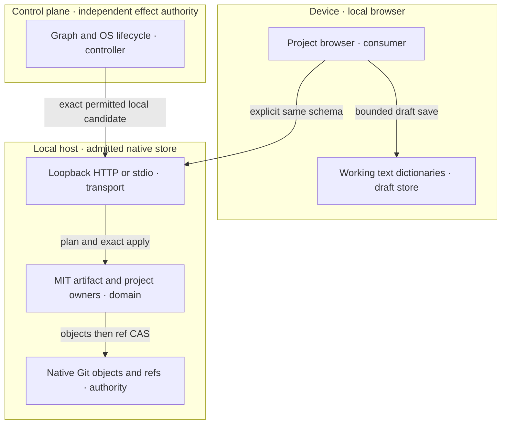
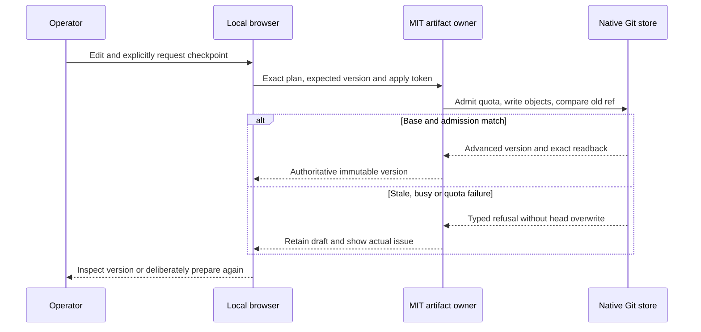
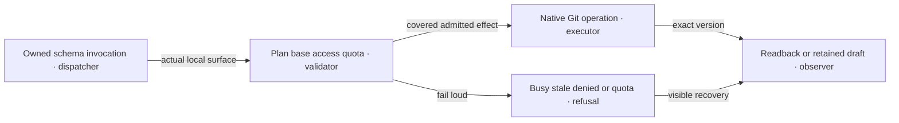
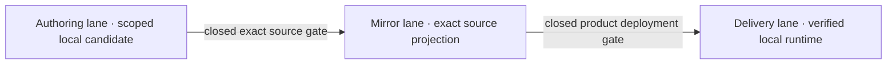

# Reference implementation — local source bindings and unavailable managed reference

This size-bounded source companion consumes the five roles in
[the product specification](artifacts-prd-tad-adr-mvp-gtm.md) at
`VERSIONED-WORKSPACE-001@0.3.1`. It adds concrete bindings, not a second product owner.
Provider facts were checked on 2026-10-03 and are unavailable-reference context only; no provider path is in the active MVP.
No external example code or dependency is copied or installed.

## Reference implementation — authoring and workflow sources

The requested authoring source is [PRD/TAD/ADR/MVP/GTM Guidelines 3.4.0][guideline] at
`82835ac37d524643faa6b9703cb077ea9474ab15`, exact clone HEAD when read. Same-commit companion files under `guidelines/`: `prd-tad-adr-mvp-gtm-{templates,codebase-grounding,planning-record,verification,selection,readiness,maturity}.md`, `cid-guidelines.md`, `adlc-artifact-continuity.md`, `prd-tad-adr-mvp-gtm-diagram-canvas-render.companion.md`. These source identities are read-time bindings, not runtime proof.

Execution sources: agentic-os `5f5633b0b0c5694e28e4b46bedb240edf1365e59`,
`guides/SYSTEM-PROMPT-RUNTIME.md` (999-byte SSOT), `docs/adlc-guidelines.md`,
[START][start], [RELEASE][release], [DEPLOY/rollback][deploy],
and [product/composition boundaries][topology]. Canonical remains read-only.
The OS START admitted three planning Markdown paths; its base equals the OS source pin. The
separate Graph START admitted a native implementation lane; its bootstrap/requirement distinction
is recorded in the handoff. No global always-load guidance/module is added.

## Reference implementation — codebase grounding

Inspected clean local source: Graph `12a8f50232fc367762d763a86e810a3e8f8b11d9`;
Canvas OS `9feb73844b93810ed0370c96ecb5743c3754e72f`; OS pin above.
Paths/symbols below were read in actual source; named suites are check plans, **not test results**.

| Grounding / VCC | Exact source owner and observed contract | Reuse delta / named check |
|---|---|---|
| G1 / V1,V3 | Graph [WorkspaceFs types][fs-types] `WorkspaceFs`, `WorkspaceSourceTextConflictError`; [persisted owner][fs-persist] `createWorkspacePersistedFs`; `workspaceFsIndexedDb.ts` `createWorkspaceFsDb`. Existing durable browser files and optional expected-text fence | **Defer** implementation reuse: browser/shared licensing unresolved. Source behavior is not selected-product proof. Existing `workspaceFsPersistenceReload.test.ts` remains contextual only |
| G2 / V3,V8 | Graph [persistence owner][persist] `createAgenticGraphStorageEnginePersistence`, `compareAndPut`; transactional revision CAS and 256 KiB binary chunks | **Defer** browser store; selected native Git/aggregate reservation has its own runtime tests. Do not copy schema or assume per-record budget is aggregate quota |
| G3 / V2,V4 | Graph [Git engine][git-engine] `createAgenticGraphGitEngine`; [contracts][git-contract] define Git objects/refs and offline-only mode | **Defer** browser engine; use native FOSS Git bare objects/ref CAS, preserving independent SHA-256 file integrity. Existing browser Git tests do not prove this variant |
| G4 / V9–V11 | Graph [history types][history] `VersionHistoryEntry`, `buildVersionHistoryGitGraphCode`; existing runtime snapshots | **Extend-owner locally authorized**: normalized source history/global-index mapping and shared restore; these are Canvas snapshots, not native Git project OIDs |
| G5 / V2–V6 | Graph [local artifact runtime][host-runtime] `createWorkspaceArtifactRuntime`; [tool contract][host-contract] `WORKSPACE_ARTIFACT_TOOL_DEFINITIONS`; MIT configured-root digest plan/apply and receipts; prior cap 1 MiB/file | **Extend-owner selected**: six project operations, stricter logical quotas, same two tool identities. Existing `node --test mcp/__tests__/workspace-artifact-runtime.test.mjs mcp/__tests__/workspace-artifact-contract.test.mjs mcp/__tests__/workspace-artifact-stdio-e2e.test.mjs` checks compatibility |
| G6 / V5 | Graph [local sync owner][sync] `runStorageSyncLocalTool`; browser-storage requests explicitly return `BROWSER_RUNTIME_REQUIRED` | **Retain-local distinction**: selected native project store is host-owned; it never claims browser IndexedDB was changed. Existing local-sync tests stay context, no duplicate relay |
| G7 / V3,V5 | OS [invocation][invoke] `PREFIX_KINDS`, `parseInvocationToken`; [collab reducer][collab] `applyOp`; optional baseVersion allows conflict rejection and omission allows last-write-wins | **Defer full integration**: original browser preparation grammar consumes C1 operations; no second OS registry/full-agent parity. Native ref CAS is mandatory |
| G8 / V2,V3,V6,V8 | Graph [hardened native Git wrapper][native-git] `createRepositoryPackGit`; `run` disables hooks, system/global config, interactive prompts and all remote protocols | **Reuse selected** inside new `createWorkspaceProjectRuntime`; use bounded local plumbing only. New runtime/HTTP tests below check version, race, quota and network denial |

Confirmed initial bounded gap: no `@cloudflare/artifacts` or `ArtifactProject` source appeared in
Graph `canvas`, `mcp`, `cloudflare`, `src` search at the base. No provider adapter is added now.
The earlier browser-history gap informed selection; it is not an instruction to copy browser code.

License posture: OS package and Graph `mcp/package.json` declare MIT. Graph root/Canvas/shared
packages and Canvas OS root lack a declared root/package license in the inspected paths, so those
sources have NONE/private distribution posture. User explicitly authorizes existing Canvas owner changes locally; no Canvas FOSS, copied datastore or external distribution claim is made. Original headless additions remain within selected MIT `mcp` scope; exact
source/license checks are release evidence. Native Git/Node are FOSS prerequisites; no package is
installed by this plan. Graph pins OS `e0ef770860905830157e64c455f0a342084b6d25`, Canvas OS pins
`a04c643f78c2ddafcfde766d063f28765996f482`; current OS HEAD never proves consumer parity.

### Reference implementation — selected owner files and checks

New files are in the admitted Graph lane; they did not exist at the grounding base SHA. Their current byte hashes are in `owner-tests-lifecycle.json`; the corrected bound check passed 44/44 in 10.058s with unchanged source. Earlier client/browser receipts are historical. These new files remain uncommitted lane source,
not content existing at the grounding base SHA or a released product.

| Selected owner / symbol | Contract / check |
|---|---|
| `mcp/workspace-artifact-contract.js`, `WORKSPACE_PROJECT_OPERATIONS` | Six `project-*` operation identities extend same `WORKSPACE_ARTIFACT_TOOL_DEFINITIONS` |
| `mcp/workspace-artifact-runtime.js`, `createWorkspaceArtifactRuntime` | Project dispatch preserves existing configured-root file owner |
| `mcp/workspace-project-runtime.js`, `createWorkspaceProjectRuntime` | Native objects/ref CAS; immutable `version`, mutation `expectedVersion`; files `{path, content, digest?}`; project ID in `path`; import verifies file digests |
| `mcp/workspace-project-server.js`, `createWorkspaceProjectServer`, `startWorkspaceProjectStdio` | Node HTTP loopback; optional existing SDK stdio lazily loaded; no new dependencies |
| `mcp/workspace-project-client.js`, `mcp/workspace-project.html` | Original working-dictionary UI, explicit draft/checkpoint states, same schema and native version receipts |
| `mcp/package.json` | Only `dev:project` and `test:project` scripts; no dependency additions |
| `mcp/__tests__/workspace-project-runtime.test.mjs` | Checkpoint restart/immutable reads, export/import, separate-process expected-old races, quota/path/UTF-8/alternate-store refusal |
| `mcp/__tests__/workspace-project-server.test.mjs` | Actual HTTP checkpoint/read/export/import, origin/token/host denial, bounded UTF-8 chunks, native-only/offline dependency behavior |

Named combined command: `node --test mcp/__tests__/workspace-project-runtime.test.mjs mcp/__tests__/workspace-project-server.test.mjs`.
Executed source-bound command also includes artifact runtime/contract and repository-pack
runtime/contract compatibility: 44/44 passed (10 project runtime, 11 HTTP/stdio, 23 compatibility),
exit 0, 10.058s. [Receipt](artifacts-implementation-handoff.md#owner-test-receipt-and-source-binding).

#### Reference implementation — existing Canvas view owners

The user requested Source Files, FloatingPanel GitGraph and Gantt-Timeline synchronization. Reuse eight actual owners: `features/gitgraph/{GitGraphFloatingPanelView.tsx,GitGraphBottomPanelView.tsx,versionHistoryGitGraph.ts,useMermaidGitGraphDocument.ts,useMermaidGanttDocument.ts}`, `hooks/store/historySlice.ts`, `hooks/store/graph-data-slice/graphDataMarkdownDocumentStateActions.ts`, and `lib/markdown-workspace-runtime/useMarkdownWorkspaceSelection.ts`, all under `canvas/src/`. `selectDocumentVersionHistory` filters normalized active paths and retains global indexes; both panels map restores through that owner. Named Markdown hooks derive only current frontmatter; graph-only metadata fallback remains.

`restoreHistory` matches workspace-prefixed source paths, restores source/Explorer together, preserves other files, cancels delayed history, clears row/command state and resets matching transport. `setMarkdownDocument` clears only on normalized identity change; edits retain selection. `setSelectionPathSafe` captures `historyRestoreRevision`, rejecting outdated editor/save/write-queue completions. Five real React/store/hook tests in `workspaceCrossViewSync.test.tsx` pass, including both editor/save races; corrected selected rerun 17/17, exit 0, 9.151s unchanged source (`canvas-sync-tests.json` in handoff evidence directory). Excluded broad Gantt guard fails unchanged HEAD. Canvas runtime snapshots remain separate from native Git project OIDs; no Git-backed Canvas checkpoint adapter is implemented.

Preview `http://127.0.0.1:5191` uses the admitted Graph lane, installed dependencies, `npm --prefix canvas --ignore-scripts run dev -- --host 127.0.0.1 --port 5191 --strictPort`; Vite 6.4.3 ready in 2312ms, app registration/render observed. Existing user `5190` stays in its own lane. Full native cross-view browser journey is unverified: CDP focus/dispatch became unresponsive even there before changes. Own 5191 recheck timed out 30s before journey; recheck automation before claiming current browser behavior.

## Reference implementation — one capability across surfaces

Existing tool names remain `agentic-graph.workspace_artifact.plan` and
`agentic-graph.workspace_artifact.apply`. They serve `project-discover`, `project-list`,
`project-inspect`, `project-checkpoint`, `project-import`, `project-export` through C1 schema.
HTTP `/api/plan` and `/api/apply` use that owner; `/session` discloses actual configured root/token.
Only checkpoint/import mutate a project. All input bounds and actual local store stay explicit.

Browser preparation grammar is `/operation #project @local-git`, e.g.
`/inspect #demo @local-git`, `/checkpoint #demo @local-git`, `/export #demo @local-git`.
It validates against `WORKSPACE_PROJECT_OPERATIONS` and prepares owner input; it does not apply,
create a new registry or claim parity with OS global `/`, `#`, `@` parser semantics.

The current [official WebMCP draft](https://webmachinelearning.github.io/webmcp/)
attaches `modelContext` to **Document**, with `registerTool`; older navigator proposals are stale.
Feature-detect `document.modelContext.registerTool`, derive confined project schemas from the same
C1 definitions and register those same two identities. Optional stdio loads the existing MCP SDK;
its dependencies are unchanged. Actual native browser registration of both identities was observed. WebMCP tool execution is
pending; HTTP/optional SDK invocation is tested. Registration does not prove full-platform
conformance; unsupported browser availability remains visible.

## Reference implementation — Cloudflare Artifacts feasibility

The [requested overview](https://developers.cloudflare.com/artifacts/) describes Git-compatible
versioned repository storage accessed through Workers, REST and Git. The supplied Markdown URL
could not be parsed by the web reader; its official HTML counterpart was inspected.

**Hard constraint failure:** [pricing](https://developers.cloudflare.com/artifacts/platform/pricing/)
currently requires Workers Paid and makes Artifacts unavailable on Workers Free. Usage billing
starts 2026-10-14. A paid plan's included usage does not meet the user's no-paid-plan rule.
No hosted service FOSS eligibility is established. All remote execution is disabled in this plan.
Recheck pricing and owner constraints before changing that disposition; no account was accessed.

## Reference implementation — unavailable provider contract

The official reference is retained as factual API context, not an implementation dependency.
No binding/REST/Git adapter, provider env, account access, credential, provisioning, token, event,
remote execution or fallback is selected. Reopening it requires an explicitly admitted successor.

| Official source | Observed reference behavior / unavailable boundary |
|---|---|
| [Workers binding](https://developers.cloudflare.com/artifacts/api/workers-binding/) | Namespace create/get/list/import/delete and repository read/log/tree/blob methods; documented writes use Git push, not an invented file-write method |
| [REST API](https://developers.cloudflare.com/artifacts/api/rest-api/) | Account/namespace repository control and content endpoints; acceptance/pending responses are distinct from completed readback |
| [Authentication](https://developers.cloudflare.com/artifacts/guides/authentication/) | REST API credentials and repository-scoped Git tokens have different roles; none is introduced in selected product |
| [Git protocol](https://developers.cloudflare.com/artifacts/api/git-protocol/) | Native protocol semantics require independent adapter/race evidence; local Git proves no hosted behavior |
| [Limits](https://developers.cloudflare.com/artifacts/platform/limits/) | Provider limits do not increase selected logical/file/store/transport admission |

[ArtifactFS](https://developers.cloudflare.com/artifacts/guides/artifact-fs/) is a host FUSE API,
not a browser API; its [Apache-2.0 license](https://github.com/cloudflare/artifact-fs/blob/main/LICENSE)
does not license the hosted service. No Artifacts emulator is selected; reviewed development
references did not establish fully offline hosted-service emulation. No SDK/CLI/provider package
is added. Current source/reference facts refresh on drift; no provider completion ETA exists.
Native expected-old refs are supported by [Git update-ref](https://git-scm.com/docs/git-update-ref).

## Reference implementation — limits and development boundaries

Use installed Node and native FOSS Git on existing hardware. Browser and server are original local
MIT-owner additions; no Canvas/IndexedDB datastore is copied. Existing private Canvas views are reused only under explicit local user authorization. Authoritative bare Git store
and draft localStorage each independently cap aggregate bytes at 10 MiB. Files 256 KiB, project
2 MiB, count 100, history display 100. HTTP encoded input 3 MiB accommodates JSON escaping without
raising logical quotas; response writes 256 KiB chunks (<500,000 bytes), with UTF-8 boundary tests.
Store quota counts retained objects and nonwaiting reservations; busy is explicit and never polled.

Node binds 127.0.0.1 only, validates Host/Origin/Sec-Fetch and exact session apply token; CSP
`connect-src 'self'`. Authenticated GET export uses SameSite Strict HttpOnly session cookie plus host/origin/referer
admission; the session token stays out of export URLs/logs. Original Blob download was not captured
by native browser download flow; the owner HTTP attachment fix produced the actual download.
No LAN access, concurrent remote hosting or automatic cross-device sync.
Manual export/import is admitted; second-device and physical-phone proof remain separate.
The local preview is Development, not public deployment or release. No code execution is exposed.

## Reference implementation — topology diagram

Diagram `D1`; class **Runtime topology**; notation **Mermaid flowchart TB**; version **0.3.1**.
Primary target: Graph `d3` 2D canvas via [renderer registry][renderer]; secondary Markdown static
preview. Caption: browser drafts and authoritative local Git versions have explicit separate
owners; loopback HTTP joins the same artifact contract. Design projection, not runtime evidence.

| D1 node | Component / residency / interface |
|---|---|
| view, draft | C5 / browser / local working text; no authoritative-version claim |
| transport | C4 / 127.0.0.1 host / same plan/apply contract |
| domain, store | C2,C3 / admitted host / hardened Git plumbing and expected-old ref |
| lifecycle | C6 / independent control plane / exact authority and proof per effect |

## Reference implementation — five-flow diagrams

All consume the TAD journeys at 0.3.1. Flowcharts project to `d3`; sequence notation has secondary
Markdown rendering. Six diagrams declare identity/class/notation/caption/inventory; new parse/static
render checks are pending. Prior 0.1.0 diagrams/checks do not establish this successor's diagrams.

**Diagram D2** · Class: Journey stage map · Notation: Mermaid flowchart LR · Version: 0.3.1.
**Caption:** local edit/checkpoint/inspect/export reaches a recoverable version in one sitting.

```mermaid
flowchart LR
  open["Open project · user stage"]
  edit["Edit and retain draft · user stage"]
  checkpoint["Checkpoint or conflict recovery · user stage"]
  inspect["Inspect immutable version · user stage"]
  handoff["Manual export or import · user stage"]
  open -->|"select admitted tree"| edit
  edit -->|"prepare exact expected base"| checkpoint
  checkpoint -->|"read immutable version"| inspect
  inspect -->|"deliberate portable handoff"| handoff
```

| D2 node | Journey inventory |
|---|---|
| open, edit | F1 / local browser and visible draft durability |
| checkpoint, inspect | F2,F3 / exact version or retained conflict draft |
| handoff | F4,F5 / explicit schema/store disclosure and verified bundle |

**Diagram D3** · Class: User workflow · Notation: Mermaid sequenceDiagram · Version: 0.3.1.
**Caption:** acknowledgment follows native expected-old ref advancement and exact readback.

| D3 participant | Workflow inventory |
|---|---|
| User, View | F1–F5 operator/browser, explicit effect and retained text |
| Owner, Store | C1–C4, stale/busy/quota/path/access refusal or exact version receipt |

**Diagram D4** · Class: Data flow · Notation: Mermaid flowchart LR · Version: 0.3.1.
**Caption:** bounded UTF-8 files become immutable native objects and verified portable export.

```mermaid
flowchart LR
  files["Paths and UTF-8 bytes · input"]
  objects["Blob tree commit · transform"]
  cache["Bare objects and CAS refs · persistence"]
  version["Immutable project version · read model"]
  export["Manifest bytes digests · output"]
  files -->|"validate paths and logical bytes"| objects
  objects -->|"persist before ref CAS"| cache
  cache -->|"read exact commit"| version
  version -->|"256 KiB response chunks"| export
```

| D4 node | Data lifecycle |
|---|---|
| files, objects | F1,F2 drafts → retained native Git objects |
| cache, version | C3 authoritative objects/ref → immutable inspect |
| export | F5 verified portable bytes; SHA-256 digest differs from Git OID |

**Diagram D5** · Class: Orchestration / harness flow · Notation: Mermaid flowchart LR · Version: 0.3.1.
**Caption:** deterministic local admission yields readback or explicit refusal with no paid fallback.

| D5 node | Harness role / bound |
|---|---|
| request, gate | C1,C2,C4; same schema + effect preflight, zero model calls |
| local, refusal | C3; bounded Git call or nonwaiting refusal, no remote execution |
| result | C5 readback/issue projection; keep draft and operation context |

**Diagram D6** · Class: Lane & deploy boundary · Notation: Mermaid flowchart LR · Version: 0.3.1.
**Caption:** source projection and environment delivery require their own exact authority and proof.

| D6 node | Lane / recovery |
|---|---|
| authoring | Native admitted source lane; preserve draft/source bytes |
| mirror | Exact source/pin projection; revert reviewed input |
| delivery | Product controller and compatible data; no authority inferred |

| Diagram / class | Surface / projects | Expected nodes / edges / clusters | Evidence |
|---|---|---|---|
| D1 / Runtime topology | d3 / yes | 6 / 5 / 3 | New parse-only check pending; static rendering separate |
| D2 / Journey stage map | d3 / yes | 5 / 4 / 0 | New parse-only check pending |
| D3 / User workflow | Markdown / no | 0 / 0 / 0 projected; 4 participants | Static renderer pending |
| D4 / Data flow | d3 / yes | 5 / 4 / 0 | New parse-only check pending |
| D5 / Orchestration / harness | d3 / yes | 5 / 5 / 0 | New parse-only check pending |
| D6 / Lane & deploy boundary | d3 / yes | 3 / 2 / 0 | New parse-only check pending |

[guideline]: https://github.com/huijoohwee/huijoohwee.github.io/blob/82835ac37d524643faa6b9703cb077ea9474ab15/guidelines/prd-tad-adr-mvp-gtm-guidelines.md
[start]: https://github.com/huijoohwee/agentic-os/blob/5f5633b0b0c5694e28e4b46bedb240edf1365e59/docs/START-WORKFLOW.md
[release]: https://github.com/huijoohwee/agentic-os/blob/5f5633b0b0c5694e28e4b46bedb240edf1365e59/docs/RELEASE-WORKFLOW.md
[deploy]: https://github.com/huijoohwee/agentic-os/blob/5f5633b0b0c5694e28e4b46bedb240edf1365e59/guides/DEPLOY-WORKFLOW.md
[topology]: https://github.com/huijoohwee/agentic-os/blob/5f5633b0b0c5694e28e4b46bedb240edf1365e59/guides/TECH-STACK.md
[fs-types]: https://github.com/huijoohwee/agentic-graph/blob/12a8f50232fc367762d763a86e810a3e8f8b11d9/canvas/src/features/workspace-fs/types.ts
[fs-persist]: https://github.com/huijoohwee/agentic-graph/blob/12a8f50232fc367762d763a86e810a3e8f8b11d9/canvas/src/features/workspace-fs/workspaceFsPersisted.ts
[persist]: https://github.com/huijoohwee/agentic-graph/blob/12a8f50232fc367762d763a86e810a3e8f8b11d9/canvas/src/lib/storage/agentic-graph-storage-engine-persistence.ts
[git-engine]: https://github.com/huijoohwee/agentic-graph/blob/12a8f50232fc367762d763a86e810a3e8f8b11d9/canvas/src/lib/storage/git/agentic-graph-git-engine.ts
[git-contract]: https://github.com/huijoohwee/agentic-graph/blob/12a8f50232fc367762d763a86e810a3e8f8b11d9/canvas/src/lib/storage/git/agentic-graph-git-contracts.ts
[history]: https://github.com/huijoohwee/agentic-graph/blob/12a8f50232fc367762d763a86e810a3e8f8b11d9/canvas/src/features/history/versionHistoryTypes.ts
[host-runtime]: https://github.com/huijoohwee/agentic-graph/blob/12a8f50232fc367762d763a86e810a3e8f8b11d9/mcp/workspace-artifact-runtime.js
[host-contract]: https://github.com/huijoohwee/agentic-graph/blob/12a8f50232fc367762d763a86e810a3e8f8b11d9/mcp/workspace-artifact-contract.js
[sync]: https://github.com/huijoohwee/agentic-graph/blob/12a8f50232fc367762d763a86e810a3e8f8b11d9/mcp/storage-sync-local-runtime.js
[invoke]: https://github.com/huijoohwee/agentic-os/blob/5f5633b0b0c5694e28e4b46bedb240edf1365e59/src/invocation.mjs
[collab]: https://github.com/huijoohwee/agentic-os/blob/5f5633b0b0c5694e28e4b46bedb240edf1365e59/runtime/adapters/collab-room.js
[renderer]: https://github.com/huijoohwee/agentic-graph/blob/12a8f50232fc367762d763a86e810a3e8f8b11d9/canvas/src/lib/config.render.ts
[native-git]: https://github.com/huijoohwee/agentic-graph/blob/12a8f50232fc367762d763a86e810a3e8f8b11d9/mcp/repository-pack-git.js
