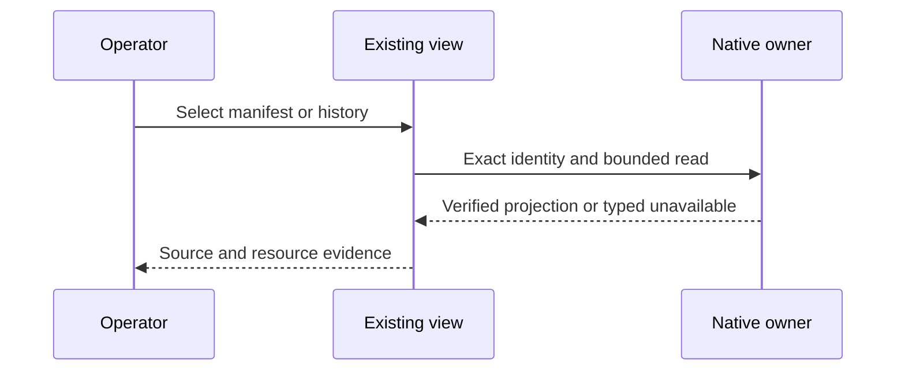
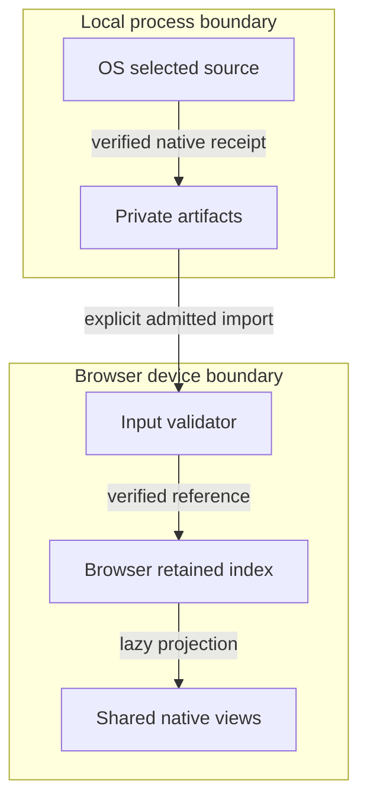
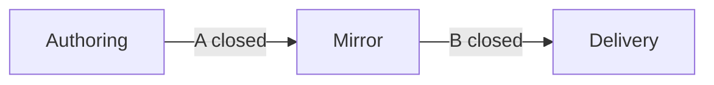

# Reference implementation — Native Session History, Indexing & Observability Economics

Make existing agent work cheaper to inspect and resume: reuse verified codebase indexes, mission manifests,
resource receipts and shared views; then add lossless checkpoint recovery where current history is insufficient.
Revision 0.2.2 records merged first-slice source and a bounded trace follow-on; recovery and acceptance remain open.
It does not claim complete transcripts, hidden model state, effect replay or live runtime authority.

## Context, intent and directive — reference implementation

**Join:** `NATIVE-SESSION-HISTORY-001@0.2.2` binds all five roles and their projections. TAD consumes PRD;
ADR binds TAD; MVP and GTM consume their criteria. This capability extends the [lifecycle owner](PRD-TAD-ADR-MVP-GTM.md).
**Context:** the update requests lower time/resource cost across existing codebase indexes and observability;
E12–E22 ground current owners, B01 measures a narrow baseline, and customer pain/WTP remain unvalidated.
**Intent:** reduce repeated source work and time to a trustworthy answer while preserving evidence and privacy.
**Directive:** specify the smallest bounded native changes, exact invalidation and resource checks, then a USD 1 pilot.
**Role/Subject:** efficiency architect. **Action/SVO:** architect specifies reuse of verified native observations.
**Outcome:** a revision-bound plan connecting each feature to an owner, criterion, cost and rollback.
**0:** native indexes/views/receipts exist; redundant reads are observed; fleet/mobile savings and demand are unknown.
**1 target:** in a 14-day pilot, one independent operator identifies a real bottleneck using the existing mission view,
verifies a matched before/after saving with unchanged evidence, and separately pays net ≥USD 1 for assistance.
Delivery, collected cash and repeat use require distinct evidence. Offline two-device recovery remains a follow-on target.
**Artifact bounds:** one on-demand file, <600 lines, ≤60,000 UTF-8 bytes; no new runtime module, dependency or
always-load entry. Local source candidates follow existing owner caps. Outreach, payment and deployment remain outside
this update. No paid plan, addon, overage, hosted dependency or feature inference.

## Codebase grounding — reference implementation

Clean clones were inspected at these exact pins; `confirmed` means source observed, `contradicted` rejects an
overclaim, `absent` is path-bounded and `unverified` needs evidence. No external implementation/service is introduced.

| Binding | Exact inspected revision | Responsibility / compatibility limit |
|---|---|---|
| OS | `f6897811e1e92931e0f03b2737541aba1c4311a2` | Lifecycle and shared contracts; native source baseline |
| Graph | `737f0a818fce76538c19be78111c40177177cd8e` | Browser workspace and chat/history product |
| Canvas | `893bd6b63390e6f31dccc55715283aee675400d0` | Agent application contracts and curated memory |
| Shared workspace | `e730b858d45d6b0cddc65ddb8787890a1b400605` | Private curated source and local artifacts; distinct from the browser virtual filesystem |
| Authoring rules | `8231098f7305c5d31814216c959c71906c95d1a3` | [Guideline 3.3.0][rules], templates, continuity, readiness and verification |

| Evidence | Source / symbol / disposition | What exists; smallest delta / check host |
|---|---|---|
| E01 | [Turn registry][turns], `createReasoningContinuityRegistry`; confirmed | In-memory 32 threads/64 turns, one pending; semantics only. Host: `__tests__/reasoning-continuity.test.mjs`. |
| E02 | [Workflow collector][collector], `collectManifest`/`startWorkflow`; confirmed | Immutable private digest evidence, staged locked writes, 32,000-byte manifest. Host: `__tests__/workflow-collection.test.mjs`. |
| E03 | [Archive][archive], `buildArchive`/`readArchive`; confirmed | Digest-checked pages/advice; no raw transcripts. Host: `__tests__/workflow-archive.test.mjs`. |
| E04 | [Agent state][state], `AgentState`/`reconcileState`; confirmed | Transactional expiring claims, not history. Host: `__tests__/durable-agent-state.test.mjs`. |
| E05 | [Chat persistence][chat], `appendChatHistoryWorkspaceFile`; confirmed | Per-path process serialization, completed traces, replaceable drafts, sanitized text, async mirror. Host: `chatHistoryWorkspacePersistence.test.ts`. |
| E06 | [History shape][shape] / [owner][history], `VersionHistoryEntry`/`createHistorySlice`; confirmed | Parent snapshots cap 100; restore mutates document, next commit trims future. Host: `historyViewEditHistoryUndoRedoRestore.test.tsx`. |
| E07 | [Sessions][sessions], `createEcsSessionStore`; confirmed | In-memory 15-min TTL/64 entries; identity only, not durability. Host: `mcp/__tests__/ecs-session-store.test.mjs`. |
| E08 | [Curated memory][memory] / [record owner][memory-log]; confirmed | Bounded revision context excludes raw sessions. Checkpoints stay separate. |
| E09 | [Invocation catalog][invocations]; confirmed / absent | Workflow collect/export/recommend exist; session checkpoint/diff/branch routes absent. |
| E10 | E01/E04–E07; contradicted | Existing transient/trimmed history is not lossless persistent session versioning. |
| E11 | E05–E07; unverified | Cross-tab atomicity, restart, capture fidelity and mobile/two-device transfer need V01–V06. |
| E12 | [Context index][context-index], `createCodebaseContext`; confirmed | Per-instance metadata reuse by exact file digest; every snapshot still reads bytes twice. Freshness is non-atomic and local; CLI creates a new instance per invocation. Extend `__tests__/codebase-context.test.mjs`; never substitute mtime/HEAD for content checks. |
| E13 | [Workflow trace][trace], `traceWorkflow`; confirmed | Per traversal map + text + verification reads yield four source passes in B01; literal navigation only. Reuse one bounded snapshot within this owner; `__tests__/workflow-trace.test.mjs`. |
| E14 | [Mission index hook][index-hook] + [retained index][index-owner]; confirmed | Hook deduplicates in-flight requests, not completed reads; key omits selected manifest digest. Retained index already skips identical writes but active reads rebuild from full projection. Extend these owners and `agentGraphImportFidelity.test.ts` / `agentMissionWorkspace.test.ts`. |
| E15 | [Observation runtime][observe], `createAdlcObservabilityRuntime`; confirmed | LRU projection cache defaults to 16 entries; digest read, parse and evaluation precede the lookup. Native `adlc-run/v1` evaluator is unavailable in `mcp/adlc-ledger-runtime.js`; only an admitted historical adapter can evaluate. No new evaluator or live-proof claim for a performance change. |
| E16 | [Validation economics][economy], `resourceObservation`, `observeCost`; confirmed | Exact check identity/context, 32-sample histories, 14-day age limit, reused observations excluded; advisory ranking never removes mandatory coverage. CPU/RSS scope is explicit; unknowns are null. Extend `__tests__/validation-execution-economy.test.mjs`. |
| E17 | [Toolkit observer][toolkit] + [Canvas shim][canvas-shim]; confirmed | OS owns digest/status/timing export with 100 ms exporter deadline; Canvas re-exports that owner. Preserve failure isolation and contract-only shim; do not add a second telemetry client. |
| E18 | [Workspace hydration][workspace-owner], `hydrateWorkspace`; confirmed | Physical `.workspace` holds curated `.memory`/`.todo`; generated memory index lives under `.git/agentic-os-memory`, local artifacts are ignored. One coherent source receipt, not per-view resync; `__tests__/workspace-startup.test.mjs`. |
| E19 | [Fleet ownership][fleet]; confirmed | Related repositories enter only through declared ownership and selected roots; no generic scan of sibling repositories or private workspace. Read-only consumers reuse references, never copy contracts. |
| E20 | [Runtime log reader][runtime-log], `load_runtime_events_from_log`; confirmed | Batch accumulation has no total-event bound; read failure becomes an empty list. Bounded incremental reads and explicit partial/error status are follow-on work only if measured as a bottleneck. |
| E21 | [MainPanel][main-panel], [FloatingPanel][floating-panel], [bottom host][bottom-panel]; confirmed | Existing history/GitGraph/document-version views, lazy mounting and shared utilities listed in C8. Reuse shells, selection and renderers; visual GitGraph is not repository Git authority or lossless session persistence. |
| E22 | [Mission source tree][mission-files], [workspace projection][mission-workspace], [editor adapter][mission-editor]; confirmed | Selected `agent-mission.manifest.json` uses `MarkdownFileTree`, `agentMissionWorkspace`, `agentRunInspectionStore` and the existing read-only editor. Manifest text is preserved; member/index rows are references, not copied private evidence. |

Source bindings use exact commit/path links; B01 also binds snapshot and raw-result digests below.
Graph pins OS `1d0000c52f5b4e56e1dced82628d35857f25ba4c`; Canvas pins `2a86d4321edbcc34ea38f3f4718fd4e49b80d153`.
The inspected OS HEAD is not assumed installed. Shared exports require exact consumer pin/lock validation.
The requested `agentic-graph-os` maps to the existing `agentic-graph` clone; no separate clone was found or renamed.
The browser comment selects a real UI surface, but supplies no deployed-revision or runtime-readiness proof.

## PRD — reference implementation

**Primary user/buyer/beneficiary:** a developer or small-team operator already using the native workspace.
Job: locate relevant source and trustworthy run evidence quickly, understand unknown resource values, and resume useful work.
Current workarounds are repeated scans, re-opening JSON and manually correlating receipts; their user cost is unmeasured.

| Pain / rank | Hook → break → fix → close | Feature / nearest owner / evidence |
|---|---|---|
| P1 / 1 | Inspect source → repeated reads/derivations → reuse verified snapshot/index → same answer with less work | F7/F8; E12–E14; technical duplication observed, buyer pain/WTP unvalidated |
| P2 / 2 | Inspect agent run → repeated projection and ambiguous cost → existing receipts with scoped metrics → rank measured bottleneck | F9/F10; E15–E17; current paths confirmed, user benefit unvalidated |
| P3 / 3 | Switch tree/editor/panels → duplicate work or inconsistent selection → shared native utilities → one coherent observation | F11/F12; E18/E19/E21/E22; user explicitly requested reuse, performance benefit unmeasured |
| P4 / follow-on | Lose a useful result or change device → insufficient history → save/compare/restore a copy → verify recovery | F1–F6; E01–E11; original scope retained, additional storage work deferred |

Ranks use observed work and smallest owner delta; no invented WTP score. Priced interviews may reorder them.
F7–F12 are the first economy increment's Musts. F1–F6 become Musts only for the separately admitted recovery increment.

| Feature / story | Priority | Acceptance condition / VCC / check / constraint | Design / decision |
|---|---|---|---|
| F1: Save completed checkpoint | Follow-on Must | V01: Save/restart preserves ordered content digests/completion boundary; exclude drafts; E05 restart/partial-write cases; zero provider calls. | C1/C2, ADR01 |
| F2: Compare checkpoints | Follow-on Must | V02: Deterministic added/removed/changed content and missing attachments within 1 s; reads leave bytes unchanged; E06 identical/Unicode cases. | C1/C3, ADR01 |
| F3: Continue from prior checkpoint | Follow-on Must | V03: Restore creates a copy with exact parent; original remains unchanged; stale concurrent write conflicts; E06 two-tab/restart cases; zero effect replay. | C2/C3, ADR01/02 |
| F4: Transfer between devices | Follow-on Must | V04: Clean offline import validates all bytes/identity; corrupt/missing/unknown-version data fails before head changes; workspace I/O fixtures; no remote fetch. | C1/C2/C3, ADR02 |
| F5: Control export | Follow-on Must | V05: Preview exclusions; reject secrets, out-of-root/oversized/incomplete capture; redaction derives a new digest, preserving original; malicious fixtures; no payload logs/network. | C1/C2, ADR02 |
| F6: Browser/headless parity | Follow-on Must | V06: Same typed results/errors/effect guards; 360 px/keyboard/screen reader completes V01–V05 offline; E09/browser cases; no inference or executable resume. | C1/C3/C4, ADR03 |
| F7: Inspect source with bounded reuse | Must | V07: For unchanged and edited fixtures, trace/map/search match prior result/error/freshness semantics; trace source reads fall from 4× to ≤2× unique source bytes. Same-size/mtime edit, deletion, symlink swap and mid-read mutation invalidate or fail. E12/E13 hosts; no persistent source-body cache. | C5, ADR04 |
| F8: Reopen the retained codebase index | Must | V08: Concurrent consumers of the same complete identity perform ≤1 retained parse/build; repeats within the valid cache lifetime reuse metadata. Changed selected manifest, source digest, schema, root or principal never receives a late prior result. Tamper/restart fixtures reverify persisted bytes. Extend E14 hosts. | C6, ADR04 |
| F9: Inspect a run without duplicate computation | Must | V09: While an admitted ledger/evaluator entry remains valid, derive once and reuse; every request still checks current authority, expiry, receipt and source bytes. Unavailable evaluator remains unavailable. E15 runtime/projection tests plus Canvas observation-contract test. | C7, ADR04 |
| F10: Measure savings honestly | Must | V10: Native resource receipts retain wall/CPU scope, source/output bytes, parse/cache counts, peak-process RSS, tokens and estimated/actual cash distinctions. Null stays Unknown; reused checks add no current consumption; overlap does not sum into wall time. E16 hosts and `agentRunSpanMetric.test.ts`. | C7, ADR04 |
| F11: Reuse workspace and related-repo evidence | Must | V11: Selected-root fixtures hydrate one coherent accepted source receipt; offline/dirty upstream retains last accepted identity with stale/unavailable status. No scan of private sibling roots, raw-session import or artifact publication. Existing workspace-startup/sync and collector tests. | C6/C7, ADR04 |
| F12: Use the same mission/history across native views | Must | V12: Tree → manifest editor → MainPanel/FloatingPanel/BottomPanel retains source digest, read-only status and selection within each domain; repeat switching causes no duplicate index build/poller. On expiry/authority change all views clear private projections; 360 px/keyboard flow works offline. Extend E21/E22 hosts listed in C8. | C8, ADR03/04 |

**Should, after profiling:** cursor-based runtime-log reads in E20 with rotation/truncation detection and explicit partial/error status.
**Follow-on:** session-title search, changed-content storage and retention controls after V01–V06; do not add an index service for them.
**Could:** an additional native runtime adapter after a fixture demonstrates its capture/resume semantics.
**Won't this increment:** universal transcript import, hidden reasoning capture, automatic merging, remote hosting,
automatic sync, peer daemon, credential copying, paid model execution, billing integration or automatic deletion.
Follow-on content-only recovery is labelled “working copy restored”; no runtime resume claim.

### Baseline, performance targets and economics

**B01 observed, 2026-09-23 12:08 UTC:** OS revision above, one 9,807-byte `runtime/reasoning-continuity.mjs` file,
five independent sequences on this local machine: create context → cold map → warm map → search for
`createReasoningContinuityRegistry` → map again. All snapshots shared digest
`2a377851e4b7c67a667e054614a4b13cb68860a2db51a8cd6819b03c37f8e44b`.

| Operation | Samples / median wall ms | Source bytes read / parse / reuse | Interpretation |
|---|---|---|---|
| Cold map | 5 / 63.58 | 19,614 / 1 / 0 | Native metadata parse with two byte passes |
| Warm map | 5 / 59.61 | 19,614 / 0 / 1 | Parse reuse already exists; source I/O remains |
| Search; then map | 5 each / 60.62; 60.26 | 19,614 each / 0 / 0 then 1 reused | Search preserves same-hash structure metadata; no invalidation defect claimed |
| Single-file trace | 1 / 74.87 (single elapsed, not median estimate) | 39,228 / 1 / 0 | Four passes observed; current-process CPU 6.848 ms, excludes Git children |

Raw B01: private `.workspace/.artifacts/session-history-economy-20260923/baseline.json`, SHA-256
`d852f468593c37e8293aa69016a5046be4da2a28815cc9a06bc31f2f33e9c7b3`. Five tiny samples prove duplication, not stable p95, fleet savings or ROI.
Browser/Canvas, dirty source, multi-file, battery, network and memory baselines remain unmeasured; tokens/cash are null.

| Acceptance target / status | Method / economic implication |
|---|---|
| V07 trace reads ≤2× unique bytes; unchanged-map parses remain 0 | Preserve start/end inventory and exact-byte verification; improve duplicate work before changing parser sophistication |
| V08/V09 repeated derivation count ≤1 per complete identity; warm median CPU ≥30% below matched baseline | 20 repetitions after 5 warmups on 1/20/100-file fixtures within owner caps; record cold separately, device/Node/browser/pins, digest, p50/p95 and RSS; p95 wall regression >5% or RSS >10% blocks acceptance unless explicitly reviewed |
| V12 visible response ≤1 s on bounded fixture; task TTV ≤60 s | Select mission → open manifest/index → inspect metric/source; three user actions. Test 360 px mobile plus desktop and keyboard; record device/browser. Hidden views initiate 0 index rebuilds, pollers or model calls |
| V10/V11 correctness | 20/20 adversarial freshness/expiry/quota/replay cases; unknown economics never becomes zero or completeness; no readiness uplift |
| Follow-on recovery | V01 ≤60 s, V02/V03 ≤90 s, V04–V06 ≤180 s; 20/20 atomicity/fault cases, unchanged originals; clean two-device proof pending |
| Cost / benefit | Feature inference=0 by design; incremental hosting/tools target USD 0. Labor, electricity and existing subscriptions unknown; no zero total-cost claim |

Net minutes saved/use = matched prior task time − new task time − extra verification/support time. Break-even uses =
implementation+maintenance minutes / positive net saved minutes/use; undefined until both are observed. Capture bytes,
CPU and device conditions as well as wall time; no model-token saving inferred from less I/O. Reject complexity with no
measurable gain. Buyer frequency, session boundary/size, browser durability, obligations and fee-free collection remain gaps.

## TAD — reference implementation

**Scope:** PRD F7–F12 first, retained F1–F6 follow-on, all at `0.2.2`. Extend existing owners before extraction. Do not turn lifecycle receipts,
curated memory or expiring continuation stores into a second transcript database.

| Component / accountable owner | Existing source → proposed change | Responsibility / local / delivered rung |
|---|---|---|
| C1: capture/contract; browser owner | E05/E06 → checkpoint envelope/completed-content adapter | Bounded validation; extension `spec-complete` / `undocumented` |
| C2: storage; browser owner | E05 filesystem → immutable objects/conditional head | One atomic owner, preserve prior head; same rungs |
| C3: interaction; history owner | E06 → filter/compare/preview/copy/bundle | Existing history view and undo; same rungs |
| C4: invocation/evidence; OS owner | E02/E03/E09 → references/registration if needed | No duplicate payload/controller; same rungs |
| C5: source context; OS owner | E12/E13 → request-scoped verified snapshot reuse | One reader/hash/structure owner; no watcher, daemon, new database or cross-request raw-body cache; `spec-complete` / `undocumented` for change |
| C6: index/workspace; Graph + workspace owners | E14/E18/E19 → exact-key derived reuse and coherent source receipt | Native retained projection/manifest remain SSOT; do not duplicate indexes per view/repo; same rungs |
| C7: resource evidence; OS owner, Graph renderer | E15–E17 → bounded pure derivation reuse, existing receipts and metrics | Canvas consumes OS export; no new collector/telemetry backend; evaluator absence stays explicit; same rungs |
| C8: shared views; Graph product owner | E21/E22 → existing shells, stores, utility contracts | Main/Floating/Bottom plus Source Files/editor consume the same verified identity; no alternate shell or editor; same rungs |

**C5 cache contract:** retain a bounded snapshot only for one synchronous request; read source under existing realpath,
symlink, byte and time guards, parse once, then recheck inventory/HEAD and exact bytes before emitting. Delete the snapshot
after the request. Same mtime/size/HEAD is insufficient; concurrent mutation returns the existing typed freshness failure.
Retain current non-atomic/local-only disclosure. Existing limits: 512 files, 128 KiB/file, 4 MiB aggregate, 16 KiB output,
20 results, 10 s; trace remains ≤20 nodes/64 edges/depth 6/512,000 source bytes. Large totals stream in chunks <500 kB.

**C6/C7 identity and lifecycle:** derived key = principal/scope + canonical root/store identity + selected mission digest
+ index/ledger digest + parser/schema/projection version + admitted evaluator source/pin + view/cursor/limit where applicable.
Absent required key fields means no reuse. C6 adds selected manifest digest to in-flight identity; recheck current selection
before binding an async result. Coalesce same-key work and cancel/suppress stale results. Mutations invalidate affected keys;
reopen/restart/tamper requires source-byte validation. Existing `active.ref` and workflow reference files remain authoritative
locators; browser virtual `/.workspace/codebase-index` is distinct from the physical shared repository and its ignored artifacts.
Cache only pure derived results: current grant/TTL/state revision/receipt bindings and digest verification execute on every read.
A hit never renews the ≤60 s inspection lease, changes Unknown/partial, bypasses evaluator absence, or authorizes execution.
Clear on expiry, authority/principal/root change and close/pagehide; one request in flight per key; no autonomous polling.
Proposed per-owner cache ceiling: min(16 entries, 4 MiB estimated serialized payload); each emitted chunk ≤400,000 bytes.
Evict derived entries only. Oversized entries bypass cache; preserve existing accepted inputs (some currently exceed 500 kB)
through bounded paging/chunking, not silent truncation. Measure retained heap separately from this byte estimate.

**C8 mandatory UI reuse:** MainPanel → existing `HistoryView`/`MainPanelFrame`; floating → `FloatingPanel` and
`GitGraphFloatingPanelView`; BottomPanel → existing `StrybldrTimelineBottomPanel` lazy host, `GitGraphBottomPanelView`
and `DocumentVersionGitGraphPanel`. Reuse `useMermaidGitGraphDocument`, `versionHistoryGitGraph` builders,
`mermaidGitGraphSelection`, `mermaidGitGraphEdit`, `MermaidDiagramPanelView`, `HistoryUndoRedoControls`,
`useGraphStore` selection, theme/responsive/overlay utilities. Extend one owner if needed; never copy parsers/renderers.
These current GitGraph edit/restore handlers mutate documents: observation and session-copy actions must not call them
as a shortcut. Share display/selection contracts while preserving document undo and C2's separate atomic-copy semantics.
**Selected manifest reuse:** `AgentMissionSourceFile` → `MarkdownFileTree`/row/context-menu and workspace path/sort
utilities → `agentMissionWorkspace`/`resolveAgentMissionSource` → `agentRunInspectionStore` →
`useAgentRunWorkspaceDocument` → existing `MarkdownWorkspaceMain` editor. Preserve exact manifest text, read-only
mutation guards, source links, Unknown values, expiry and member references; no new explorer, editor, tree state or manifest store.
Memoize only pure projection/serialization by immutable identities after measuring repeated work; changing selection alone
must not reparse/reindex the codebase. Share `missionControlProjection` metrics instead of formatting a second cost ledger.
V12 extends `agentMissionWorkspace.test.ts`, `markdownFileTreeRowButton.test.tsx`, `markdownFileTreeContextMenuItems.test.ts`,
`historyViewEditHistoryUndoRedoRestore.test.tsx`, `documentVersioning.test.ts`, `mermaidGitGraphEdit.test.ts` plus a
behavioral cross-surface test for digest/selection/expiry and duplicate work. Existing tests are hosts, not proof of new behavior.

**Follow-on contract:** proposed `session-checkpoint/v1` contains workspace/session, checkpoint/parent digests,
time, adapter/version, completion boundary, ordered `{kind,digest,byteLength}` content references, source revision,
exclusions and unsupported capabilities. Canonical UTF-8/LF/key order and absent/null rules bind manifest hashing
(excluding its digest); exact bytes bind content hashes. Redaction/normalization creates derivatives. No credentials,
hidden model state, runtime grants or implicit home reads. These are proposed fields, not an existing API.
**Operations:** capture/list/compare/restore-to-copy/export/import; bind principal/workspace/session/checkpoint,
`expectedHead`, and for writes idempotency key+payload digest. Same key/different payload fails; identical retry
returns the receipt. Errors distinguish invalid/unsupported/incomplete/missing/digest/stale/quota/permission/storage.
**Commit:** validate → stage immutable objects → verify readback → atomically compare-and-set head → acknowledge.
E05 promises are not cross-tab locks. Unproven backends stay read/export-only. Reconcile uncertain writes before retry;
retain orphan objects and divergent device heads. Restore creates a copy and replays no effects.
**Retention:** ≤100 checkpoints/session, 32 sessions/workspace, 20 MB storage, 400,000 bytes/chunk, 2 MB/bundle,
128,000 bytes/list page. Refuse at cap; no silent trimming/deletion. Restart preserves references; dangling parents fail
unless explicitly truncated. Optional attachments are named omissions; unknown versions require new-object migration.
**Boundaries:** contracts → native owner → adapter → view; CLI internals never enter browser storage. Extract shared
pure contracts only with two real consumers/equivalence cases; otherwise extend owner. Export/check upstream → exact
consumer pin/lock → affected tests → remove replacement. Shims need named callers, version window and removal trigger.

### Ecosystem, developer path and invocation reuse

| Participant | Job / value exchange | Native boundary / evidence gap / exit |
|---|---|---|
| User and buyer | Inspect a bottleneck; consider a USD 1 assisted pilot | C8 existing views; demand unvalidated; local data and zero subscription |
| Operator | Provide bounded onboarding and recovery support | C2 backup/readback; ≤30 min/pilot target; no routine access to private content |
| Developer | Add a supported native capture adapter | C1 typed fixture → local rehearsal → authenticated invocation → receipt → reconciliation → support → version retirement |
| Agent/provider | Discover metadata; request an explicitly allowed operation | C4 → C1; no model needed; provider session resume remains unsupported |
| Assurance mechanism | Judge emitted VCC evidence independently of author claims | Deterministic test runner plus independently recorded usability/payment evidence; none supplied for product VCCs |

| Surface | Actual route / proposed route | Mode / contract / authority |
|---|---|---|
| Local CLI and MCP | Existing `workflow.collect`, `workflow.export`, `workflow.recommend` | E09 register; collect writes private evidence, export/recommend read; none authorizes runtime effects |
| `/`, `#`, `@` | Existing `/workflow.export #read-only @input:<manifest>` | Exact catalog owner; input binding locates evidence, never executes session content |
| Browser | Existing Source Files/editor and mission/history/panel views; proposed efficiency changes | C8/C6/C7 preserve read-only observation; C3/C1/C2 add recovery only in follow-on |
| Headless/MCP | Proposed session operations; not registered or callable today | Same C1 domain result; principal/path/byte limits at adapter boundary |
| WebMCP | Proposed browser adapter; unsupported until host capability and conformance proof | No shim claiming protocol support; local browser controls remain available |
| New `/`, `#`, `@` tuples | Deferred names until domain contract acceptance | Add exact identities once in existing dictionaries/catalog; no invented runnable examples |

Status/discovery reuse existing read-only receipts. Session operations remain proposed and undelivered; no gateway
or route name proves execution. Contract cases cover invalid encoding/fields, exact digests, argument binding,
cancellation, expiry/replay, cross-principal access and transport-specific failures.

### Five flows and deployment boundaries

All diagrams are proposed v2, 2026-09-23, Markdown/Mermaid reference implementation. Captions/inventories
are text equivalents; rendering is unverified. The first increment is F7–F12; F1–F6 attach recovery to the same owners later.

**Diagram J1** · Journey stage map · flowchart LR · Version 2. Select evidence, inspect its source, compare cost, decide.

Inventory: j1/j2 C8, j3 C5/C6, j4 C7, j5 C1–C4; buyer decides, evidence grants no effects.

**Diagram W1** · User workflow · sequenceDiagram · Version 2. All views request a verified native projection.

Inventory: U operator, V C8, S C5–C7; changed digest retries only after reconciliation; expiry clears; unavailable stays explicit.

**Diagram D1** · Data flow · flowchart LR · Version 2. Verify bytes before reusing pure derived content.

Inventory: d1 existing owners, d2 C5–C7, d3 same owners' disposable derived state, d4 C8; private bytes never enter source publication.

**Diagram H1** · Orchestration / harness flow · flowchart LR · Version 2. Observe bounded deterministic work without inference.

Inventory: h1 C4/C8, h2 C5–C7, h3 E16/E17, h4 C8; one attempt plus one reconciled retry; no polling loop.

**Diagram T1** · Runtime topology · flowchart TB · Version 2. Local stores stay separate and transfer only through explicit validated input.

Inventory: t1 C5, t2 E02/E18, t3 C6/C7, t4 E14, t5 C8. Offline device B uses a validated local artifact;
live host access is optional and cannot be implied by offline support. Follow-on bundles use C1/C2 on each device.

**Diagram L1** · Lane & deploy boundary · flowchart LR · Version 2. Source and delivery have distinct closed gates.

Inventory: l1 scoped source, l2 approved preview/package, l3 delivered product. No private source evidence enters mirrors.

| Diagram | Class | Nodes / edges / clusters | Surface / projects / version |
|---|---|---|---|
| J1 | Journey stage map | 5 / 4 / 0 | Markdown / no / 2 |
| W1 | User workflow | 3 / 4 / 0 | Markdown / no / 2 |
| D1 | Data flow | 4 / 3 / 0 | Markdown / no / 2 |
| H1 | Orchestration / harness | 4 / 3 / 0 | Markdown / no / 2 |
| T1 | Runtime topology | 5 / 4 / 2 | Markdown / no / 2 |
| L1 | Lane & deploy boundary | 3 / 2 / 0 | Markdown / no / 2 |

### Quality, operations and recovery

| Concern | Scenario / control / acceptance evidence |
|---|---|
| Privacy/security | Malicious imported content is inert data; no execution, absolute paths, traversal, symlink following or ambient credential lookup. V05 includes invalid UTF-8, deep nesting, duplicate IDs, oversized/unknown fields and cross-workspace data. |
| Reliability | Crash before/after head commit preserves either complete prior or complete new state; stale writes fail; V01/V03 inject failures at each write boundary. Browser eviction remains a risk addressed by explicit verified export. |
| Performance/accessibility | V07–V12 matched source/CPU/read/heap/UX fixtures; lazy views, bounded pages and no hidden pollers; V06 later adds recovery. Keyboard, focus, screen-reader and 360 px checks pending; no general device benchmark claim. |
| AI/fallback | Feature input/output is typed; zero model calls, zero serving tokens; unavailable adapters return unsupported with read/export available. Resuming any model requires separate capability/spend admission. |
| Operations | One operator, ≤5 initial pilots, ≤30 min assistance each; collect metadata only. On integrity failure stop writes, preserve objects and inspect last valid manifest. Reconcile before retry. |
| Dependencies | Reuse installed FOSS/native APIs only after license inventory; OS package declares MIT. Remaining transitive product-license and browser-capability audit is open. No hosted service is required. |
| Obligations | Operator must establish entity, jurisdiction, rights to imported content, retention/deletion, service/refund terms and applicable tax/privacy duties before selling or handling others' data. Applicability is unknown; no legal conclusion is asserted. |
| Recovery | Disable derived reuse and fall back to existing verified cold reads; invalidate cache only, preserve native indexes/receipts. For follow-on, disable new capture; open existing history/export; restore previous code pin only if stored-format compatibility passes. Never delete checkpoints as code rollback. Keep source formats and receipts for forward recovery. |

| Boundary | From → to | Evidence required / operator instruction | Rollback / state |
|---|---|---|---|
| A | Authoring → mirror | Exact source candidate, required checks, version compatibility; none for this feature | Revert scoped source/pins through owner release workflow; preserve user objects; closed |
| B | Mirror → delivery | All Must VCCs, exact preview identity, license/cost eligibility and promotion instruction; none | Retained exact prior bundle plus readback; incompatible data requires forward recovery; closed |

## ADR — reference implementation

All decisions are **Proposed**, dated 2026-09-23, joined at `0.2.2`. Local source work does not confer release authority.
Constraints: C-zero-spend, C-offline-browser, C-preserve-source, C-existing-owner, C-bounded-data.

| Decision | Options and constraints → argument → non-compensatory ordering | Consequences / revisit |
|---|---|---|
| ADR01: native history extension | Native owner provisionally passes, pending atomicity; manual files pass with weaker integrity; new database fails owner reuse; hosted archive fails verified zero cost. V01–V03 integrity vetoes convenience. | Keep document undo; revisit if atomic heads cannot fit budget. |
| ADR02: immutable objects/manual bundles | Native bundles pass; sync fails boundedness until conflict/auth/quota proof; overwrite fails preservation. | Manual transfer adds a step; hashes prove integrity, not sender identity. Copy only, no replay. |
| ADR03: pure operations/shared views | Existing browser/headless owners pass; model gateway fails zero-spend/value. One contract, permitted transports; unsupported stays explicit. | Reuse C8; extraction requires two consumers and output/effect equivalence. |
| ADR04: optimize verified native work before new storage | Existing owner changes plus exact-key pure caches: pass provisionally; HEAD/mtime-only cache: fail-C-preserve-source; per-panel index/store or telemetry backend: fail-C-existing-owner; persistent full-source cache: fail privacy/byte bounds; removing evaluator/authority checks: fail correctness. Reduce duplicate bytes/derivations first, measured by V07–V12; absolute correctness vetoes speed. | Broader keys/revalidation can reduce hit rate. No gain means remove optimization. Cache disable/cold-read fallback preserves format and receipts. Revisit only after benchmark, identity-contract change or demonstrated capacity limit. |

Disputed choices retain claim/counterclaim and evidence in the existing selection record; no independent selection is claimed.
Review cap: three cycles/30 active minutes; stop after two cycles without fewer blockers.

| 12-month TCO dimension | Native extension | Manual files | Self-managed sync |
|---|---|---|---|
| New hosting/egress/inference | USD 0 by scope | USD 0 by scope | Unknown; deferred |
| Hardware/energy/labor | Unknown, not zero | Unknown, not zero | Unknown + administration |
| First implementation | R1/R2: ≤300 min, 9 existing modules/24 kB | 30-min preparation hypothesis | Unestimated |
| Exit/operations | Cold-read fallback, portable objects | Weaker lineage/integrity | Auth/conflict/retention burden |

E06 document restore cannot serve immutable session recovery. C8 reuses its view; C2 adds proven copy semantics.
Remove replacements only after equivalence/migration checks; rollback preserves user data.

## MVP — reference implementation

**First slice:** F7–F12/V07–V12, C5–C8, ADR03/ADR04 at `NATIVE-SESSION-HISTORY-001@0.2.2`.
Local `spec-complete`; delivered `undocumented`; six economy VCCs unproven. B01 is baseline evidence only.
F1–F6/C1–C4/ADR01–03 are explicitly retained as a follow-on recovery slice, not silently claimed complete.

| Demo beat | Bound | Observable outcome / VCC |
|---|---|---|
| Hook | 15 s | Select one real mission with known source and scoped measurements |
| Probe | 30 s | Open manifest, index reference and source using existing explorer/editor / V08,V11,V12 |
| Reveal | 45 s | Repeat trace/inspection; same digest/results with fewer reads/derivations, honest resource comparison / V07–V10 |
| Switch surfaces | 60 s | Main/Floating/Bottom retain domain selection; offline cached artifact works; changed source/expiry rejects stale data / V08,V09,V12 |
| Close | 30 s | Operator identifies next measured bottleneck; record usefulness and separate priced decision |

Total **180 s**, proposed/unmeasured. Reveal is verified cost reduction with equal correctness, not a cached animation.
Domain objects: native mission/index/receipt; environment: local browser and selected local source; user: delivery operator.
Core Requirements & Functionality, Innovation & Theme Alignment, Technical Execution & Integration, and Usefulness &
Agentic Experience remain **unassessed**. QA records the actual demo; source inspection earns no maturity rating.

### One roadmap and execution handover

| Phase / outcome | Pain / reuse / prerequisite | Active ETA, time / byte / module caps; exit / owner / rollback |
|---|---|---|
| R0: revised discovery | P1–P4; E01–E22 + B01; current request | 20-minute checkpoint; one doc <600 lines/60 kB, zero runtime modules; structural/native checks; architect |
| R1: source and measurement economy | P1/P2; E12/E13/E16/E17; implementation grant and exact source preflight | 2 × 60 min, ≤4 existing modules/10 kB net source, ≤2 affected test files; V07/V10; OS owner; cold-read fallback |
| R2: browser index/observation/view reuse | P1–P3; E14/E15/E18/E21/E22; R1 compatible export/pins and browser baseline | 2 × 90 min, ≤5 existing modules/14 kB net source, ≤3 affected test files; V08/V09/V11/V12; Graph owner plus Canvas contract check; disable cache |
| R3: first-dollar usefulness | R1/R2 evidence, validated pain, obligations/collection path | Five prospects/14 days, ≤150 support min, zero acquisition spend; operator; GTM stop/pivot rules |
| R4: native session recovery | P4; demand justifies storage; atomic-store/license/device proof | Original 3 × 90 min/≤6 modules/30 kB for V01–V03, then 2 × 90 min/≤4 modules/20 kB for V04–V06; ≤2 new modules total; original heads preserved |

R1/R2 add zero runtime modules, dependencies or always-load bytes. Caps include contract/pin impact; tests reported separately.
At each checkpoint measure changed modules/bytes, elapsed time, verification cost and evidence invalidation. Oversized work
is split into a reviewed successor with explicit unmet criteria; a bounded subset never earns all-Must acceptance.
External conditions (authority, device, evaluator, pilot participation, promotion) have no ETA; recheck only on changed evidence.
Do not implement a missing evaluator merely to optimize it; native OS receipts remain inspectable while that adapter is unavailable.
E20 incremental logs, additional repos, session recovery and synchronization require profiling/demand plus a separately bounded scope.

The lifecycle owner remains [START](../docs/START-WORKFLOW.md) → [RELEASE](../docs/RELEASE-WORKFLOW.md)
→ [DEPLOY/rollback](DEPLOY-WORKFLOW.md). Source, delivery, payment and repeat use have separate receipts.
Implementation planning moves to its product owner through a reviewed handoff with this capability ID; no second
editable owner. This proposal reserves no browser source paths.

## GTM — reference implementation

**Offer hypothesis:** a USD 1 assisted bottleneck diagnosis and efficiency rehearsal for a developer already using the native workspace.
The software remains FOSS and runs without a paid service. A token-priced pilot tests an initial exchange,
not sustainable support economics or validated willingness to pay at a higher price.
**Alternatives:** raw receipts, existing CLI queries and manual file comparison; workflow/switching costs unmeasured.
Technical reuse alone does not prove commercial differentiation.
Geography/jurisdiction is unselected; start only with a reachable consenting prospect and resolved obligations.

| Stream / distance rank | Constraints → argument → outranking | Mechanism / demand / cash |
|---|---|---|
| S1 assisted efficiency / 1 | Zero ad spend, native users, ≤30 min service; reuse existing journey. Outranks S2/S3 only on shorter operational distance; WTP is unknown. | Not mechanism-proven; not demand-validated; no collection evidence |
| S2 paid onboarding / 2 | Same local software; requires repeatable materials and lower support time; defer until S1 usefulness proof | Unvalidated / no collection evidence |
| S3 hosted team history / deferred | Fails current zero-spend/privacy/sync evidence constraints | No mechanism, demand or revenue claim |

**Experiment:** operator invites at most five existing contacts only under a separate communication grant;
no messages are sent by this task. Funnel = contacted → qualified native user → offered USD 1 → paid →
successful V07–V12 diagnosis → repeat use within 14 days. Record each denominator, date, support minutes,
refusal reason and evidence locator. Pass: ≥1 independent net payment ≥USD 1 and ≥3/5 successful diagnoses with measured task-time benefit.
Continue productization only after ≥2 repeat-use observations; pivot workflow if ≥2 cannot identify a trustworthy bottleneck; stop this
offer after five qualified refusals or an unresolved data-loss incident. Small samples do not establish market size.
Payment, refunds and fulfillment use an existing verified zero-incremental-fee/manual channel; availability is
unverified. Never add a payment integration to force this hypothesis into scope.

**Market sizing, incomplete:** top-down TAM = sourced relevant developers × evidenced annual spend; SAM filters
native-workspace access/geography/local-storage fit. Population/spend/filter evidence is absent. Bottom-up SOM =
reachable qualified prospects × measured conversion, capped by support capacity; five is a proposed sample, not customers.
Product owner obtains two independent methods and reconciles them before any market-size claim.

**Financial assumptions:** USD, M1–M12 from first pilot, forecast only; actuals cutoff 2026-09-23.

| ID / owner | Low / base / high | Source, uncertainty, refresh and driver |
|---|---|---|
| A1 price; operator | 1 / 1 / 1 per rehearsal | Offer hypothesis; five offers → revenue |
| A2 prospects; operator | 5 / 5 / 5 | Experiment cap, not pipeline; prospect log → units |
| A3 conversion; operator | 0 / 0.2 / 0.4 | Sensitivity only; five outcomes → units |
| A4 support; operator | 30 / 20 / 10 min/unit | Unverified; timed pilots → margin/capacity |
| A5 hosting/inference | 0 / 0 / 0 incremental USD | Scope constraint; implementation audit → margin |
| A6 fees/labor/fixed costs/opening cash/taxes; financial owner | Unknown | Records absent; resolve before viability claims → statements |
| A7 retention/lags/refunds; operator | Unknown | No cohort/cash history; 14-day observations → cash/LTV |

Units = min(A2×A3,150/A4): **0/1/2 hypothetical pilots**; revenue = fulfilled units×A1: **USD 0/1/2**, not cash proof.
Margin/unit = A1−serving cost−fees−variable support cost; A6 prevents positive-margin claims. CAC = acquisition cost/new
payers; LTV = observed horizon contribution; payback = period cumulative contribution covers CAC. All remain unknown.
Bookings, recognition and receipts differ; first-dollar proof excludes fees/refunds, self-transfers and tests.
**Linked statements, incomplete:** monthly net result = revenue−COGS−opex−tax; operating cash = receipts−payments−tax,
reconciled through noncash/working capital. Closing cash = opening+operating+investing+financing, carried to next month.
Assets(cash+receivables+other) = liabilities(payables+prepayments+other)+equity(opening+result+contributions−draws).
A6/A7 and months 2–12 demand are missing: all 12 cash rows and cash-floor runway remain unpopulated. Pilot sensitivities
are not complete downside/base/upside statements. Financial owner fills sourced schedules before investor/viability claims.
**Capital/operations:** bootstrap existing devices; no funding/equity ask or dilution calculation. New tools/hosting/ads USD 0;
R1–R4 time remains cost. Hire only when repeat demand exceeds 150 support minutes/window and positive contribution funds it.
**Value flow:** indexing/observation/storage move no money. Future collection: offer → consent → payment record → reconcile
unknown outcome → fulfillment → refunds, through operator's verified existing channel; technical receipts confer no payment authority.

## Coverage, projections and open findings — reference implementation

All source-section joins below are `@0.2.2`; domain decisions mean coverage, not product readiness.

| Domain | Decision / source | Evidence or gap / accountable owner / next check |
|---|---|---|
| C01 purpose/pain | covered / PRD | P1–P4 hypotheses; product owner; five interviews |
| C02 market/timing | deferred / GTM | No two sourced populations; product owner; obtain sources before market claim |
| C03 offer/alternatives | covered / GTM + ADR | S1 and manual alternatives; operator; priced walkthrough |
| C04 experience | covered / PRD | V07–V12 first; V01–V06 follow-on; no observed TTV; QA; clean-device demo |
| C05 architecture/data | covered / TAD | E01–E22, C1–C8; architect; cache/freshness proof |
| C06 quality/security/AI | covered / TAD | Bounded fixtures and zero-model constraint; QA; fault/privacy tests |
| C07 decisions | covered / ADR | Four proposed decisions, explicit vetoes; architect; owner review |
| C08 smallest slice | covered / MVP | Six economy VCCs plus six follow-on VCCs; QA; all-Must acceptance |
| C09 acquisition/retention | covered / GTM | Five-prospect experiment, no contacts sent; operator; authorized pilot outcomes |
| C10 operations | covered / TAD + GTM | Capacity/incident/export design; operator; timed rehearsal |
| C11 obligations/team | deferred / TAD | Jurisdiction/entity/terms applicability unknown; operator; pre-sale review |
| C12 financial viability | deferred / GTM | A6/A7 and M1–M12 cash missing; financial owner; records and scenarios |
| C13 capital | covered / GTM | Bootstrap decision, no funding ask; operator; revisit only on funded expansion |
| C14 execution | covered / MVP + Evidence | Local source candidates in native lanes; architect; required checks and effect-specific receipt |
| C15 projections | deferred / this section | Draft registers below, no audience-ready projections; writer; after C02/C11/C12 evidence |
| C16 learning | covered / GTM | Continue/pivot/stop thresholds; product owner; new immutable successor Context after pilot |

**Coverage:** 16/16 dispositioned; 12/16 applicable domains covered; 4 deferred; 0 not applicable.
Deferrals block dependent promises. Revisit at baseline, acceptance and handoff; no exhaustive rule-conformance ratio claimed.

**Projections, deferred at this revision:** pitch seeks a pilot decision; business plan joins PRD segment, GTM market,
TAD operations, ADR risks and MVP milestones; financial model joins A1–A7/cost ledger. No new claims.

| Pitch role / draft slide | Source / evidence status | Speaking bound |
|---|---|---|
| Problem / 1 | PRD P1; unvalidated | 15 s |
| Who pays / 2 | GTM S1; unvalidated | 10 s |
| Market / 3 | C02; incomplete research | 10 s |
| Solution / 4 | MVP slice; spec-complete | 15 s |
| Reveal / 5 | MVP Reveal/V07–V10; unproven | 35 s |
| Why now / 6 | ADR04 reuse opportunity; no market-timing proof | 10 s |
| Team / 7 | TAD function owners; capacity unmeasured | 10 s |
| Alternatives / 8 | GTM manual alternatives; interview pending | 10 s |
| Traction / 9 | GTM no observed cohorts/payment | 10 s |
| Economics / 10 | A1–A7, incomplete forecast | 10 s |
| Roadmap / 11 | R0–R4; proposed | 10 s |
| Ask / 12 | S1 USD 1 pilot, R3, no equity | 15 s |

Total draft pitch **170 s ≤180 s**. This register is not a ready-to-present deck or a paid-customer claim.

| Finding Type | Severity | Rule anchor / requirement | Evidence / owner / remediation |
|---|---|---|---|
| pain-point-not-validated | major | pain-point-to-feature-mapping#3: evidence for Must pain | PRD buyer/WTP unvalidated; product owner; priced pilot before baseline |
| unimplemented-guideline | major | time-to-value#2: clean-environment TTV proof | PRD ≤60 s is a target; QA; timed V07–V12 before sign-off |
| market-size-single-method | major | venture-record-pitch-deck-business-plan--financial-model#6: two sourced methods | GTM TAM/SAM unknown; product owner; independent populations and reconciliation |
| scenario-set-incomplete | major | venture-record-pitch-deck-business-plan--financial-model#5: three linked scenarios | GTM cash/runway unpopulated; financial owner; source A6/A7 and monthly schedules |
| unimplemented-guideline | major | overview#1: unknown coverage stays a gap | C11 jurisdiction/entity/terms unknown; operator; applicability evidence before sale |

This artifact claims no delivered capability or independent alignment sign-off. Five major findings remain; product checks
are unproven. Risks: demand/channel concentration, support capacity, negative margin, leakage and browser eviction.
Likelihood is unknown; operator uses GTM stop/pivot thresholds, 150-min support cap, A6 margin check, V05 rejection and
verified export/cold-read fallback. Discovery gaps block dependent promises, not this bounded document update.

## Evidence and release handover — reference implementation

**Authority:** exact source integration completed with green checks. The user approved only Graph #1216 checkout cleanup:
recoverable quarantine, digest `3cfd666f29d948934c70fabf7d6d491066539365d6441280199cc674723e9e53`.
Graph's four-checkout cap still blocks recovery admission; retain other owners. OS reused its checkout by successor/readmission.

| Evidence / check | Result / evaluator / surface / limitation |
|---|---|
| OS #292 | Main `b1707da259a24802c2c133d978926bb06880ea13`; protected checks green. Reads reached 2× bytes. Follow-on batches final visibility/HEAD while rechecking bytes; local trace tests 7/7, publication pending |
| B02 | 20 ABBA pairs, 9,807-byte trace: reads 39,228→19,614 B; median wall 73.75→73.61 ms, CPU 6.44→6.07 ms. Same digest/graph; no proven wall/30% CPU benefit. Private `paired-trace.json` |
| B03 | 20 paired runs after 5 warmups/arm, 20-file fixture, Node 22.22.3 arm64: median wall 1392.55→727.06 ms, current-process CPU 113.62→63.71 ms; p95 wall 1578.81→822.35 ms. Equal digest/1806 read bytes. Sampled RSS 60.46→60.51 MB; peak and fleet effects unknown. Private `paired-trace-20-files.json`, SHA-256 `eb00133f5c71f622a1e6dfcb7a835fb97de65cad24a806ffaecab829ca28b03e` |
| Graph #1216 | Main `23ead08a3f3c7a4743f2bb3752b96c643bc41512`; Integration Gate green. Shared index/tree/editor/panel/observer owners; browser smoke passed; V08–V12 acceptance incomplete |
| Guideline #261 | Main `987dd1d1e6d25761f2279d49a53c40a210466679`; policy checks green; post-implementation handover rule current |
| Plan integrity | Five joined revisions, 16 domains, 12 criteria, six diagrams; `npm run evals` green. Diagram rendering and Graph choreography revision conflict remain open |
| V01–V12 | F7–F12 code merged, unaccepted. F1–F6 unimplemented. Multi-file, browser/mobile, tamper, 30% CPU, two-device and pilot proof open |
| Delivery | Source integration only; no production, customer proof or readiness upgrade |

**Cost ledger:** B01/B02 read/wall observations are narrow; current-process CPU excludes Git children. Total CPU, heap,
tokens, fees and energy are unknown. Charge checks only to their executing revision; no zero-labor claim or paid dependency.
Next: OS RELEASE; then Graph F1–F6 atomic content recovery when a slot opens. Finish V01–V12
before acceptance. Production needs an exact effect receipt; two devices and a consenting pilot remain evidence gaps.

[rules]: https://github.com/huijoohwee/huijoohwee.github.io/blob/987dd1d1e6d25761f2279d49a53c40a210466679/guidelines/prd-tad-adr-mvp-gtm-guidelines.md
[turns]: https://github.com/huijoohwee/agentic-os/blob/f6897811e1e92931e0f03b2737541aba1c4311a2/runtime/reasoning-continuity.mjs
[collector]: https://github.com/huijoohwee/agentic-os/blob/f6897811e1e92931e0f03b2737541aba1c4311a2/bin/agentic-os-workflow.mjs
[archive]: https://github.com/huijoohwee/agentic-os/blob/f6897811e1e92931e0f03b2737541aba1c4311a2/bin/agentic-os-workflow-archive.mjs
[state]: https://github.com/huijoohwee/agentic-os/blob/f6897811e1e92931e0f03b2737541aba1c4311a2/runtime/adapters/agent-state.js
[chat]: https://github.com/huijoohwee/agentic-graph/blob/737f0a818fce76538c19be78111c40177177cd8e/canvas/src/features/chat/chatHistoryWorkspace.persistence.ts
[shape]: https://github.com/huijoohwee/agentic-graph/blob/737f0a818fce76538c19be78111c40177177cd8e/canvas/src/features/history/versionHistoryTypes.ts
[history]: https://github.com/huijoohwee/agentic-graph/blob/737f0a818fce76538c19be78111c40177177cd8e/canvas/src/hooks/store/historySlice.ts
[sessions]: https://github.com/huijoohwee/agentic-graph/blob/737f0a818fce76538c19be78111c40177177cd8e/mcp/ecs-session-store.js
[memory]: https://github.com/huijoohwee/agentic-os/blob/f6897811e1e92931e0f03b2737541aba1c4311a2/guides/MEMORY.md
[memory-log]: https://github.com/huijoohwee/agentic-canvas-os/blob/893bd6b63390e6f31dccc55715283aee675400d0/docs/MEMORY-LOG.md
[invocations]: https://github.com/huijoohwee/agentic-os/blob/f6897811e1e92931e0f03b2737541aba1c4311a2/catalog/invocation.json
[context-index]: https://github.com/huijoohwee/agentic-os/blob/f6897811e1e92931e0f03b2737541aba1c4311a2/bin/agentic-os-context-index.mjs
[trace]: https://github.com/huijoohwee/agentic-os/blob/f6897811e1e92931e0f03b2737541aba1c4311a2/bin/agentic-os-workflow-trace.mjs
[index-hook]: https://github.com/huijoohwee/agentic-graph/blob/737f0a818fce76538c19be78111c40177177cd8e/canvas/src/features/agent-ready/useAgentMissionCodebaseIndex.ts
[index-owner]: https://github.com/huijoohwee/agentic-graph/blob/737f0a818fce76538c19be78111c40177177cd8e/canvas/src/features/agent-graph/agentGraphWorkspaceIndex.ts
[observe]: https://github.com/huijoohwee/agentic-graph/blob/737f0a818fce76538c19be78111c40177177cd8e/mcp/adlc-observability-runtime.js
[economy]: https://github.com/huijoohwee/agentic-os/blob/f6897811e1e92931e0f03b2737541aba1c4311a2/bin/agentic-os-validation-economy.mjs
[toolkit]: https://github.com/huijoohwee/agentic-os/blob/f6897811e1e92931e0f03b2737541aba1c4311a2/runtime/agents/agent-toolkit-observability.js
[canvas-shim]: https://github.com/huijoohwee/agentic-canvas-os/blob/893bd6b63390e6f31dccc55715283aee675400d0/agent-api/src/agent-toolkit-observability.js
[workspace-owner]: https://github.com/huijoohwee/agentic-os/blob/f6897811e1e92931e0f03b2737541aba1c4311a2/bin/agentic-os-workspace.mjs
[fleet]: https://github.com/huijoohwee/agentic-os/blob/f6897811e1e92931e0f03b2737541aba1c4311a2/catalog/fleet-ownership.json
[runtime-log]: https://github.com/huijoohwee/agentic-graph/blob/737f0a818fce76538c19be78111c40177177cd8e/agentic_graph_parser/runtime_events.py
[main-panel]: https://github.com/huijoohwee/agentic-graph/blob/737f0a818fce76538c19be78111c40177177cd8e/canvas/src/features/panels/MainPanel.tsx
[floating-panel]: https://github.com/huijoohwee/agentic-graph/blob/737f0a818fce76538c19be78111c40177177cd8e/canvas/src/components/ui/FloatingPanel.tsx
[bottom-panel]: https://github.com/huijoohwee/agentic-graph/blob/737f0a818fce76538c19be78111c40177177cd8e/canvas/src/features/strybldr/StrybldrTimelineBottomPanel.tsx
[mission-files]: https://github.com/huijoohwee/agentic-graph/blob/737f0a818fce76538c19be78111c40177177cd8e/canvas/src/features/agent-ready/agentMissionSourceFiles.tsx
[mission-workspace]: https://github.com/huijoohwee/agentic-graph/blob/737f0a818fce76538c19be78111c40177177cd8e/canvas/src/features/agent-ready/agentMissionWorkspace.ts
[mission-editor]: https://github.com/huijoohwee/agentic-graph/blob/737f0a818fce76538c19be78111c40177177cd8e/canvas/src/features/agent-ready/agentRunWorkspaceDocument.ts
