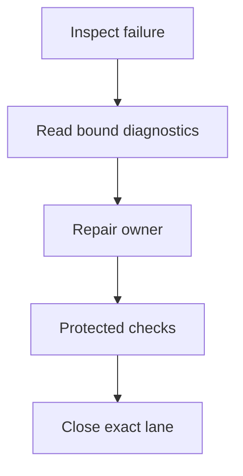
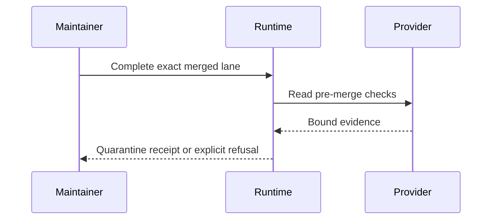
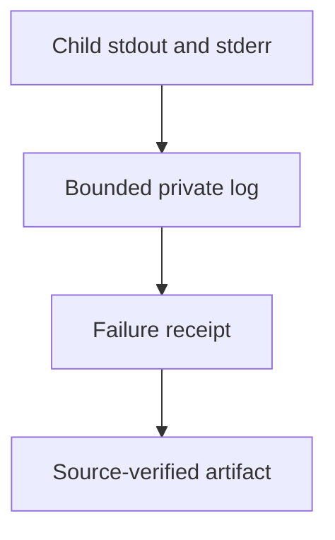
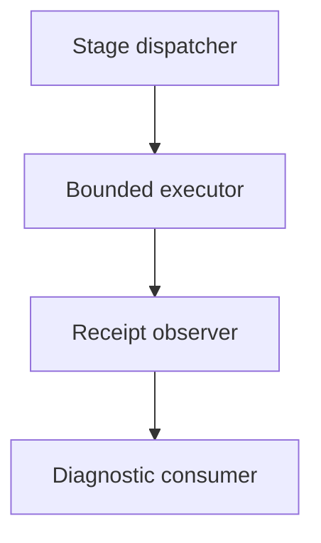
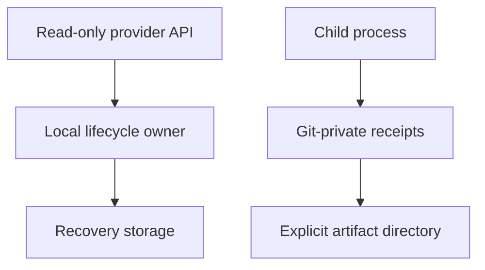

# Spatial workspace stabilization — reference implementation

All five roles join `SPATIAL-STABILIZATION-001@0.1.0`. This headless slice owns lifecycle
and validation repairs. Graph owns spatial acceptance and its separate successor specification.
No new store, dependency, provider, service, deployment permission or always-loaded instruction is added.

## Grounding — reference implementation

| Owner at the reviewed revision | Observed gap | Change |
|---|---|---|
| `bin/agentic-os-cleanup-review.mjs#inferMergedReviewWorkflow` | Exactly-one-check inference rejects later post-merge runs before recovery can evaluate historical evidence. | Infer the workflow from pre-merge checks, then reuse `recoveryChecks` for success and binding. |
| `bin/agentic-os-cleanup-recovery.mjs#recoveryChecks` | Existing selection already verifies latest completed pre-merge evidence for the named workflow. | Preserve this authority boundary; later pre-merge failure still blocks. |
| `bin/agentic-os-release-common-complete.mjs#runReleaseCommonLocalCleanup` | A hard-coded 10,000-entry inventory override contradicts the selected recovery policy's 250,000-entry projection bound. | Consume the selected bound without raising it or deleting ignored files. |
| `bin/agentic-os-test-receipt.mjs#executeCommand` | Tail-only output can lose an early failing test name, counterexample, seed and stack. | Retain up to 16 MiB of failure output privately; keep console output bounded. |
| `bin/agentic-os-validation-stages.mjs#runValidationStages` | Failure evidence names a local log but does not preserve full diagnostics for upload. | Bind full logs to the failed stage receipt and expose an explicit source-bound export command. |

Observed consumer evidence: Graph PR #1302 merged as `434972605932f219bb680f9c782988477ee73f02`;
its successful pre-merge Integration run is `36219315451`. Later PR-edit runs failed after merge.
Main run `36220758438`, attempt 2, passed all five partitions and XR checks. Its first attempt
reported one core-unit failure without retaining the test name; an unchanged exact-Node local
reproduction and the Linux retry passed. This is evidence loss, not a diagnosed unit defect.

## PRD — reference implementation

Maintainers need a completed change to close safely and a failed check to remain diagnosable.
These incidents establish engineering pain; customer frequency, willingness to pay and revenue remain unvalidated.

| Must / pain | Acceptance condition | VCC and design |
|---|---|---|
| C1 / blocked closeout | Post-merge runs cannot rewrite successful pre-merge evidence; missing evidence, wrong app/workflow and later pre-merge failures block. | `user-cleanup-recovery.test.mjs`; T1/A1 |
| C2 / retained checkout | An ignored inventory over 10,000 entries, within the existing selected bound, is quarantined with exact bytes and references preserved. | `release-common-complete.test.mjs`; T2/A2 |
| C3 / hidden failure | An early failure name, seed and diagnostics survive a long passing tail in a content-bound exported artifact. | `repository-validation-diagnostics.test.mjs`; T3/A3 |
| C4 / evidence integrity | Changed source, tampered logs and successful-stage exports are refused; oversized output is explicitly marked truncated. | Same diagnostics suite; T3/A3 |

Non-goals: broader cleanup permission, deletion, new check authority, automatic retries, production
promotion, a new spatial model, or invented customer observations. Local inspection and log export
work offline; live provider verification still requires connectivity.

## TAD — reference implementation

T1: workflow inference filters by exact reviewed head, authentic provider app and completion at or
before merge. All required checks must resolve to one workflow. Existing recovery selection then
verifies the successful run and exact identity. Ambiguous workflows remain blocked.

T2: admission and cleanup mechanics consume the same recovery inventory policy. The 250,000-entry,
4-GiB projection ceiling and all registration/shared-state limits remain unchanged. Quarantine retains
ignored runtime artifacts, branches and objects; no file is deleted to satisfy a budget.

T3: execution retains at most 16 MiB per failed stage, with a 48,000-byte console tail. Failure receipts
bind filename, digest, byte count and truncation. A separately invoked exporter checks current clean
HEAD/tree and the failed-stage receipt, verifies raw bytes, and writes only the selected log and manifest
into a new private directory. Success logs and arbitrary Git-private files are not exported. Consumers
own upload policy and retention; Graph consumes this command through its pinned runtime.

### Linked flow patterns — reference implementation

Journey: inspect failure → diagnose exact source → repair → protected checks → closeout.

All diagrams are version 1, dated 2026-09-26, reference-implementation views. Classes in order:
journey, workflow, data, orchestration, topology. Flowcharts project to Storyboard/D3 Graph;
the sequence uses the Sequence surface. Nodes/edges/clusters: 5/4/0, non-projecting, 4/3/0,
4/3/0 and 6/4/0. These diagrams document flow and do not establish browser readiness.

## ADR — reference implementation

| Decision | Reason and rejected alternative | Rollback |
|---|---|---|
| A1: reuse historical recovery validation | Unconditional latest-check selection lets post-merge edits alter cleanup evidence; ignoring all failures would weaken protection. | Refuse cleanup and retain bytes if historical binding cannot be proven. |
| A2: consume the existing policy bound | A second lower override strands valid inventories; arbitrary larger limits or deleting dependencies loses the selected contract or recovery evidence. | Preserve the mounted lane when the selected ceiling is exceeded. |
| A3: retain bounded exact failure bytes | Tail-only output loses diagnoses; unlimited capture risks exhaustion. A separate log avoids huge aggregate receipts. | Mark truncation and retain the known tail; never turn a failure into success. |

## MVP — reference implementation

| Stage | Owner action | Exit evidence | State |
|---|---|---|---|
| S1 | Implement C1/C2 at lifecycle owners | Focused adversarial fixtures and exact consumer closeout | Focused owner fixtures pass; consumer closeout pending |
| S2 | Implement C3/C4 at validation owners | Failed-test export with seed/digest and bounded overflow | All three failure-diagnostic cases pass |
| S3 | Protected owner integration, then consumer pin | Required owner/consumer CI; current canonical runtime | Pending |
| S4 | Graph SW5/SW6 and five-role successor | Real-app evidence and provenance roundtrips | Consumer-owned; pending |

Initial estimate: three hours of implementation/local validation across this owner and the consumer;
14 changed runtime modules, six new files, zero dependencies and zero always-loaded instruction bytes.
Refresh before scope expansion. Remote checks are dependencies with explicit state/recheck conditions.
Local verification: readiness, document and unchanged module budgets pass (111 CLI modules,
23,175 CLI lines). The focused lifecycle/diagnostics suites pass 39 tests; the collaboration
race suite passes two tests after its enrollment barrier repair. The broad affected run preserved
103 observations before the nine-minute command budget, including a one-minute collaboration
setup timeout. Its rerun exposed a stale race clock started before worker enrollment. The local
fixture now starts its unchanged race deadline after both workers report readiness; the same
race, fence and published-history assertions pass. The admission-economy suite did not complete
within that broad run's remaining budget. Required protected CI remains the broad validation gate.
No test assertion, timeout, inventory bound or module cap was loosened.

The additional change is confined to `__tests__/collaboration-cloud.test.mjs`; the hosted proof
owner is unchanged. Exact protected observations replace pending entries only after verification.

## GTM — reference implementation

First value is a diagnosable failure or a recoverable closeout, not a commercial sale. Measure repair
minutes, repeated-run count, diagnostic bytes, preserved entries and successful receipt retrieval.
No model calls, paid infrastructure or outreach is needed for this engineering slice; labor remains measured separately.

The consumer pilot targets a solo scene author, an agent-workflow builder and a mobile-first reviewer.
Technical rehearsals can verify the workflow but are not consent, buyer interviews, price acceptance
or market validation. Actual participant records remain empty until supplied. A scoped paid pilot
requires real acceptance and separate payment authorization; neither is implied by these repairs.
